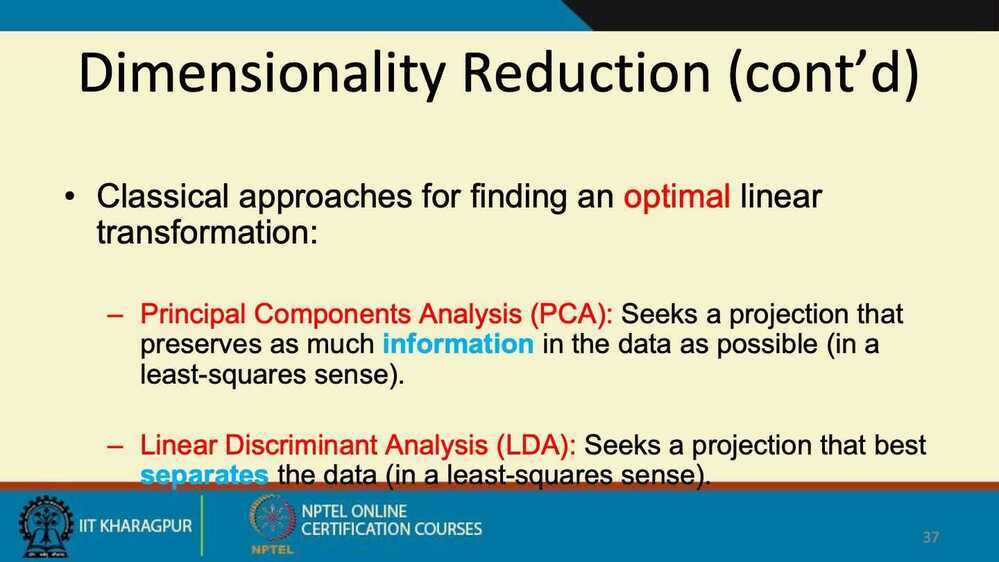
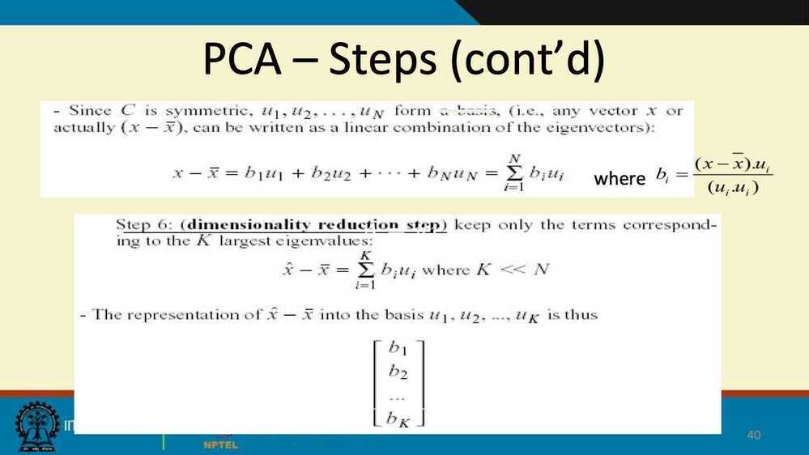
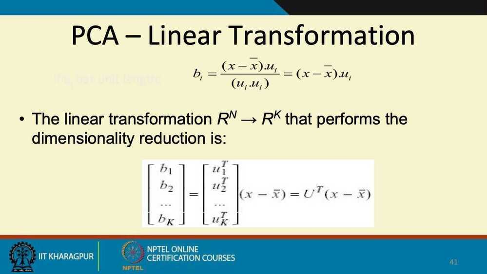
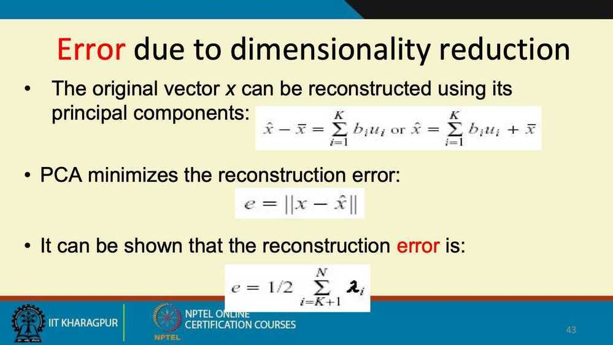

# Dimensionality Reduction

## Dimensionality Reduction

- Purpose
  - Avoid curse of dimensionality
  - Reduce amount of time and memory required by data mining algorithms
  - Allow data to be more easily visualized
  - May help to eliminate irrelevant features or reduce noise
- Techniques
  - Principle Component Analysis
  - Singular Value Decomposition
  - Others: supervised and non-linear techniques

## Data Dimensionaity

- From a theoretical point of view, increasing the number of features should lead to better performance
- In practice, the inclusion of more features leads to worse performance (i.e., curse of dimensionality)
- The number of training examples required increases exponentially with dimensionality

## Curse of Dimensionality

- When dimensionality increases, data becomes increasingly sparse in the space that it occupies
- Definitions of density and distance between points, which is critical for clustering and outlier detection, become less meaningful

## Dimensionality Reduction

- Purpose
  - Avoid curse of dimensionality
  - Reduce amount of time and memory required by data mining algorithms
  - Allow data to be more easily visualized
  - May help to eliminate irrelevant features or reduce noise
- Techniques
  - Principle Component Analysis
  - Single Value Decomposition
  - Others: Supervised and non-linear techniques

<https://www.datacamp.com/community/tutorials/principal-component-analysis-in-python>

## Feature Subset Selection

- Another way to reduce dimensionality of data
- Redundant features
  - duplicate much or all of the information contained in one or more other attributes
  - Example: purchase price of a product and the amount of sales tax paid
- Irrelevant features
  - contain no information that is useful for the data mining task at hand
  - Examples: students' ID is often irrelevant to the task of predicting students' GPA

- Evaluate a subset of feature
- Search for the best subset

### Techniques

#### Brute-force approach

Try all possible feature subsets as input to data mining algorithm

#### Embedded approaches

Feature selection occurs natually as part of the data mining algorithm

#### Fiter approaches

Features are selected before data mining algorithm is run

#### Wrapper approaches

Use the data mining algorithm as a black box to find best subset of attributes

## Feature Creation

- Create new attributes that can capture the important information in a data set much more efficiently than the original attributes
- Three general methodologies
  - Feature Extraction - domain-specific
  - Mapping data to new space
  - Feature construction - combining features

## Links

[Introduction to dimensionality reduction - Blog | Hex](https://hex.tech/blog/dimensionality-reduction/)
