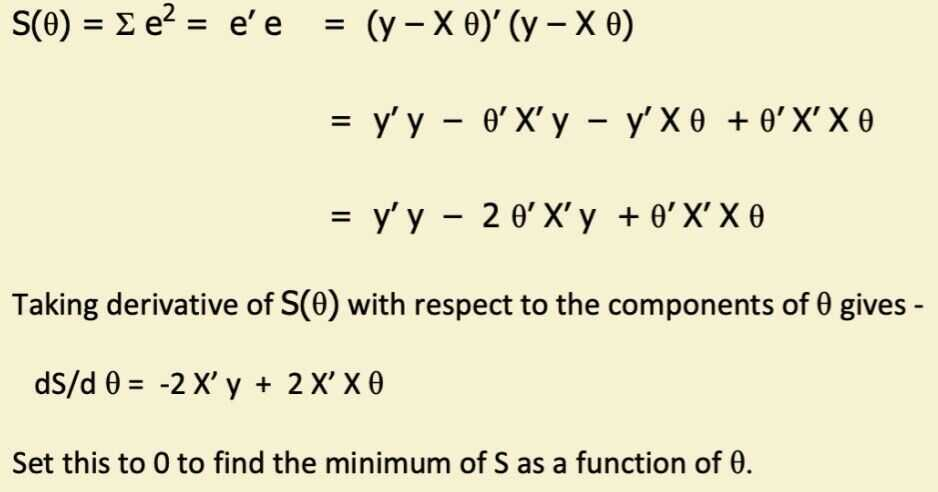

# Linear regression

Linear regressionis a method for finding the straight line or hyperplane that best fits a set of points

The representation of linear regression is an equation that describes a line that best fits the relationship between the input variables (x) and the output variables (y), byfinding specific weightings for the input variables called coefficients (B).

For example:

y = B0 + B1 * x

We willpredict y given the input x and the goal of the linear regression learning algorithm is to find the values for the coefficients B0 and B1.

Different techniques can be used to learn the linear regression model from data, such as a linear algebra solution for ordinary least squares and gradient descent optimization.

Linear regression has been around for more than 200 years and has been extensively studied. Some good rules of thumb when using this technique are to remove variables that are very similar (correlated) and to remove noise from your data, if possible.

## LOESS Curve Fitting (LOcally WEighted Scatter-plot Smoother)

This is a method for fitting a smooth curve between two variables, or fitting a smooth surface between an outcome and up to four predictor variables.

This is a nonparametric method because the linearity assumptions of conventional regression methods have been relaxed. Instead of estimating parameters like m and c in y = mx +c, a nonparametric regression focuses on the fitted curve. The fitted points and their standard errors represent are estimated with respect to the whole curve rather than a particular estimate. So, the overall uncertainty is measured as how well the estimated curve fits the population curve.

https://www.statsdirect.com/help/nonparametric_methods/loess.htm

https://towardsdatascience.com/loess-373d43b03564?gi=dca24c6898e1

## Assumptions of Linear Regression

- Linear relationship

There is a linear relationship between the dependent variables and the regressors, meaning the model you are creating actually fits the data

- The errors or residuals of the data are normally distributed and independent from each other
- Multivariate normality
- No or little multicollinearity between explanatory variables
- No auto-correlation
- Homoscedasticity

This means the variance around the regression line is the same for all values of the predictor variable

https://en.wikipedia.org/wiki/Homoscedasticity

http://r-statistics.co/Assumptions-of-Linear-Regression.html

https://towardsdatascience.com/an-introduction-to-linear-regression-for-data-science-9056bbcdf675

https://blog.minitab.com/en/adventures-in-statistics-2/how-to-interpret-regression-analysis-results-p-values-and-coefficients

## Linear Regression

## Solving for the θ's

- Problem is equivalent to inverting X' X matrix
    - Inverse does not exist if matrix is not of full rank
        - E.g., if 1 column is a linear combination of another (collinearity)
        - Note that X'X is closely related to the covariance of the X data
            - So we are in trouble if 2 or more variables are perfectly correlated
        - Numberical problems can also occur if variables are almost collinear
- Equivalent to solving a system of p linear equations
    - Many good numerical methods for doing this, e.g.,
        - Gaussian elimination, LU decomposition, etc
    - These are numerically more stable than direct inversion
- Alternative: gradient descent
    - Compute gradient and move downhill

## Multivariate Linear Regression

- Prediction model is a inear function of the parameters
- Score function: quadratic in predictions and parameters
    - Derivative of score is linear in the parameters
    - Leads to a linear algebra optimization problem, i.e., C θ = b

- Model structure is simple
    - p-1 dimensional hyperplane in p-dimensions
    - Linear weights => Interpretability
- Often useful as a baseline model
    - e.g., to compare more complex models to
- Note: even if it's the wrong model for the data (e.g., a poor fit) it can still be useful for prediction

## Limitations of Linear Regression

- True relationship of X and Y might be non-linear
    - Suggests generalizations to non-linear models
- Complexity
    - O(N p^2^ + p^3^) - problematic for large p
- Correlation / Collinearity among the X variables
    - Can cause numerical instability (C may be ill-conditioned)
    - Problems in interpretability (indentifiability)
- Includes all variables in the model
    - But what if p=1000 and only 3 variables are actually related to Y?

What is a hyperparameter that helps determine gradient descent's step size along the hypersurface to hopefully speed up convergence?

- Learning rate

## Regression Diagnostics

- **Non-linearity**

In a regression, we are assuming that the relationship between the dependent and independent variables is linear. If it is not:

- You can run a non-linear regression
- Or use mathematical transformation (square, nature log, etc) on either the dependent or independent variables to create a more linear relationship

- **Multicollinearity**

In a multiple regression, the independent variables should, in a perfect world, be uncorrelated with each other. But we don't live in a perfect world...

- **Homoskedasticity**

The residuals (or prediction errors) should not reveal any patterns (get larger or smaller), as the independent variable(s) increaes and decrease

- **Normality**

The residuals should be normally distributed

## Linear vs Non-Linear Regressions

- The easiest way to detech multicollinearity is to run scatter plots of the dependent variable against each independent variables

- A non-linear regression tries to find a best fit line through the non-linear plot. The process of fitting a line, though, is more complicated, and often involves trial and error
- If you choose to transform a variable (dependent or independent), you may have to use trial and error (using the scatter plot) to find your best transformation

## Collinearity Diagnostics

- Multicollinearity can cause coefficient estimates on the independent variables to become unreliable and volatile
    - It reduces the precision of these coefficients and the statistical power of the regression
    - It generally does not influent the predictions or precision of the predictions
- The multicollinearity in a multiple regression can be measured with a **variance inflation factor (VIF)**
    - A VIF greater than 5 indicates sever multicollinearity
    - A VIF between 1 and 4 indicates moderate multicollinearity
- If there is multicollinearity, you can
    - Try replacing or removing one of a pair of independent variables that are correlated
    - Run individual simple regressions against the indepedent variables
    - Do nothing, use the multiple regression for predictions, and don't over read the coefficients on variables

## Prediction Errors from Regression: Homoskedasticity and Heteroskedasticity

## Regression Variants

- Ordinary Least Squares (OLS)
- Generalized Least Squares (GLS)

When the residuals from the OLS regression are heteroskedastic or autocorrelated, one alternative that will yield more unbiased estimates is a Generalized Least Squares (GLS) regression.

- To run a GLS regression, you usually begin with an OLS regression and use the information in the prediction error terms to build a GLS regression
- The output from a GLS regression resembles that from an OLS regression and can be used similarly to make predictions and test hypotheses

- Weighted Least Squares

In a weighted least squares regression, not all observations in a sample are weighted equally. Instead, a weighting mechanism is created that weights some observations more than others

- In some cases, the weighting may reflect your belief that some of your observations convey more information about the population than others
- In others, it can be to counter the problem of standard errors of predictions varying across different values for the explanatory variable

## Regression Predictions

- **Precision**

In almost every regression, your predictions from a regression will be imprecise, with a standard error and range around the prediction. If the R-squared is low, and the range is large, a regression is less actionable

- **Stationarity**

Regressions are run with observed data from the past. To the extent that the process that you are observing is non-stationary, with changes in population and structure, the predictions will not hold up in future periods

- **Observability**

In a regression, you need to be able to observe the dependent variable (or variables) to be able to generate predictions of the independent variables. Regressions that use indepedent variables that don't lend themselves to timely observation cannot be acted upon

- **Actionability**

If the predicted value for Y from a regression deviates from the actual value, being able to act on the divergence makes the reliable more useful (in many cases)
