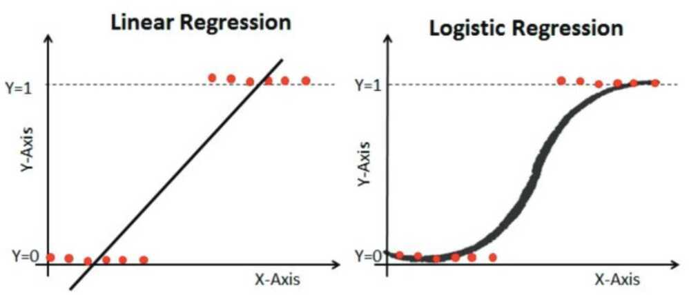

# Logistic regression

Logistic regression is another technique borrowed by machine learning from the field of statistics. It is the go-to method for **binary classification problems** (problems with two class values).

Logistic regression is like linear regression in that the goal is to find the values for the coefficients that weight each input variable.

Unlike linear regression, the prediction for the output is transformed using a non-linear function called the logistic function.

The logistic function looks like a big S and will transform any value into the range 0 to 1. This is useful because we can apply a rule to the output of the logistic function to snap values to 0 and 1 (e.g. IF less than 0.5 then output 1) and predict a class value.

<https://en.wikipedia.org/wiki/Logistic_function>

Because of the way that the model is learned, the predictions made by logistic regression can also be used as the probability of a given data instance belonging to class 0 or class 1. This can be useful for problems where you need to give more rationale for a prediction.

Like linear regression, logistic regression does work better when you remove attributes that are unrelated to the output variable as well as attributes that are very similar (correlated) to each other.

It's a fast model to learn and effective on binary classification problems.

## What is Logistic Regression?

This kind of classi‑cation algorithm came into being where linear regressions failed. Unlike linear regression, where the prediction is made based on a continuous output, logistic regression gives us a binary output (like is this tumor malignant or not). It considers several parameters and initially achieves exponential growth then reaches its highest point at the carrying capacity creating an S-shaped curve instead of the default straight line used in linear regression. In this case, we can very eciently predict the binary result according to its weight. A higher weight indicates that the result should be true and a lower weight indicates a false output. This is a widely used technique in classifying inputs into true or false.

