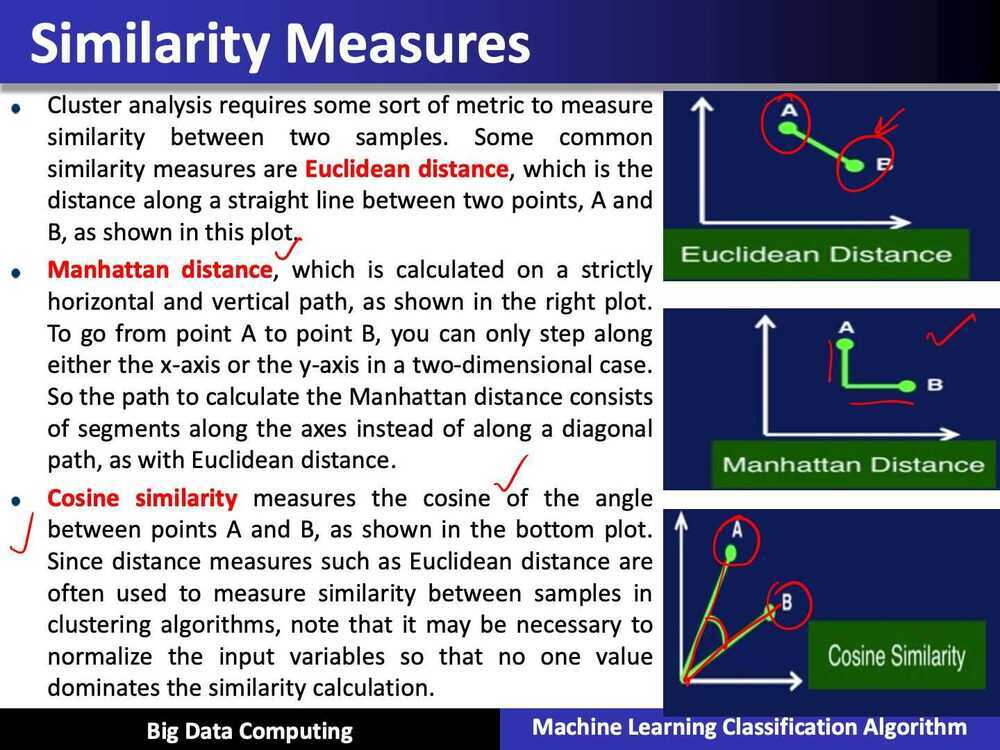
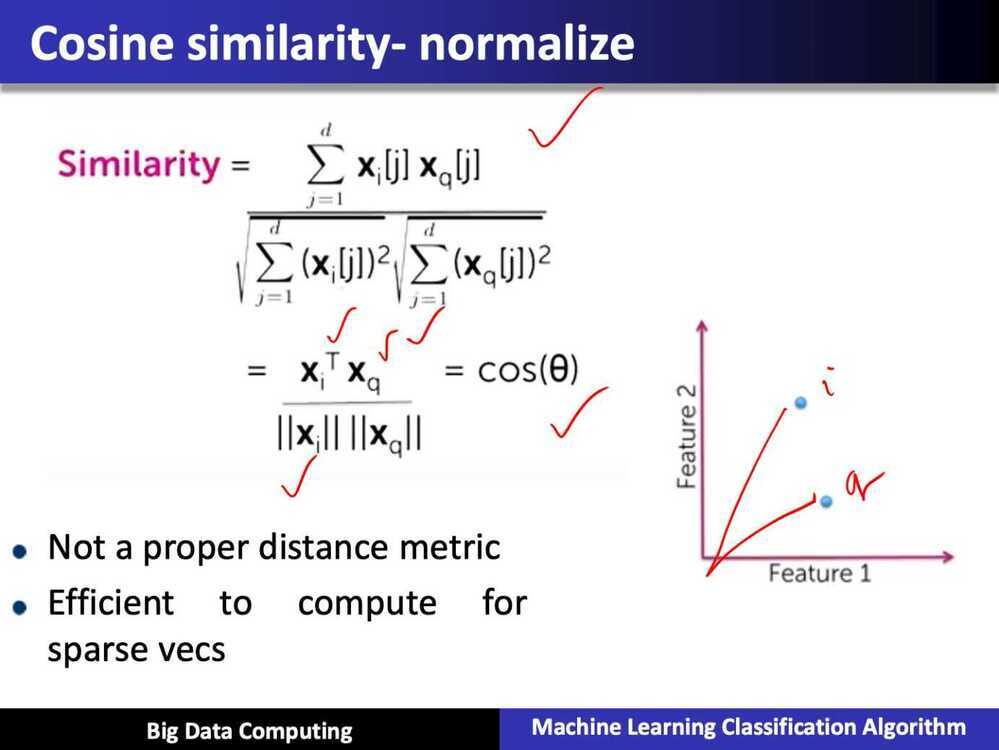
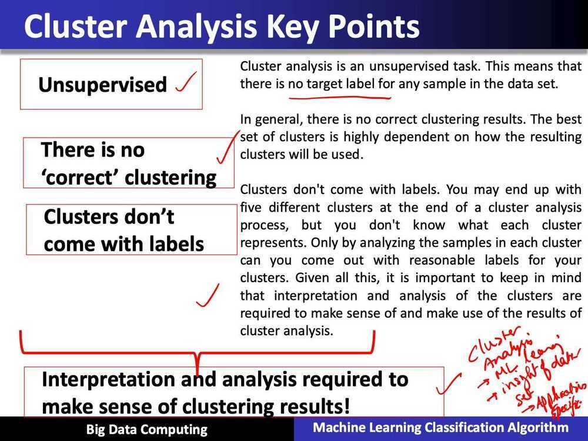
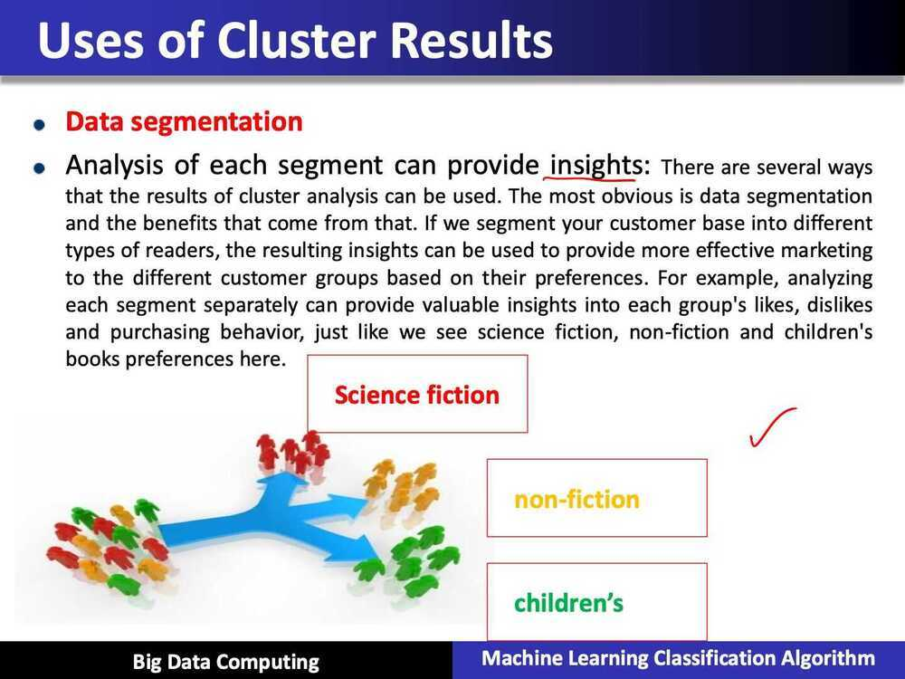
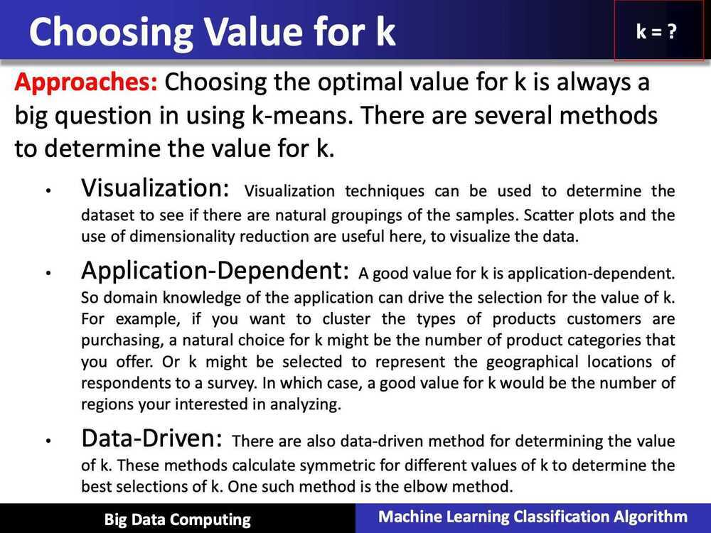
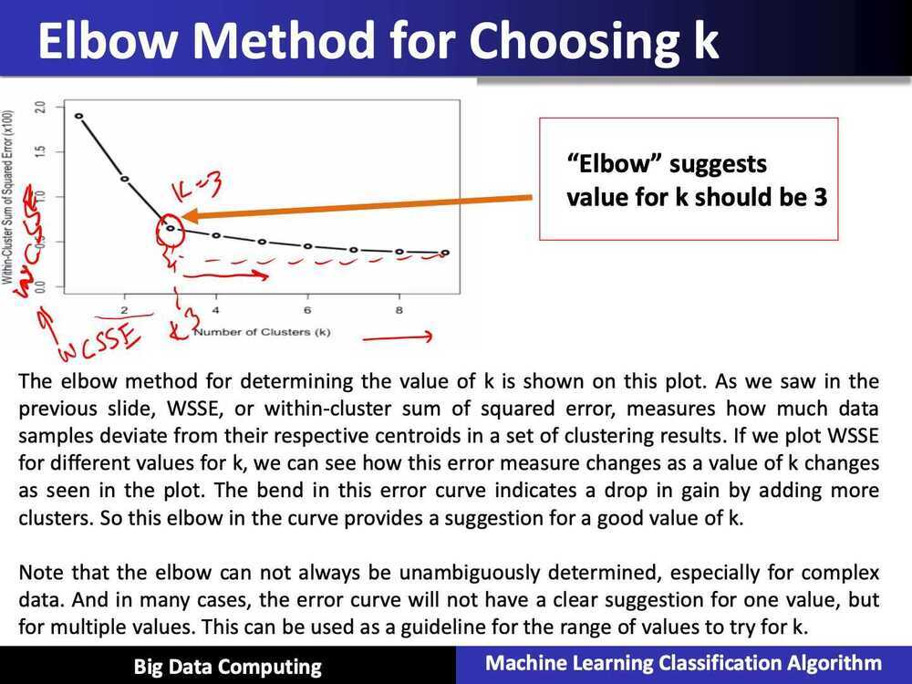
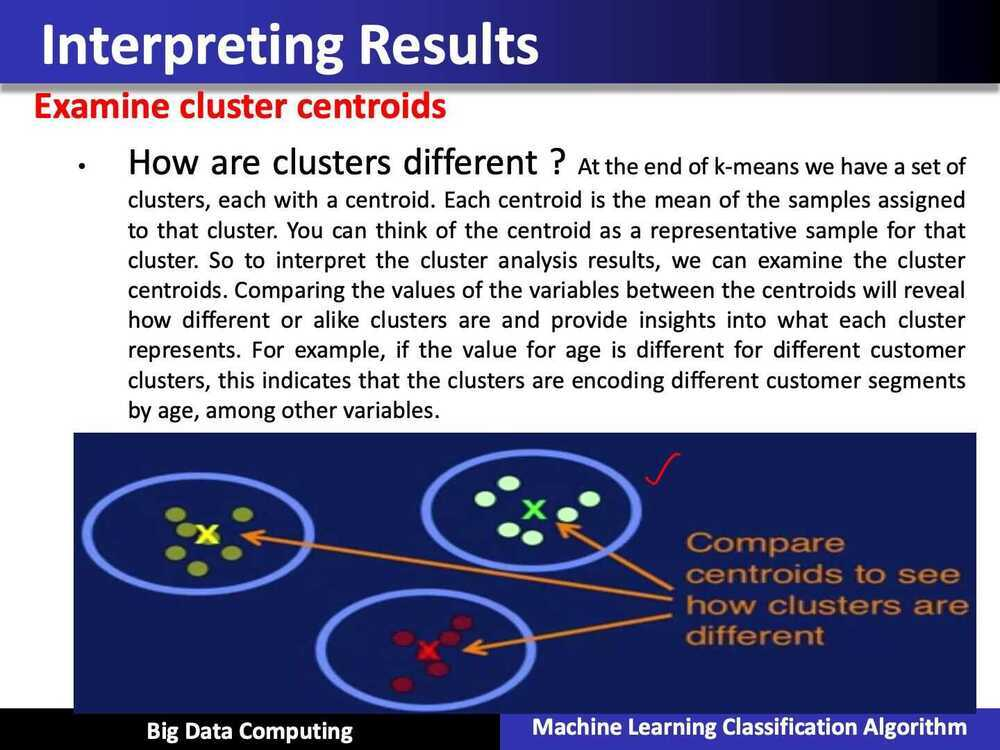

# Machine Learning Algorithm K-means using Map Reduce for Big Data Analytics

## Preface

- In this lecture, we will discuss machine learning classification algorithm k-means using mapreduce for big data analytics

## Cluster Analysis (Clustering) Overview

- Goal: Organize similar items into groups
- In cluster analysis, the goal is to organize similar items in given dataset into groups or clusters. By segmenting given data into clusters, we can analyze each cluster more carefully

## Applications

- Segment customer base into groups
- Characterize different weather patterns for a region
- Group news articles into topics
- Discover crime hot spots

## Cluster Analysis Summary

- Organize similar items into groups
- Analyzing clusters often leads to useful insights about data
- Clusters require analysis and interpretation

## Chossing Initial Centroids

- Issue:

Final clusters are sensitive to initial centroids

- Solution:

Run k-means multiple times with different random intitial centroids, and choose best results

## K-Means summary

- Classic algorithm for cluster analysis
- Simple to understand and implement and is efficient
- Value of k must be specified
- Final clusters are sensitive to initial centroids
