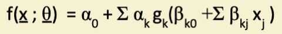
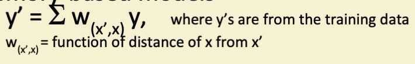
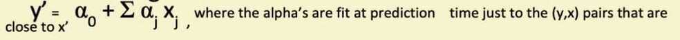
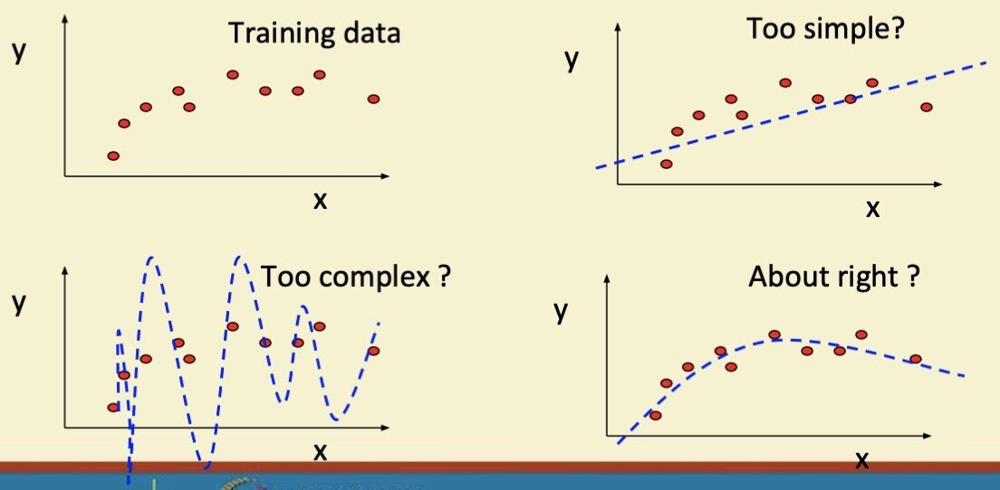
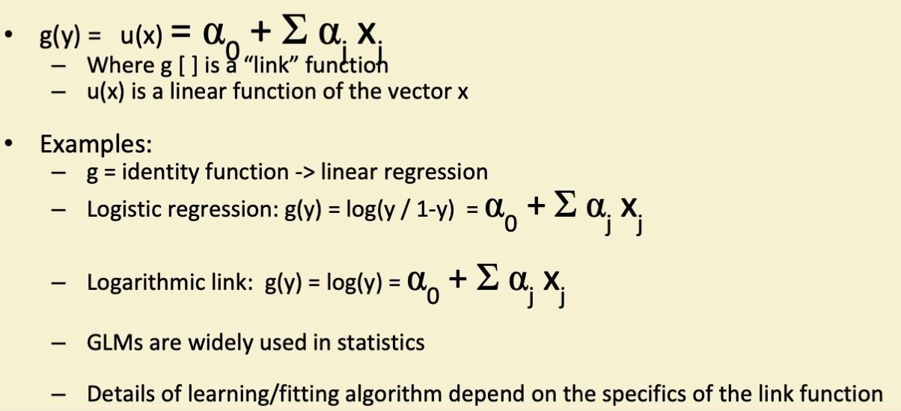

# Non linear regression

## Non-linear Regression

- We can generalize further to models that are nonlinear:

where the g's are non-linear functions

- In statistics this is referred to as a generalized linear regression
- Closed form (analytical) solutions are rare
- We have a multivariate non-linear optimization problem

## Optimization in the Non-Linear Case

- We seek the minimum of a function in d dimensions, where d is the number of parameters (d could be large)
- There are a multitude of heuristic search techniques
    - Steepest descent (follow the gradient)
    - Newton methods (use 2nd derivative information)
    - Conjugate gradient
    - Line search
    - Stochastic search
    - Genetic algorithms
- Two cases
    - Convex (nice -> means a single global optimum)
    - Non-convex (multiple local optima -> need multiple starts)

## Other non-linear models

- Splines
    - Patch together different low-order polynomials over different parts of the x-space
    - Works well in 1 dimension, less well in higher dimensions
- Memory-based models

- Local linear regression

## Complexity vs Goodness of Fit

## Generalized Linear Models (GLMs)

## Tree-Structured Regression

- Functional form of model is a "regression tree"
    - Univariate thresholds at internal nodes
    - Constant or linear surfaces at the leaf nodes
    - Yields piecewise constant (or linear) surface
    - (like classification tree, but for regression)
- Very crude functional form... but
    - Can be very useful in high-dimensional problems
    - Can useful for interpretation
    - Can handle combinations of real and categorical variables
- Search problem
    - Finding the optimal tree is intractable
    - Practice: greedy algorithms

## Model Averaging / Ensembles

- Can average over parameters and models
    - E.g., weighted linear combination of predictions from multiple models

y = Σ w~k~ y~y~

- Why? Any predictions from a point estimate of parameters or a single model has only a small chance of the being the best
- Averaging makes our predictions more stable and less sensitive to random variations data set (good for less stable models like trees)
