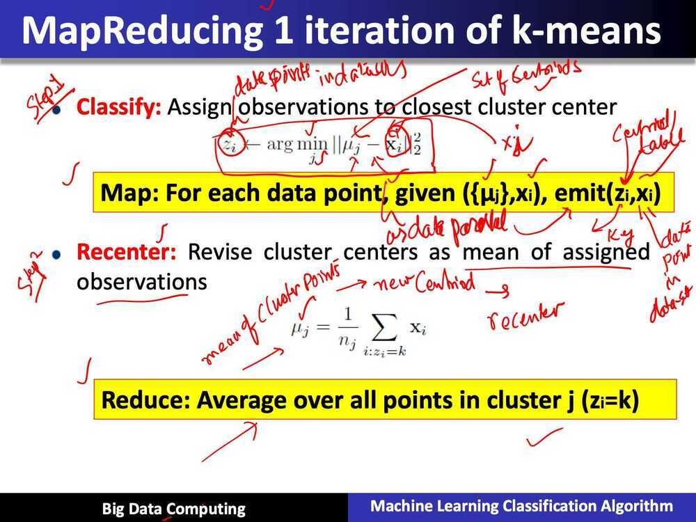
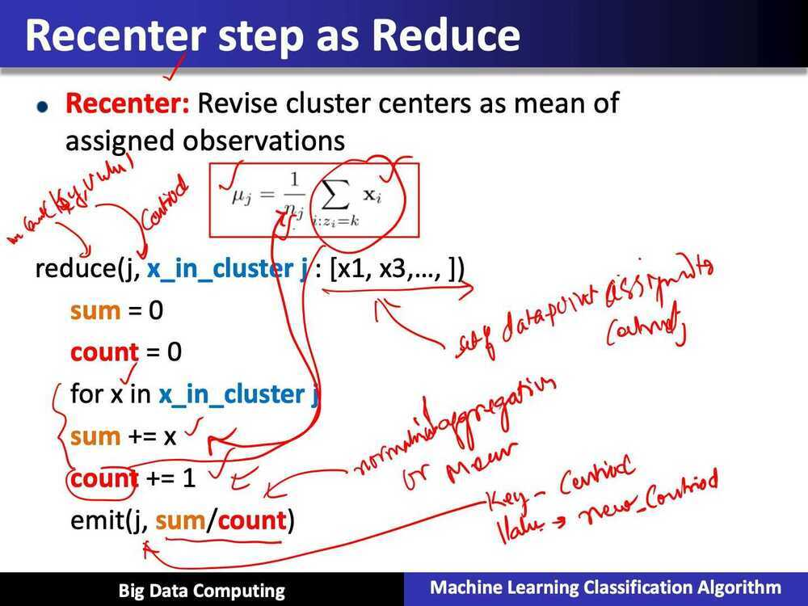
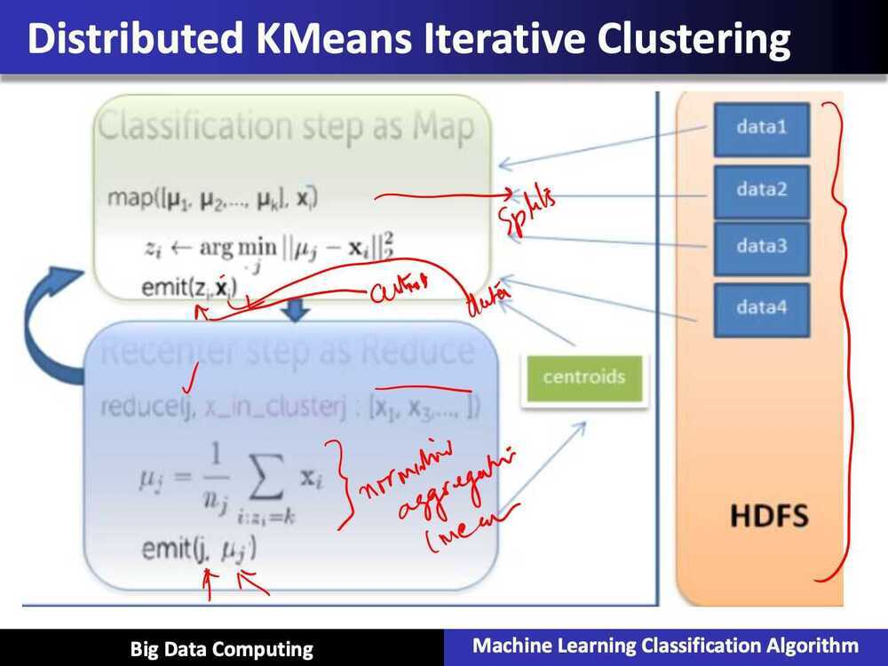

# Parallel K-means using Map Reduce on Big Data Cluster Analysis

## Summary of Parallel k-means using MapReduce

- Map: classification step
  - data parallel over data points
- Recuce: recompute means
  - data parallel over centers

## Some practical considerations

- k-means needs an iterative version of MapReduce
  - Not standard formulation
- Mapper needs to get data point and all centers
  - A lot of data
  - Better implmentation
    - mapper gets many data points
