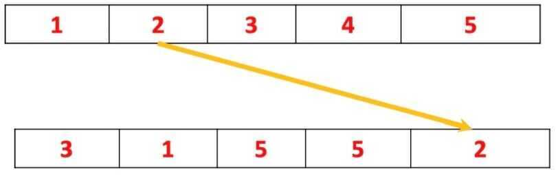
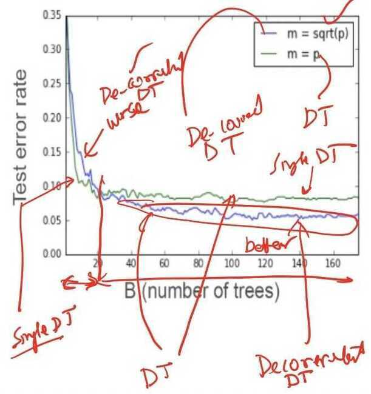

# Predictive Analytics 1

## Preface

- In this lecture, we will discuss the fundamental techniques of predictive analytics
- We will mainly cover Random Forest, Gradient Boosted Decision Trees and a case study with Spark ML Programming, Decision Trees and Ensembles

## Bootstrap and Bagging

## Bootstrap

- Bootstrapping is an algorithm which produces replicas of a data set by doing random sampling with replacement. This idea is essential for the random forest algorithm
- Consider a dataset Z={(x1, y1),...,(xn,yn)}
- Bootstrapped dataset Z* - It is a modification of the original dataset Z, produced by random sampling with replacement.

## Sampling with Replacement

- Each iteration pick an object at random, and there is no correlation with the previous step. Consider a data set, Z, for example, with five objects.

- At the first step, you pick at random an object, for example, the object number three

- Then you repeat it and pick the object number one

- Then the object number five

- Then possibly you can pick again the object number five, because at each iteration you pick an object at random, and there is no correlation with the previous step

- And finally, you pick the object number two

- After bootstrapping we have a new data set. The size of this data set is the number of elements in the original data set. But its content, as you see, is slightly different. Some objects may be missing and other objects may be present several times, more than once

## Bagging

- It was the second idea essential for understanding of the random forest algorithm
- Bagging (Bootstrap Aggregation): It is a general method for averaging predictions of other algorithms, not decision trees, but any other algorithm in general
- Bagging works because it reduces the variance of the prediction

## Algorithm

## Why does bagging work?

- Model f(x) has higher predictive power than any single f^xb^(x), b=1,...,B
- Most of situations with any machine learning method in the core, the quality of such aggregated predictions will be better than of any single prediction
- The phenomenon is based on a very general principle which is called the bias variance trade off. You can consider the training data set to be random by itself.

- What is the training data set?
  - In the real situation, the training data set may be a user behavior in Internet, for example, web browsing, using search engine, doing clicks on advertisement, and so on.
  - Other examples of training data sets are physical measurements. For example, temperature, locations, date, time and so on. And all these measurements are essentially stochastic.
  - If you can repeat the same experiment in the same conditions, the measurements actually will be different because of the noise in measurements, and since user behavior is essentially stochastic and not exactly predictable. Now, you understand that the traning data set itself is random

- Bagging: It is an averaging over a set of possible datasets, removing noisy and non-stable parts of models.
- After averaging, the noisy parts of machine learning model will vanish out, whereas stable and reliable parts will remain. The quality of the average model will be better than any single model

## Summary

- Bootstrap: A method for generating different replicas of the dataset
- Bagging (Bootstrap Aggregation): A method for averaging predictions and reducing prediction's variance
- Bagging improves the quality of almost any machine learning method
- Bagging is very time consuming for large data sets

## Random Forest

- Random Forest algorithm is a bagging of de-correlated decision trees

## Algorithm: Random Forest

## How to grow a random forest decision tree

- The tree is built **greedily** from top to bottom
- Select m <= p of the input variables at random as candidates for splitting
- Each split is selected to maximize information gain (IG)

- Select m <= p of the input variables at random as candidates for splitting
- Recommendations from inventors of Random Forests
- m = sqroot(p) for classification, minInstance PerNode = 1
- m = p/3 for regression, minInstancePerNode = 5

## Random Forest

- Here are the results of training of two random force. The first variant is marked with green here, and either the variant were at each step m equals speed
- It means that at each step, we grow a regular decision tree and you find the best split among all the variables. And the blue line, it is a de-correlated decision tree.
- In this situation, we randomly pick m equals square root of b. And all the trees can be built using different subsets of variables. As we can see at this diagram, at the initial stage, the variant is m equals square root b is worse before 20 iterations. But eventually, this variant of the Random Forest algorithm converges to the better solution

## Summary

- Random Forest is a good method for a general purpose classification/regression problems (typically slightly worse than gradient boosted decision trees)
- **Automatically handle interactions of features:** Of course, this algorithm can automatically handle interactions of features because this could be done by a single decision tree
- **Computational scalability:** Of course, this algorithm can automatically handle interactions of features because this could be done by a single decision tree
- In the Random Forest algorithm, each tree can be built independently on other trees. It is an important feature and I would like to emphasize it. That is why the Random Forest algorithm east is essentially parallel
- The Random Forest could be trained in the distributed environment with the high degree of parallelization
- **Predictive Power:** As far as predictive power of the Random Forest is, on the one hand better than a single decision tree, but it is slightly worse than gradient boosted decision trees
- **Interpretability:** Here you'll lose the interpretability because their composition of hundreds or thousands Random Forest decision trees cannot be analyzed by human expert
