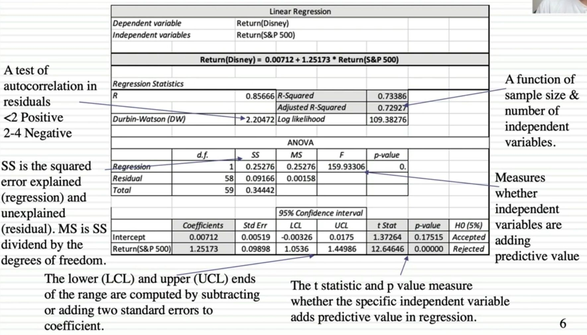

# Regression

Regression is a technique used to predict the value of a response (dependent) variables, from one or more predictor (independent) variables, where the variable are numeric. There are various forms of regression such as linear, multiple, logistic, polynomial, non-parametric, etc.

Linear and Logistic regression are the most basic form of regression which are commonly used. The essential difference between these two is that Logistic regression is used when the dependent variable is binary in nature. In contrast, Linear regression is used when the dependent variable is continuous and nature of the regression line is linear.

| **BASIS FOR COMPARISON**                                        | **LINEAR REGRESSION**                                                          | **LOGISTIC REGRESSION**                                                                                             |
|---------------------|----------------------|-----------------------------|
| Basic                                                           | The data is modelled using a straight line.                                    | The probability of some obtained event is represented as a linear function of a combination of predictor variables. |
| Linear relationship between dependent and independent variables | Is required                                                                    | Not required                                                                                                        |
| The independent variable                                        | Could be correlated with each other. (Specially in multiple linear regression) | Should not be correlated with each other (no multicollinearity exist).                                              |

## Key Differences Between Linear and Logistic Regression

1. The Linear regression models data using continuous numeric value. As against, logistic regression models the data in the binary values.

2. Linear regression requires to establish the linear relationship among dependent and independent variable whereas it is not necessary for logistic regression.

3. In the linear regression, the independent variable can be correlated with each other. On the contrary, in the logistic regression, the variable must not be correlated with each other.

Linear regression models data using a straight line where a random variable, Y(response variable) is modelled as a linear function of another random variable, X (predictor variable). On the other hand, the logistic regression models the probability of the events in bivariate which are essentially occurring as a linear function of a set of dependent variables.

## Toptal

Linear regression is a statistical model that, given a set of input features, attempts to fit the best possible straight line (or hyperplane, in the general case) between the independent and the dependent variable. Since its output is continuous and its cost function measures the distance from the observed to the predicted values, it is an appropriate choice to solve regression problems (e.g. to predict sales numbers).

Logistic regression, on the other hand, outputs a probability, which by definition is a bounded value between zero and one, due to the sigmoid activation function. Therefore, it is most appropriate to solve classification problems (e.g. to predict whether a given transaction is fraudulent or not).

<https://techdifferences.com/difference-between-linear-and-logistic-regression.html>

<https://medium.com/@dhiraj8899/top-5-difference-between-linear-regression-and-logistic-regression-893f6470d7e0>

## Regression

- Predict real-valued output for given input - given a training set
- Examples:
  - Predict rainfall in cm for month
  - Predict stock prices in next day
  - Predict numbers of users who will click on an internet advertisement

## Reading a Regression

[Statistics](https://www.youtube.com/playlist?list=PL8dPuuaLjXtNM_Y-bUAhblSAdWRnmBUcr)
