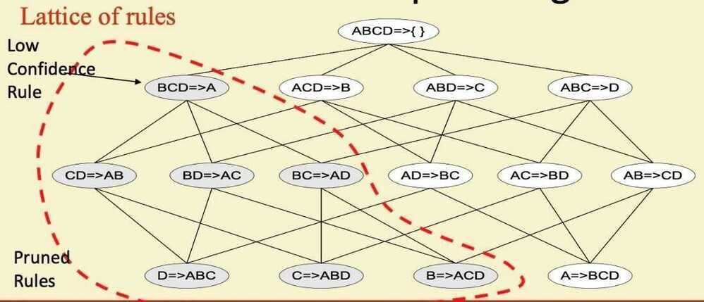
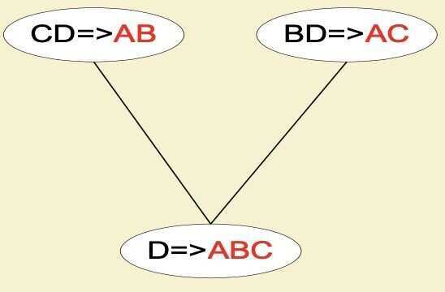
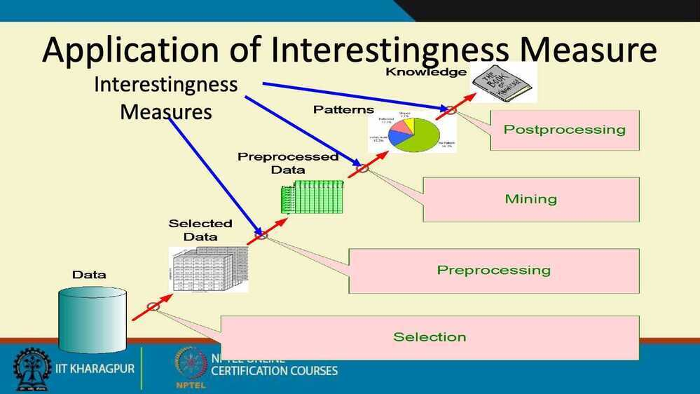
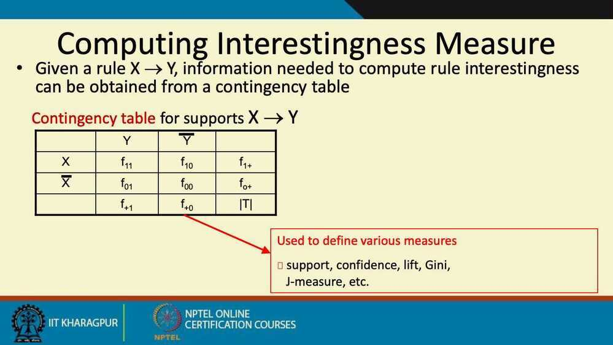
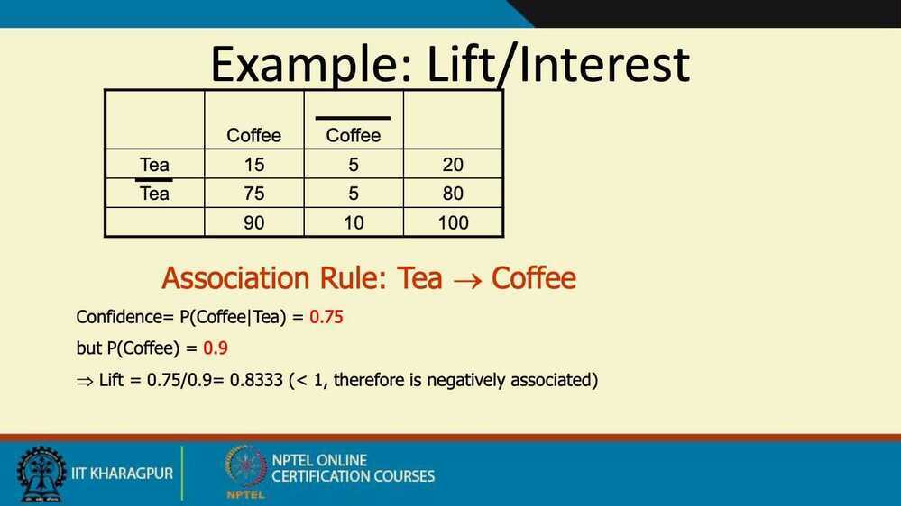
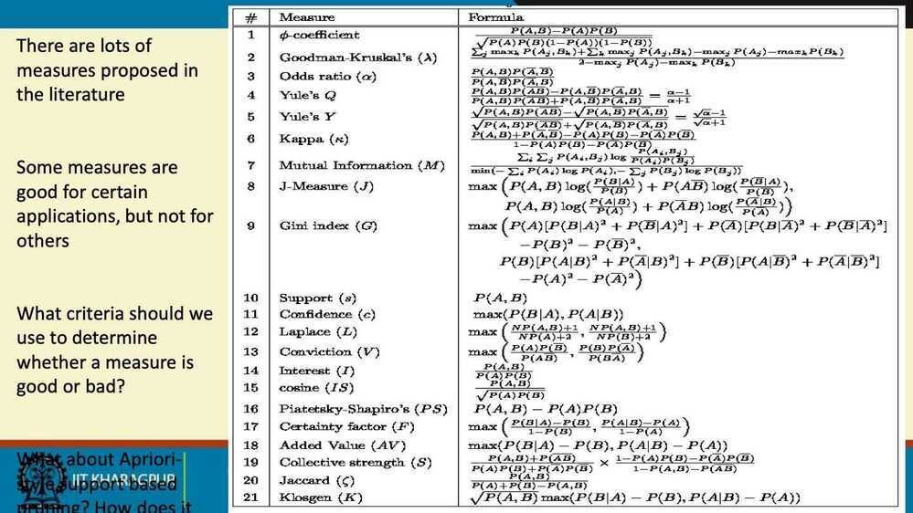

# Rule generation & Pattern Evaluation

monotone - a continuing sound, especially of a person's voice, that is unchanging in pitch and without intonation.

Ex - "he sat and answered the questionsin a monotone"

According to wikipedia.. a monotonic function is a function that is either increasing or decreasing.. if a function is increasing and decreasing then its not a monotonic function or its an anti-monotonic .

In data mining, what would be a monotonic function would be the support function of an itemset (its frequency in the transaction database). But when "frequent" (i.e sup(X) > supmin) is our criteria : "if a set is frequent, then all of its subset are frequent too",*and also*"if a set is infrequent then all of its superset are also infrequent." The combination of both means the anti-monotonicity in this context.

## Rule Generation

- How to efficiently generate rules from frequent itemsets?
    - In general, confidence does not have an anti-monotone property
    - But confidence of rules generated from the same itemset has an anti-monotone property
    - e.g., `L = {A,B,C,D}`

`c (ABC -> D) >= c(AB -> CD) >= c(A -> BCD)`

- Confidence is anti-monotone w.r.t. number of items on the RHS of the rule

Confidence `(X -> Y)` - Measures how often transactions Y apper in transactions that contain X

`c(ABC -> D) = |ABCD| / |ABC|`

Therefore

`|ABCD| / |ABC| >= |ABCD| / |AB| >= |ABCD| / |A|`

Since,

`|ABC| <= |AB| <= |A|`

## Rule Generation for Apriori Algorithm

- Candidate rule is generated by merging two rules that share the same prefix in the rule consequent
- `join (CD => AB, BD => AC) would produce the candidate rule D => ABC`
- `Prune rule D => ABC if its subset AB => BC does not have high confidence`

