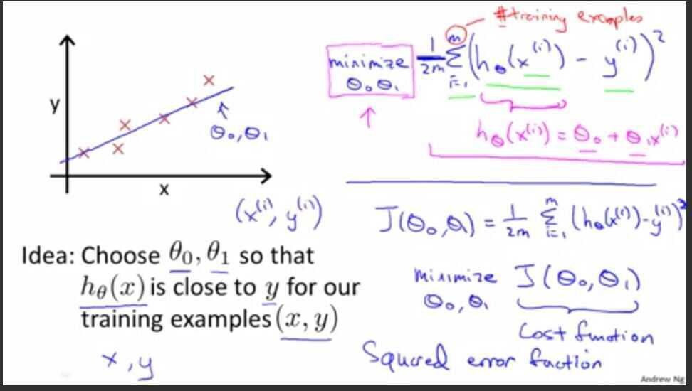
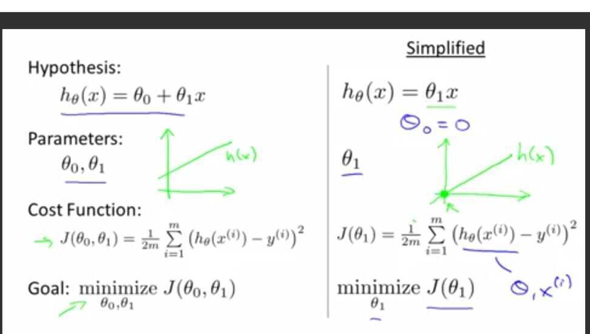
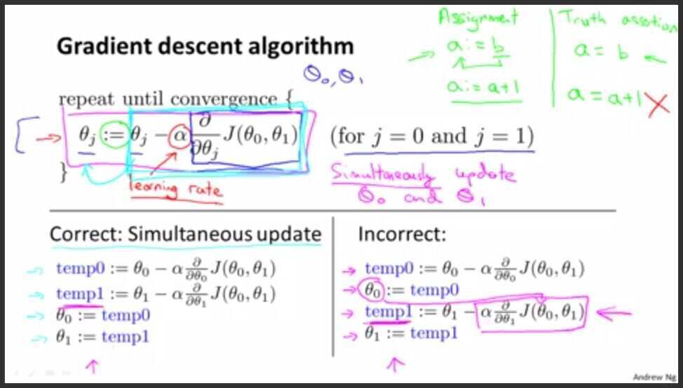
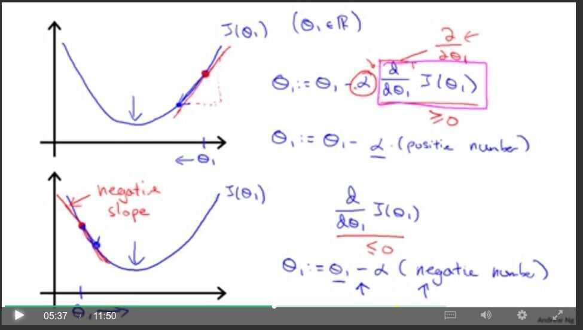
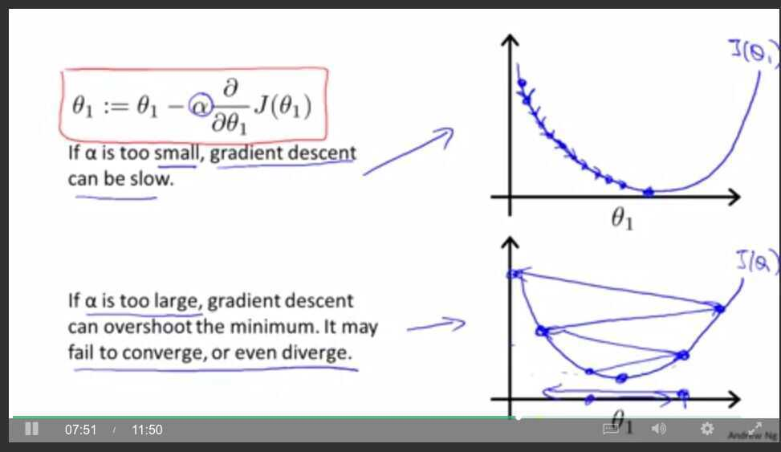
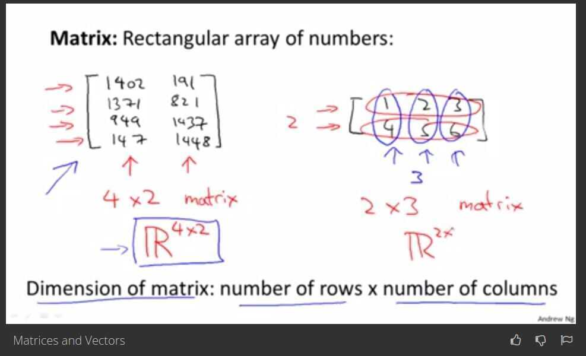

# Andrew NG

## Model and cost function

1. Model representation - Linear regression using Training set

m - number of training examples

x's - input variables / features

y's - output variable / "target" variable

(x,y) - one training example

## 2. Cost function

Cost function intuition -

Octave

- **Singular Value Decomposition (SVD)**

Every nxm matrix can be written as a product of three smaller matrices.

- SVD appreas in lots of places
    - Statistics (PCA)
    - Chemical physics
    - Image processing
    - Genomics
    - Robotics
    - Quantum physics (entanglement)
    - Data embeddings / vector embeddings

## Gradient Descent for Linear regression with one variable

Gradient descent intuition

## Derivative term

## Alpha

## Gradient Descent for Linear Regression

Gradient descent is a convex function (Global minimum)

Also called (Batch gradient descent) becauses look at all training sample.

Linear Algebra Review

Matrix - Rectangular array of numbers.

Dimension of matrix : number of rows * number of columns

Vector - is a matrix with one column (n*1 matrix)

Uppercase for matrices

Lower case for others variables, vectors, etc.

Addition and Scalar Multiplication

Scalar multiplication is 3*matrix (n*matrix).

Scalar division is ⅓ * matrix

Matrix Vector Multiplication

Calculating hypothesis using matrix-vector multiplication in octave its easy

Matrix - Matrix multiplication

If we have 3 hypothesis with 4 houses then,

Multiplication Properties

- Multiplication is not commutative ( A*B not equal to B*A)
- Multiplication is Associative ( a*(b*c) = (a*b)*c)
- Identity matrix (A.I = I.A = A)

Matrix Inverse and Transpose

Matrix Inverse:

- 0 does not have an inverse.
- 3 inverse is 3-1
- Matrix inverse ( A * A-1 = Identity)
- Matrix that don't have an inverse are singular or degenerate matrix
- Ex- 0 matrix doesn't have inverse.

Matrix Transpose:

