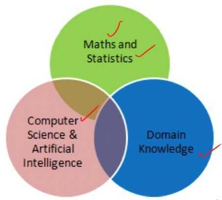

# Intro

Machine learning is a subset of artificial intelligence in the field of [computer science](https://en.wikipedia.org/wiki/Computer_science) that often uses statistical techniques to give [computers](https://en.wikipedia.org/wiki/Computer) the ability to "learn" (i.e., progressively improve performance on a specific task) with [data](https://en.wikipedia.org/wiki/Data), without being explicitly programmed.

Evolved from the study of [pattern recognition](https://en.wikipedia.org/wiki/Pattern_recognition) and [computational learning theory](https://en.wikipedia.org/wiki/Computational_learning_theory) in [artificial intelligence](https://en.wikipedia.org/wiki/Artificial_intelligence), machine learning explores the study and construction of [algorithms](https://en.wikipedia.org/wiki/Algorithm) that can learn from and make predictions on [data](https://en.wikipedia.org/wiki/Data)- such algorithms overcome following strictly static [program instructions](https://en.wikipedia.org/wiki/Computer_program) by making data-driven predictions or decisions, through building a [model](https://en.wikipedia.org/wiki/Mathematical_model) from sample inputs.

[1. Introduction](https://d2l.ai/chapter_introduction/index.html)
[1.1. A Motivating Example](https://d2l.ai/chapter_introduction/index.html#a-motivating-example)
[1.2. Key Components](https://d2l.ai/chapter_introduction/index.html#key-components)
[1.3. Kinds of Machine Learning Problems](https://d2l.ai/chapter_introduction/index.html#kinds-of-machine-learning-problems)
[1.4. Roots](https://d2l.ai/chapter_introduction/index.html#roots)
[1.5. The Road to Deep Learning](https://d2l.ai/chapter_introduction/index.html#the-road-to-deep-learning)
[1.6. Success Stories](https://d2l.ai/chapter_introduction/index.html#success-stories)
[1.7. Characteristics](https://d2l.ai/chapter_introduction/index.html#characteristics)
[1.8. Summary](https://d2l.ai/chapter_introduction/index.html#summary)
[1.9. Exercises](https://d2l.ai/chapter_introduction/index.html#exercises)

You can think of the parameters as knobs that we can turn, manipulating the behavior of the program. Fixing the parameters, we call the program a **model**. The set of all distinct programs (input-output mappings) that we can produce just by manipulating the parameters is called a**familyof models**. And the meta-program that uses our dataset to choose the parameters is called a**learning algorithm**.

## What is Machine Learning?

- Learning from data:

Machine learning is the field of study that focuses on computer systems that can learn from data. That is the system's often called models can learn to perform a specific task by analyzing lots of examples for a particular problem. For example, a machine learning model can learn to recognize an image of a cat by being shown lots and lots of images of cats.

- No explicit programming

This notion. of learning from data means that a machine learning model can learn a specific task without being explicitly programmed. In other words, the machine learning model is not given the step by step instructions on how to recognize the image of a cat

- Instead, the model learns what features are important in determining whether it picture contains a cat from the data that has analyzed. Because the model learns to perform this task from data it's good to know that the amount and quality of data available for building the model are important factors in how well the model learns the task
- Discovering hidden patterns: Because machine learning models can learn from data that can be used to discover hidden patterns and treds in the data
- Data-driven decisions: These patterns and trends lead to valuable insights into the data. Thus the use of machine learning allows for data driven decisions to be made for a particular problem

## Key Components

Core components that will follow us around, no matter what kind of machine learning problem we take on:

1. The **data** that we can learn from.
2. A **model** of how to transform the data.
3. An **objective function** that quantifies how well (or badly) the model is doing.
4. An **algorithm** to adjust the model's parameters to optimize the objective function.

## Model

By **model**, we denote the computational machinery for ingesting data of one type, and spitting out predictions of a possibly different type. In particular, we are interested in statistical models that can be estimated from data. While simple models are perfectly capable of addressing appropriately simple problems, the problems that we focus on in this book stretch the limits of classical methods. Deep learning is differentiated from classical approaches principally by the set of powerful models that it focuses on. These models consist of many successive transformations of the data that are chained together top to bottom, thus the name**deep learning**. On our way to discussing deep models, we will also discuss some more traditional methods.

## Objective Functions

Earlier, we introduced machine learning as **learning** from experience. By learning here, we mean improving at some task over time. But who is to say what constitutes an improvement? You might imagine that we could propose to update our model, and some people might disagree on whether the proposed update constituted an improvement or a decline.

In order to develop a formal mathematical system of learning machines, we need to have formal measures of how good (or bad) our models are. In machine learning, and optimization more generally, we call these **objective functions**. By convention, we usually define objective functions so that lower is better. This is merely a convention. You can take any function for which higher is better, and turn it into a new function that is qualitatively identical but for which lower is better by flipping the sign. Because lower is better, these functions are sometimes called **loss functions.**

When trying to predict numerical values, the most common loss function is **squared error**, i.e., the square of the difference between the prediction and the ground-truth. For classification, the most common objective is to minimize error rate, i.e., the fraction of examples on which our predictions disagree with the ground truth. Some objectives (e.g., squared error) are easy to optimize. Others (e.g., error rate) are difficult to optimize directly, owing to non-differentiability or other complications. In these cases, it is common to optimize a **surrogate objective.**

## Optimization Algorithm

Once we have got some data source and representation, a model, and a well-defined objective function, we need an algorithm capable of searching for the best possible parameters for minimizing the loss function. Popular optimization algorithms for deep learning are based on an approach called **gradient descent**. In short, at each step, this method checks to see, for each parameter, which way the training set loss would move if you perturbed that parameter just a small amount. It then updates the parameter in the direction that may reduce the loss.

https://d2l.ai/chapter_introduction/index.html

https://developers.google.com/machine-learning/guides/rules-of-ml

## Terminology

- Instance: The thing about which you want to make a prediction. For example, the instance might be a web page that you want to classify as either "about cats" or "not about cats".
- Label: An answer for a prediction task ­­ either the answer produced by a machine learning system, or the right answer supplied in training data. For example, the label for a web page might be "about cats".
- Feature: A property of an instance used in a prediction task. For example, a web page might have a feature "contains the word 'cat'".
- Feature Column: A set of related features, such as the set of all possible countries in which users might live. An example may have one or more features present in a feature column. "Feature column" is Google-specific terminology. A feature column is referred to as a "namespace" in the VW system (at Yahoo/Microsoft), or a [field](https://www.csie.ntu.edu.tw/~cjlin/libffm/).
- Example: An instance (with its features) and a label.
- Model: A statistical representation of a prediction task. You train a model on examples then use the model to make predictions.
- Metric: A number that you care about. May or may not be directly optimized.
- Objective: A metric that your algorithm is trying to optimize.
- Pipeline: The infrastructure surrounding a machine learning algorithm. Includes gathering the data from the front end, putting it into training data files, training one or more models, and exporting the models to production.
- Click-through Rate: The percentage of visitors to a web page who click a link in an ad.

Training a model simply means learning (determining) good values for all the weights and the bias from labeled examples. In supervised learning, a machine learning algorithm builds a model by examining many examples and attempting to find a model that minimizes loss; this process is called **empirical risk minimization

Loss is the penalty for a bad prediction. That is, loss is a number indicating how bad the model's prediction was on a single example. If the model's prediction is perfect, the loss is zero; otherwise, the loss is greater. The goal of training a model is to find a set of weights and biases that have low loss, on average, across all examples

## Real World Applications

1. Detection of network intruders or malicious insiders working towards a data breach
2. Learning to rank

## Branches

1. Statistics - Tells us what our goal is
2. Calculus - How to learn and optimize your model
3. Linear Algebra - Makes executing algorithms feasible on massive datasets
4. Probability Theory - likelihood of a prediction

## Intuition

- We cannot write algorithms for computer to do some stuff like tagging photos (recognizing faces), web search, email anti span.
- We do not know how to write programs for this kind of things.
- So the only way was that machine learn to do it by itself.

## Advanced

- Explainable Artificial Intelligence
- Humane Smart Cities

## Keys to Building ML Systems (Production)

- Unify data science and software engineering teams
- Apply software engineering methods to data science
- Identify and measure success metrics up front
- Solve a simple data science problem first
- Automate end-to-end build-and-test pipeline on day 1
- Ongoing refactoring supported by automated tests

## Convolution

https://betterexplained.com/articles/intuitive-convolution

## References

- https://en.wikipedia.org/wiki/Machine_learning
- https://en.wikipedia.org/wiki/Outline_of_machine_learning
- https://towardsdatascience.com/the-mathematics-of-machine-learning-894f046c568
- https://github.com/benedekrozemberczki/awesome-graph-classification
- https://www.toptal.com/machine-learning/interview-questions
- [Mathematics of Machine Learning](https://www.youtube.com/watch?v=8onB7rPG4Pk)
- [A friendly introduction to linear algebra for ML (ML Tech Talks) - YouTube](https://www.youtube.com/watch?v=LlKAna21fLE)
