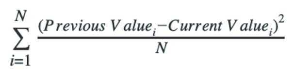
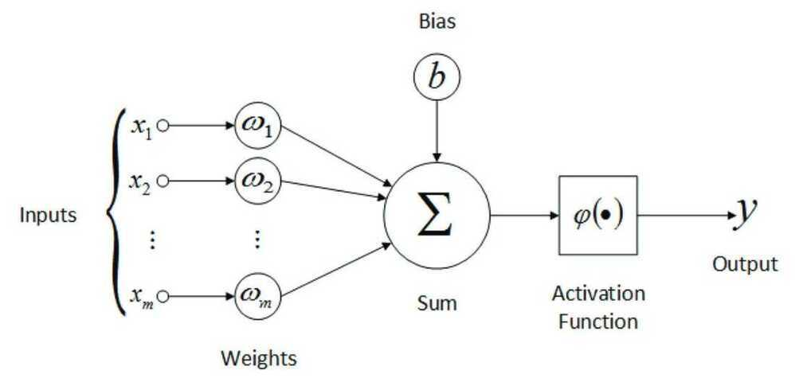

# Questions

## Differentiate between univariate, bivariate, and multivariate analysis

Often, we have a model that uses multiple parameters to make a decision. The different types of analysis, according to the number of parameters, are as follows

- Univariate: Where only one parameter is important and considered.
- Bivariate: Where 2 parameters are used in the model.
- Multivariate: Where more than 2 parameters are used in creating a model.

## How would you deal with a dataset containing variables with 30% missing values?

If we see missing values in a large dataset, we can simply remove those variables since it would make a very insigni‑cant change to the overall model. But for smaller datasets, with barely sucient information, this 30% can also be crucial. For this, we can ‑ll in the gaps using an average of the already available data.

## What is dimensionality reduction?

When you have an exhaustive dataset, it is often advised to use a dimensionality reduction method and eliminate a few parameters. This helps lower the computation power during the algorithm's execution and decreases the storage space for the dataset. Redundant information can be eliminated using dimensionality reduction. Some techniques are Low Variance Filter, High Correlation Filter, and Principal Component Analysis.

## How should you maintain a deployed model?

To maintain a deployed model you should follow 4 steps;Monitor: If you have a feedback system, one misstep in the model can lead it down the wrong path, which further diverges with each decision. So constantly monitoring for errors should be a priority.Evaluate: your model and check if you can develop a more re‑ned model with the new inferences made by your computer.Compare: Measure your older model to your newer one to see which one performs better.Rebuild: Lastly, you can rebuild your model to overcome the inaccuracies.

## What are recommender systems?

Often in well-known websites, you see that they post recommended items. For example, according to your searches, YouTube will recommend videos according to your previously watched series, and Amazon will recommend items. These systems use a series of parameters to guess how a user will rate a speci‑c item. There are 2 broad classi‑cations of the types of parameters used by a recommender system; collaborative ‑ltering and content-based. Collaborative ‑ltering system makes use of the behavior of other users. For instance, if you watch a movie, the system will recommend other movies that people who watched the ‑rst movie also liked. Content-based ‑ltering system suggests items according to a user pro‑le they create. For example, they may record your age and gender and recommend clothing depending on these factors.

## How would you find RMSE and MSE in a linear regression model?

When using your machine learning algorithm, you will have errors. It is important to quantify these errors to understand to what degree you must shift your algorithm for better results. MSE and RMSE are 2 such means.MSE is Mean Squared Error and is calculated by the following formula

The RMSE, which is the Root Mean Squared Error, is just the square root of the MSE but has the same unit as the results, which makes it easier to measure.

## How would you select the 'K' for K-means?

The 'K' in K-means clustering is the number of clusters formed. To ‑nd the optimal number, there are various methods we can use.Elbow method: Firstly, create a clustering algorithm for different values of K, then compute the within-cluster sum of squares (WSS) for each. Plot this in a graph, and you will observe a bend in the curve (elbow). The location of the bend is the ideal number

## What is the significance of the p-value?

The p-value is a threshold value which indicates if our initial null hypothesis is accurate or not. It is the probability of obtaining at least the extreme values observed in our training dataset. A higher p-value indicates stronger reliability on the null hypothesis. The cut-off is 0.05.

## How would you deal with outliers?

Outliers are any values that show a signi‑cant difference between the rest of the data given. They can come in various forms. An outlier can have incorrect value, for example, a character sequence for a distance, or can vary signi‑cantly from the rest of the data points; for example, if the rest of your data points lie within 0 - 10, an outlier can be the data point which lies at -1000. They can either be removed from the calculations, or different models can be used to ‑t the outliers into your algorithm. Even normalizing the data to encompass these extremes can be a solution.

## You have built a classification model of a cancer detection dataset with a 96% accuracy. Should you be satisfied?

In a system as relevant as a cancer detection model, accuracy can not de‑ne performance. Anything less than that can mean huge real-world consequences. So 96% is completely unsatisfactory. Here, still, 4% of the patients remain incorrectly diagnosed. So we should focus on this and decrease the error margin. Commonly used performance measures in the medical field are sensitivity and speci‑city.

## Vectors

A vector is**a tuple of one or more values called scalars.** Vectors are built from components, which are ordinary numbers. You can think of a vector as a list of numbers, and vector algebra as operations performed on the numbers in the list.

https://machinelearningmastery.com/gentle-introduction-vectors-machine-learning

## What are the feature vectors?

Our data can come in various forms. Each object may contain a multitude of different characteristics. To define this mathematically so that machines can compute them, we need feature vectors. They are n (number of characteristics of each object) dimensional vectors that help us identify a unique object.

## What is root cause analysis?

Root cause analysis is a problem-solving technique used to find the main problem with a certain process. It was initially used to find causes of accidents in the workplace, but since evolved into a mechanism for identifying and eliminating inaccuracies in machine learning algorithms. It uses various tools and methods to find the major fault and remove it to develop the algorithm further.

## Explain cross-validation

During the training phase of a machine learning model, we will often have to keep evaluating the accuracy of the algorithm. These are used to test the model on how it will react with real-time problems. The training data itself is broken down into 2 sets, i.e. the training data source and the evaluation data source. The sets are repeatedly resampled. This is cross-validation. It is used to observe issues like overfitting and remove them before deployment.

In order to evaluate our models, we must reserve a portion of the annotated data for the test set. As we already mentioned, if the test set is too small, then our evaluation may not be accurate. However, making the test set larger usually means making the training set smaller, which can have a significant impact on performance if a limited amount of annotated data is available.

One solution to this problem is to perform multiple evaluations on different test sets, then to combine the scores from those evaluations, a technique known as cross-validation. In particular, we subdivide the original corpus into N subsets called folds. For each of these **folds**, we train a model using all of the data except the data in that fold, and then test that model on the fold. Even though the individual folds might be too small to give accurate evaluation scores on their own, the combined evaluation score is based on a large amount of data, and is therefore quite reliable.

A second, and equally important, advantage of using cross-validation is that it allows us to examine how widely the performance varies across different training sets. If we get very similar scores for all N training sets, then we can be fairly confident that the score is accurate. On the other hand, if scores vary widely across the N training sets, then we should probably be skeptical about the accuracy of the evaluation score.

## Do gradient descent methods always converge at a given point?

Gradient descent is a mechanism to ‑nd the lowest point to reduce the algorithm's function to optimize it further. But it uses a method that checks all the local neighbors, and if it ‑nds any neighbor that is not lower than itself, it reaches the minimum value. But this can often be a local minimum and not the global minima, which is required. In the image below if we started searching for the minima from the extreme left, then we would reach the local minima and see that the next point is higher than the current one and the algorithm would stop and claim that this local minima is the lowest point.

## What are the drawbacks of a linear model?

The major drawback to a linear model is its divergence from the real world. In the real world, we will rarely see linear relationships between objects. Linear models also are highly susceptible to noise. Unless dealt with manually, outliers have a serious effect on linear regression.

## What are artificial neural networks?

When building an AI model, we try to replicate the human brain. The human brain comprises millions of neurons, constantly firing and passing information between each other. Artificial neural nets simulate this construction. They use a network of neurons, generally with a feedback system, to improve and predict future outcomes. The way ANNs work is each node has an input, output and initial weight assigned to them. Then using the feedback mechanism the weights are adjusted to get more accurate results.

## Why is resampling done?

Once we have sampled our data, we can use this set to find patterns in the data. But this is a very rigid method. There may be patterns we are overlooking if we only have one sample. In this case, we use resampling methods. They are used to validate our findings from the previous sample or adjust our model if inaccuracies are observed.
