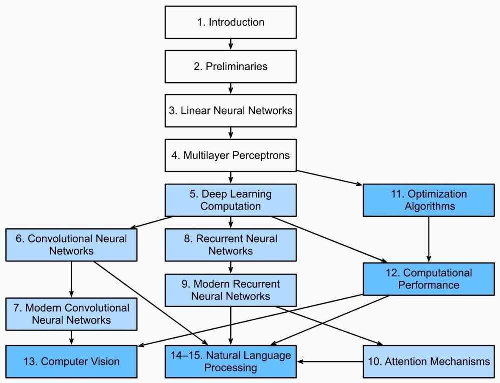

# Table of contents

## Preface - https://d2l.ai/chapter_preface/index.html

## Notation - https://d2l.ai/chapter_notation/index.html

[3. Linear Neural Networks](https://d2l.ai/chapter_linear-networks/index.html)

[3.1. Linear Regression](https://d2l.ai/chapter_linear-networks/linear-regression.html)

[3.2. Linear Regression Implementation from Scratch](https://d2l.ai/chapter_linear-networks/linear-regression-scratch.html)

[3.3. Concise Implementation of Linear Regression](https://d2l.ai/chapter_linear-networks/linear-regression-concise.html)

[3.4. Softmax Regression](https://d2l.ai/chapter_linear-networks/softmax-regression.html)

[3.5. The Image Classification Dataset](https://d2l.ai/chapter_linear-networks/image-classification-dataset.html)

[3.6. Implementation of Softmax Regression from Scratch](https://d2l.ai/chapter_linear-networks/softmax-regression-scratch.html)

[3.7. Concise Implementation of Softmax Regression](https://d2l.ai/chapter_linear-networks/softmax-regression-concise.html)

[4. Multilayer Perceptrons](https://d2l.ai/chapter_multilayer-perceptrons/index.html)

[4.1. Multilayer Perceptrons](https://d2l.ai/chapter_multilayer-perceptrons/mlp.html)

[4.2. Implementation of Multilayer Perceptrons from Scratch](https://d2l.ai/chapter_multilayer-perceptrons/mlp-scratch.html)

[4.3. Concise Implementation of Multilayer Perceptrons](https://d2l.ai/chapter_multilayer-perceptrons/mlp-concise.html)

[4.4. Model Selection, Underfitting, and Overfitting](https://d2l.ai/chapter_multilayer-perceptrons/underfit-overfit.html)

[4.5. Weight Decay](https://d2l.ai/chapter_multilayer-perceptrons/weight-decay.html)

[4.6. Dropout](https://d2l.ai/chapter_multilayer-perceptrons/dropout.html)

[4.7. Forward Propagation, Backward Propagation, and Computational Graphs](https://d2l.ai/chapter_multilayer-perceptrons/backprop.html)

[4.8. Numerical Stability and Initialization](https://d2l.ai/chapter_multilayer-perceptrons/numerical-stability-and-init.html)

[4.9. Environment and Distribution Shift](https://d2l.ai/chapter_multilayer-perceptrons/environment.html)

[4.10. Predicting House Prices on Kaggle](https://d2l.ai/chapter_multilayer-perceptrons/kaggle-house-price.html)

[5. Deep Learning Computation](https://d2l.ai/chapter_deep-learning-computation/index.html)

[5.1. Layers and Blocks](https://d2l.ai/chapter_deep-learning-computation/model-construction.html)

[5.2. Parameter Management](https://d2l.ai/chapter_deep-learning-computation/parameters.html)

[5.3. Deferred Initialization](https://d2l.ai/chapter_deep-learning-computation/deferred-init.html)

[5.4. Custom Layers](https://d2l.ai/chapter_deep-learning-computation/custom-layer.html)

[5.5. File I/O](https://d2l.ai/chapter_deep-learning-computation/read-write.html)

[5.6. GPUs](https://d2l.ai/chapter_deep-learning-computation/use-gpu.html)

[6. Convolutional Neural Networks](https://d2l.ai/chapter_convolutional-neural-networks/index.html)

[6.1. From Fully-Connected Layers to Convolutions](https://d2l.ai/chapter_convolutional-neural-networks/why-conv.html)

[6.2. Convolutions for Images](https://d2l.ai/chapter_convolutional-neural-networks/conv-layer.html)

[6.3. Padding and Stride](https://d2l.ai/chapter_convolutional-neural-networks/padding-and-strides.html)

[6.4. Multiple Input and Multiple Output Channels](https://d2l.ai/chapter_convolutional-neural-networks/channels.html)

[6.5. Pooling](https://d2l.ai/chapter_convolutional-neural-networks/pooling.html)

[6.6. Convolutional Neural Networks (LeNet)](https://d2l.ai/chapter_convolutional-neural-networks/lenet.html)

[7. Modern Convolutional Neural Networks](https://d2l.ai/chapter_convolutional-modern/index.html)

[7.1. Deep Convolutional Neural Networks (AlexNet)](https://d2l.ai/chapter_convolutional-modern/alexnet.html)

[7.2. Networks Using Blocks (VGG)](https://d2l.ai/chapter_convolutional-modern/vgg.html)

[7.3. Network in Network (NiN)](https://d2l.ai/chapter_convolutional-modern/nin.html)

[7.4. Networks with Parallel Concatenations (GoogLeNet)](https://d2l.ai/chapter_convolutional-modern/googlenet.html)

[7.5. Batch Normalization](https://d2l.ai/chapter_convolutional-modern/batch-norm.html)

[7.6. Residual Networks (ResNet)](https://d2l.ai/chapter_convolutional-modern/resnet.html)

[7.7. Densely Connected Networks (DenseNet)](https://d2l.ai/chapter_convolutional-modern/densenet.html)

[8. Recurrent Neural Networks](https://d2l.ai/chapter_recurrent-neural-networks/index.html)

[8.1. Sequence Models](https://d2l.ai/chapter_recurrent-neural-networks/sequence.html)

[8.2. Text Preprocessing](https://d2l.ai/chapter_recurrent-neural-networks/text-preprocessing.html)

[8.3. Language Models and the Dataset](https://d2l.ai/chapter_recurrent-neural-networks/language-models-and-dataset.html)

[8.4. Recurrent Neural Networks](https://d2l.ai/chapter_recurrent-neural-networks/rnn.html)

[8.5. Implementation of Recurrent Neural Networks from Scratch](https://d2l.ai/chapter_recurrent-neural-networks/rnn-scratch.html)

[8.6. Concise Implementation of Recurrent Neural Networks](https://d2l.ai/chapter_recurrent-neural-networks/rnn-concise.html)

[8.7. Backpropagation Through Time](https://d2l.ai/chapter_recurrent-neural-networks/bptt.html)

[9. Modern Recurrent Neural Networks](https://d2l.ai/chapter_recurrent-modern/index.html)

[9.1. Gated Recurrent Units (GRU)](https://d2l.ai/chapter_recurrent-modern/gru.html)

[9.2. Long Short-Term Memory (LSTM)](https://d2l.ai/chapter_recurrent-modern/lstm.html)

[9.3. Deep Recurrent Neural Networks](https://d2l.ai/chapter_recurrent-modern/deep-rnn.html)

[9.4. Bidirectional Recurrent Neural Networks](https://d2l.ai/chapter_recurrent-modern/bi-rnn.html)

[9.5. Machine Translation and the Dataset](https://d2l.ai/chapter_recurrent-modern/machine-translation-and-dataset.html)

[9.6. Encoder-Decoder Architecture](https://d2l.ai/chapter_recurrent-modern/encoder-decoder.html)

[9.7. Sequence to Sequence Learning](https://d2l.ai/chapter_recurrent-modern/seq2seq.html)

[9.8. Beam Search](https://d2l.ai/chapter_recurrent-modern/beam-search.html)

[10. Attention Mechanisms](https://d2l.ai/chapter_attention-mechanisms/index.html)

[10.1. Attention Cues](https://d2l.ai/chapter_attention-mechanisms/attention-cues.html)

[10.2. Attention Pooling: Nadaraya-Watson Kernel Regression](https://d2l.ai/chapter_attention-mechanisms/nadaraya-watson.html)

[10.3. Attention Scoring Functions](https://d2l.ai/chapter_attention-mechanisms/attention-scoring-functions.html)

[10.4. Bahdanau Attention](https://d2l.ai/chapter_attention-mechanisms/bahdanau-attention.html)

[10.5. Multi-Head Attention](https://d2l.ai/chapter_attention-mechanisms/multihead-attention.html)

[10.6. Self-Attention and Positional Encoding](https://d2l.ai/chapter_attention-mechanisms/self-attention-and-positional-encoding.html)

[10.7. Transformer](https://d2l.ai/chapter_attention-mechanisms/transformer.html)

[11. Optimization Algorithms](https://d2l.ai/chapter_optimization/index.html)

[11.1. Optimization and Deep Learning](https://d2l.ai/chapter_optimization/optimization-intro.html)

[11.2. Convexity](https://d2l.ai/chapter_optimization/convexity.html)

[11.3. Gradient Descent](https://d2l.ai/chapter_optimization/gd.html)

[11.4. Stochastic Gradient Descent](https://d2l.ai/chapter_optimization/sgd.html)

[11.5. Minibatch Stochastic Gradient Descent](https://d2l.ai/chapter_optimization/minibatch-sgd.html)

[11.6. Momentum](https://d2l.ai/chapter_optimization/momentum.html)

[11.7. Adagrad](https://d2l.ai/chapter_optimization/adagrad.html)

[11.8. RMSProp](https://d2l.ai/chapter_optimization/rmsprop.html)

[11.9. Adadelta](https://d2l.ai/chapter_optimization/adadelta.html)

[11.10. Adam](https://d2l.ai/chapter_optimization/adam.html)

[11.11. Learning Rate Scheduling](https://d2l.ai/chapter_optimization/lr-scheduler.html)

[12. Computational Performance](https://d2l.ai/chapter_computational-performance/index.html)

[12.1. Compilers and Interpreters](https://d2l.ai/chapter_computational-performance/hybridize.html)

[12.2. Asynchronous Computation](https://d2l.ai/chapter_computational-performance/async-computation.html)

[12.3. Automatic Parallelism](https://d2l.ai/chapter_computational-performance/auto-parallelism.html)

[12.4. Hardware](https://d2l.ai/chapter_computational-performance/hardware.html)

[12.5. Training on Multiple GPUs](https://d2l.ai/chapter_computational-performance/multiple-gpus.html)

[12.6. Concise Implementation for Multiple GPUs](https://d2l.ai/chapter_computational-performance/multiple-gpus-concise.html)

[12.7. Parameter Servers](https://d2l.ai/chapter_computational-performance/parameterserver.html)

[16. Recommender Systems](https://d2l.ai/chapter_recommender-systems/index.html)

[16.1. Overview of Recommender Systems](https://d2l.ai/chapter_recommender-systems/recsys-intro.html)

[16.2. The MovieLens Dataset](https://d2l.ai/chapter_recommender-systems/movielens.html)

[16.3. Matrix Factorization](https://d2l.ai/chapter_recommender-systems/mf.html)

[16.4. AutoRec: Rating Prediction with Autoencoders](https://d2l.ai/chapter_recommender-systems/autorec.html)

[16.5. Personalized Ranking for Recommender Systems](https://d2l.ai/chapter_recommender-systems/ranking.html)

[16.6. Neural Collaborative Filtering for Personalized Ranking](https://d2l.ai/chapter_recommender-systems/neumf.html)

[16.7. Sequence-Aware Recommender Systems](https://d2l.ai/chapter_recommender-systems/seqrec.html)

[16.8. Feature-Rich Recommender Systems](https://d2l.ai/chapter_recommender-systems/ctr.html)

[16.9. Factorization Machines](https://d2l.ai/chapter_recommender-systems/fm.html)

[16.10. Deep Factorization Machines](https://d2l.ai/chapter_recommender-systems/deepfm.html)

[17. Generative Adversarial Networks](https://d2l.ai/chapter_generative-adversarial-networks/index.html)

[17.1. Generative Adversarial Networks](https://d2l.ai/chapter_generative-adversarial-networks/gan.html)

[17.2. Deep Convolutional Generative Adversarial Networks](https://d2l.ai/chapter_generative-adversarial-networks/dcgan.html)

[**https://d2l.ai/**](https://d2l.ai/)

[Learning To See](https://www.youtube.com/playlist?list=PLiaHhY2iBX9ihLasvE8BKnS2Xg8AhY6iV)

[The Math of Intelligence](https://www.youtube.com/playlist?list=PL2-dafEMk2A7mu0bSksCGMJEmeddU_H4D)

[Machine Learning with Python](https://www.youtube.com/playlist?list=PLQVvvaa0QuDfKTOs3Keq_kaG2P55YRn5v)

AI Conferences

[Artificial Intelligence Search Methods For Problem Solving](https://www.youtube.com/playlist?list=PLyqSpQzTE6M8N9lDWllq6NqB5dmpy6gtc)
