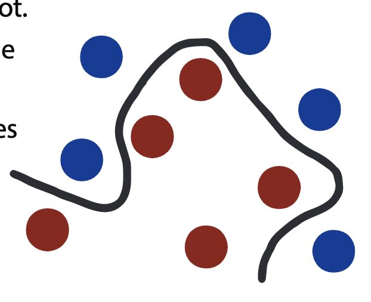

# bias-variance trade-off

Machine learning algorithms can best be understood through the lens of the **bias-variance trade-off.**

Bias are the simplifying assumptions made by a model to make the target function easier to learn.

Generally, parametric algorithms have a high bias making them fast to learn and easier to understand but generally less flexible. In turn, they have lower predictive performance on complex problems that fail to meet the simplifying assumptions of the algorithms bias.

Decision trees are an example of a low bias algorithm, whereas linear regression is an example of a high-bias algorithm.

Variance is the amount that the estimate of the target function will change if different training data was used. The target function is estimated from the training data by a machine learning algorithm, so we should expect the algorithm to have some variance, not zero variance.

The k-Nearest Neighbors algorithm is an example of a high-variance algorithm, whereas Linear Discriminant Analysis is an example of a low variance algorithm.

The support vector machine algorithm has low bias and high variance, but the trade-off can be changed by increasing the C parameter that influences the number of violations of the margin allowed in the training data which increases the bias but decreases the variance.

The goal of any predictive modelingmachine learning algorithm is to achieve low bias and low variance. In turn, the algorithm should achieve good prediction performance. The parameterization of machine learning algorithms is often a battle to balance out bias and variance.

- Increasing the bias will decrease the variance.
- Increasing the variance will decrease the bias.

## Kernel

How would you draw a linear line to cluster the red balls togetherand separate them from the blue balls? You cannot.When working with datasets, you may often come across mismatching data inseparable using the available dimensions. A kernel function introduces a new dimension, which can be used to distinguish the different data points.

## What is the bias-variance tradeoff?

Bias is when training datasets provided to the machine learning algorithm is specific to a single case or a small number of cases. This prevents the model from including all different kinds of cases that lead to under-fitting.

Variance is when you provide highly fluctuating datasets, which include noise. This can lead to a sensitive machine learning model leading to over-fitting.

The ideal machine learning model consists of a balance of low bias and low variance for the best prediction. This sweet spot is called the bias-variance tradeoff. We can use cross-validation to check the accuracy of the dataset. Here the dataset is broken down into a large training set and a smaller testing set. They are constantly resampled to improve the algorithm.

## What is selection bias?

Selection bias occurs when we are selecting the initial data to be fed into the machine for training. When the data is chosen, so that true randomization is not achieved, it is called selection bias. If this is not identifed and corrected quickly, it can provide inaccurate information about the dataset.

The types of selection bias include:

1. **Sampling bias:** It is a systematic error due to a non-random sample of a population causing some members of the population to be less likely to be included than others resulting in a biased sample.

2. **Time interval:** A trial may be terminated early at an extreme value (often for ethical reasons), but the extreme value is likely to be reached by the variable with the largest variance, even if all variables have a similar mean.

3. **Data:** When specific subsets of data are chosen to support a conclusion or rejection of bad data on arbitrary grounds, instead of according to previously stated or generally agreed criteria.

4. **Attrition:** Attrition bias is a kind of selection bias caused by attrition (loss of participants) discounting trial subjects/tests that did not run to completion.

## How to avoid overfitting and underfitting?

Overfitting results from too many parameters are found to be used accurately and the correct relationship between the data. This can be combated using 'generalization.' Here, the dataset is broadened by giving more generic data to the model.

Underfitting is when too little parameters are found to be used to categorize the data. To eliminate this, just increase the number of parameters or the complexity of the model.
