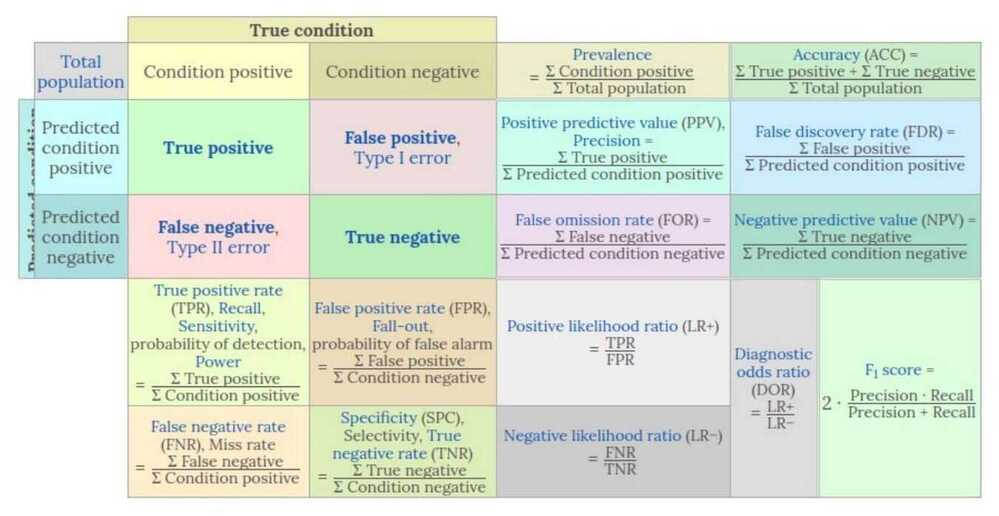
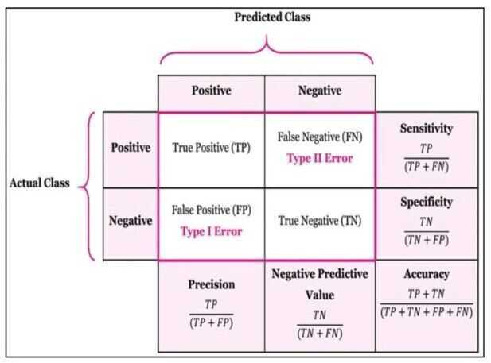
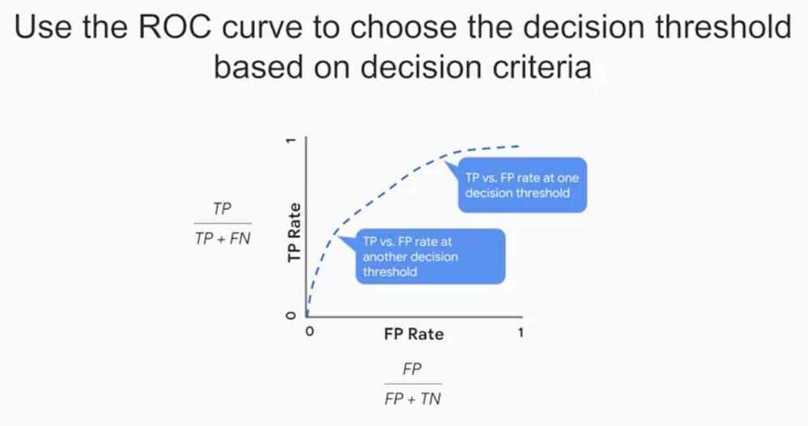
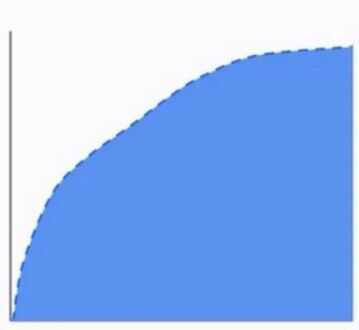

# Confusion Matrix

The confusion matrix shows - The observations broken down by actual classes and predicted classes

Accuracy - The sum of true positives and true negatives, divided by the total number of observations

What is the relationship between the confusion matrix and the area under the receiver operating characteristic curve? - Each point from the curve represents a confusion matrix.

Choose your evaluation metrics in light of acceptable tradeoffs between False Positives and False Negatives

## Evaluating Models

### Basic measures derived from the confusion matrix

1. Error Rate = (FP+FN)/(P+N)
2. Accuracy = (TP+TN)/(P+N)
3. Sensitivity (Recall or True positive rate) = TP/P
4. False negative rate = FP/(FN+TP) or FP/P

    False negative rate is the fraction of true faces that are not detected by the ML system

5. Specificity (True negative rate) = TN/N
6. Precision (Positive predicted value) = TP/(TP+FP)

    An increase in False Positives would drive down precision

7. False postitive rate = FP/(FP+TN)

    False positive rate is the fraction of the faces that the ML model detects that are not really faces

8. F-Score (Harmonic mean of precision and recall) = (1+b)(PREC.REC)/(b2PREC+REC) where b is commonly 0.5, 1, 2
9. Tradeoffs

    Sometimes false positives are better than false negatives or vice versa

## Receiver Operating Characteristic (ROC) Curve

The ROC curve plots - the true positives as a function of false positives.

An ROC curve is a graph showing the performance of a classification model at all classification thresholds. This curve plots two parameters:

- True Positive Rate
- False Positive Rate

<https://developers.google.com/machine-learning/crash-course/classification/roc-and-auc>

<https://towardsdatascience.com/understanding-auc-roc-curve-68b2303cc9c5>

## Area Under Curve (AUC)

The AUC provides an aggregate measure of performance across all possible classification thresholds

- AUC helps us to choose between models when we don't know what decision threshold is going to be ultimately used
- If we pick a random positive and a random negative, what't the probability my model scores them in the correct relative order?

## Precision-Recall Curve (PR Curve)

Precision-recall curves plot the positive predictive value (PPV, y-axis) against the true positive rate (TPR, x-axis). These quantities are defined as follows:

precision = 𝑃𝑃𝑉 = 𝑇𝑃 / (𝑇𝑃+𝐹𝑃)

recall = TPR = TP / (TP+FN)

Since precision-recall curves do not consider true negatives, they should only be used [when specificity is of no concern for the classifier](https://www.datascienceblog.net/post/machine-learning/specificity-vs-precision/).

<https://www.datascienceblog.net/post/machine-learning/interpreting-roc-curves-auc>

<https://www.datascienceblog.net/post/machine-learning/specificity-vs-precision>

<https://machinelearningmastery.com/roc-curves-and-precision-recall-curves-for-imbalanced-classification>

<https://machinelearningmastery.com/roc-curves-and-precision-recall-curves-for-classification-in-python>
