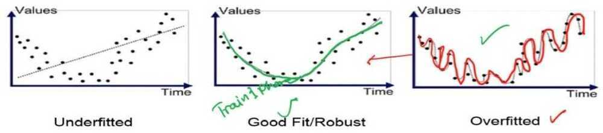
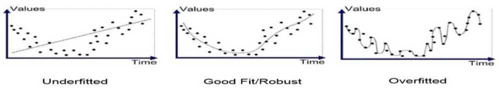
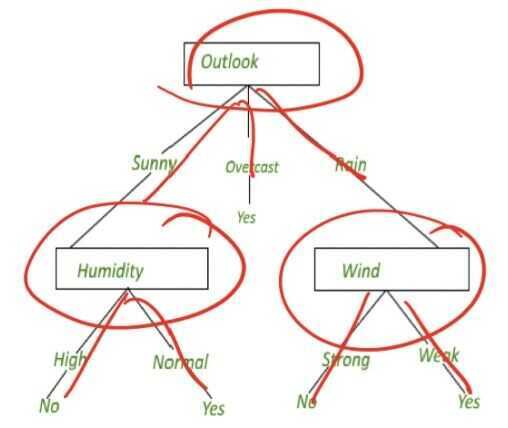
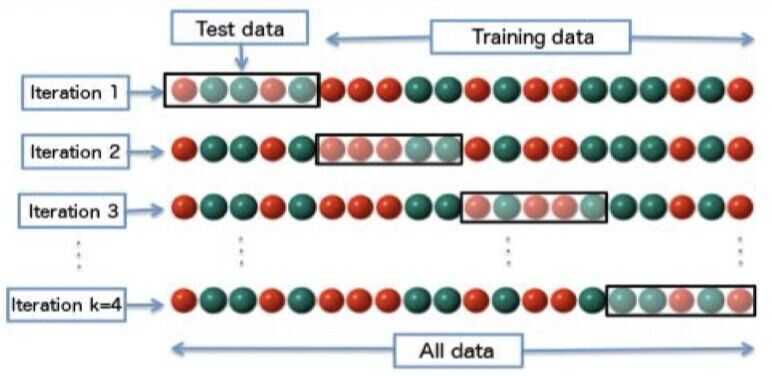

# Evaluation

- Generalization and overfitting
- Overfitting in decision trees
- Validation set
- Metrics to evaluate model performance
- Machine learning tool
- Classification in spark

## Generalization and Overfitting

## Errors in Classification

- Recall that a machine learning model maps the input it receives to an output. For a classification model, the model's output is the predicted class label for the input variables and the true clas label is the target
- Then if the classifier predicts the correct classes label for a sample, that is a success. If the predicted class label is different from the true class label, then that is an error.
- The error rate, then, is the percentage of errors made over the entire data set. That is, it is the number of errors divided by the total number of samples in a data set
- Error rate is also known as misclassification rate, or simply error

- The model is built using training data and evaluated on test data. The training and test data are two different data sets. The goal in building a ML model is to have the model perform well on training, as well as test data.
- Error rate, or simply error, on the training data is referred to as training error, and the error on test data is referred to as test error. The error on the test data is an indication of how well the classifier will perform on new data.

## Generalization

- Generalization refers to how well your model performs on new data, that is data not used to train the model
- You want your model to generalize well to new data. If your model generalizes well, then it will perform on data sets that are similar in structure to the training data, but doesn't contain exactly the same samples as in the training set
- Since the test error indicates how well your model generalizes to new data, note that the test error is also called generalization error

## Overfitting

- A related concept to generalization is overfitting. If your model has very low training error but high generalization error, then it is overfitting
- This means that the model has learned to model the noise in the training data, instead of learning the underlying structure of the data

## Connection between overfitting and generalization

- A model that overfits will not generalize well to new data
- So the model will do well on just the data it was trained on, but given a new data set, it will perform poorly
- A classifier that performs well on just the training data set will not be very useful. So it is essential that the goal of good generalization performance is kept in mind when building a model

Overfitting and Underfitting

- Overfitting occurs when the model is fitting to the noise in the training data. This results in low training error and high test error
- Underfitting on the other hand, occurs when the model has not learned the structure of the data. This results in high training error and high test error
- Both are undesirable, since both mean that the model will not generalize well to new data. Overfitting generally occurs when a model is too complex, that is, it has too many parameters relative to the number of training samples. So to avoid overfitting, the model needs to be kept as simple as possible, and yet still solve the input/output mapping for the given data set

## What causes overfitting

- In summary, overfitting is when your model has learned the noise in the training data instead of the underlying structure of the data. You want to avoid overfitting so that your model will generalize well to new data

## Overfitting in Decision Trees

- A decision tree, also referred to as tree induction, the tree repeatedly splits the data in a node in order to get successively paired subsets of data

- Note that a decision tree classifier can potentially expand its nodes until it can perfectly classify samples in the training data
- But if the tree grows node to fit the noise in the training data, then it will not classify a new sample well
- This is because the tree has partitioned the input space according to the noise in the data instead of to the true structure of a data. In other words, it has overfit

## Avoiding Overfitting in Decision Trees

Two methods

## Pre-pruning

- With pre-pruning, the idea is to stop tree induction before a fully grown tree is built that perfectly fits the training data
- To do this, restrictive stopping conditions for growing nodes must be used. For example, a nose stops expanding if the number of samples in the node is less than some minimum threshold
- Another example is to stop expanding a note if the improvement in the impurity measure falls below a certain threshold

## Post-pruning

- In post-pruning, the tree is grown to its maximum size, then the tree is pruned by removing nodes using a bottom up approach
- That is, the tree is trimmed starting with the leaf nodes. The pruning is done by replacing a subtree with a leaf node if this improves the generalization error, or if there is no change to the generalizatoin error with his replacement

## Overfitting in Decision Trees

- In other words, if removing a subtree does not have a negative effect on the generalization error, then the nodes in that subtree only add to the complexity of the tree, and not to its overall performance
- So those nodes should be removed. In practice, post-pruning tends to give better results. This is because pruning decisions are based on information from the full tree. Pre-pruning, on the other hand, may stop the tree growing process prematurely. However, post-pruning is more computationally expensive since the tree has to be expanded to its full size

## Training vs Testing Phase

## Avoiding Overfitting

- Recall that a model that overfits does not generalize well to new data
- Recall also that overfitting generally occurs when a model is too complex
- So to have a model with good generalization performance, model training has to stop before the model gets too complex
- How to you determine when this should occur?

## Validation Set

- A validation set can be used to guide the training process to avoid overfitting and deliver good generalization performance
- We have discussed having a training set and a separate test set. The training set is used to build a model and the test set is used to see how the model performs a new data

## Training and Validation Error

- Now we want to further divide up the training data into a training set and a validation set
- The training set is used to train the model as before and the validation set is used to determine when to stop training the model to avoid overfitting, in order to get the best generalization performance

- The idea is to look at the errors on both training set and validation set during model training. The orange solid line on the plot is the training error and the green line is the validation error. We see that as model building progresses along the x-axis, the number of nodes increases. That is the complexity of the model increases. We can see that as the model complexity increases, the training error decreases. On the other hand, the validation error initially decreases but then starts to increase.
- When the validation error increases, this indicates that the model is overfitting, resulting in decreased generalization performance

## When to Stop Training?

This can be used to determine when to stop training. Where validation error starts to increase is when you get the best generalization performance, so training should stop there. This method of using a validation set to determine when to stop training is referred to as model selection since you're selecting one from many of varying complexities. Note that this was illustrated for a decision tree classifier, but the same method can be applied to any type of machine learning model

## Ways to create and use the validation set

- There are several ways to create and use the validation set to avoid overfitting. The different methods are
    - Holdout method
    - Random subsampling
    - K-fold cross-validation
    - Leave-one-out cross-validation

## Holdout Method

- The first way to use a validation set is the holdout method. This describes the scenario that we have been discussing, where part of the training data is reserved as a validation set. The validation set is then the holdout set

- Errors on the training set and the holdout set are calculated at each step during model training and plotted together as we've seen before. And the lowest error on the holdout set is when training should stop. This is the just the process that we have described here before. There's some limitations to the holdout method however
- First, since some samples are reserved for the holdout validation set, the training set now has less data than it originally started out with
- Secondly, if the training and holdout sets do not have the same data distributions, then the results will be misleading. For example, if the training data has many more samples of one class and the holdout dataset has many more samples of another class

## Repeated Holdout Method

- Repeating holdout method several times
- Randomly select different hold out set each iteration
- Average validation errors over all repetitions

## K-Fold Cross-Validation

- A way to improve on the repeated holdout method is use cross-validation. Cross-validation works as follows. Segment the data into k number of disjoing partitions. During each iteration, one partition is used as the validation set. Repeat the process k times. Each time using a different partition for validation. So each partition is used for validation exactly once. This is illustrated in this figure. In the first iteration, the first partition, is used for validation. In the second iteration, the second partition is used for validation and so on

- The overall validation error is calculated by averaging the validation errors for all k iterations
- The model with the smallest average validation error then is selected. The process we just described is referred to as k-fold cross-validation. This is a very commonly used approach to model selection in practice
- This approach gives you a more structured way to divide available data up between training and validation datasets and provides a way to overcome the variability in performance that you can get when using a single partitioning of the data

## Leave-One-Out Cross-Validation

- Leave-one-out cross-validation is a special case of k-fold cross-validation where k equals N, where N is the size of your dataset
- Here, for each iteration the validation set has exactly one sample. So the model is trained to using N minus one samples and is validated on the remaining sample
- The rest of the process works the same way as regular k-fold cross-validation
- Note that cross-validation is often abbreviated CV and leave-out cross-validation is in abbreviated L-O-O-C-C and pronounced LOOCV

## Uses of Validation Set

- Note that the validation error that comes out of this process can also be used to estimate generalization performance of the model
- In other words, the error on the validation set provides an estimate of the error on the test set

## Uses of Datasets

- With the addition of the validation set, you really need three distinct datasets when you build a model. Let's review these datasets
- The training dataset is used to train the model, that is to adjust the parameters of the model to learn the input to output mapping
- The validation dataset is used to determine when training should stop in order to avoid overfitting
- The test data set is used to evaluate the performance of the model on new data

- Note that the test data set should never, ever be used in any way to create or tune the model. It should not be used, for example, in a cross-validation process to determine when to stop training
- The test dataset must always remain independent from model training and remain untouched until the very end when all training has been completed. Note that in sampling the original dataset to create the training, validation, and test sets, all datasets must contain the same distribution of the target classes
- For example, if in the original dataset, 70% of the samples belong to one class and 30% to the other class, then this same distribution should approximately be present in each of the training, validation, and test sets. Otherwise, analysis results will be misleading

## Validation Set Summary

- We have discuss the need for three different datasets in building model. A training set of train the model, a validation set to determine when to stop training, and a test to evaluate performance on new data
- We learned how a validation set can be used to avoid overfitting and in the process, provide an estimate of generalization performance
- And we covered different ways to create and use a validation set such as k-fold cross-validation

## Metrics to Evaluate Model Performance

## Class Labels

## Types of Classification Errors

## Accuracy Rate

## Precision and Recall

- Precision is considered a measure of exactness because it calculates the percentage of samples predicted as positive, which are actually in a positive class
- Recall is considered a measure of completeness, because it calculates the percentage of positive samples that the model correctly identified

## F-Measure

https://en.wikipedia.org/wiki/F-score
