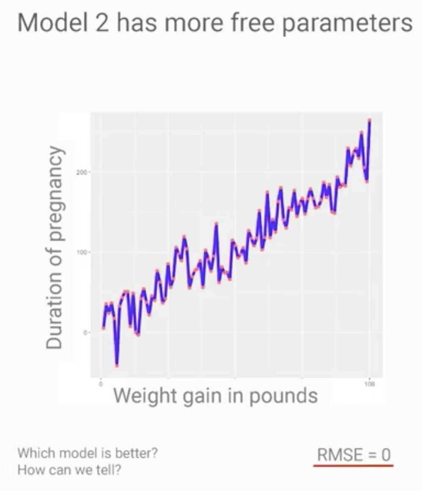
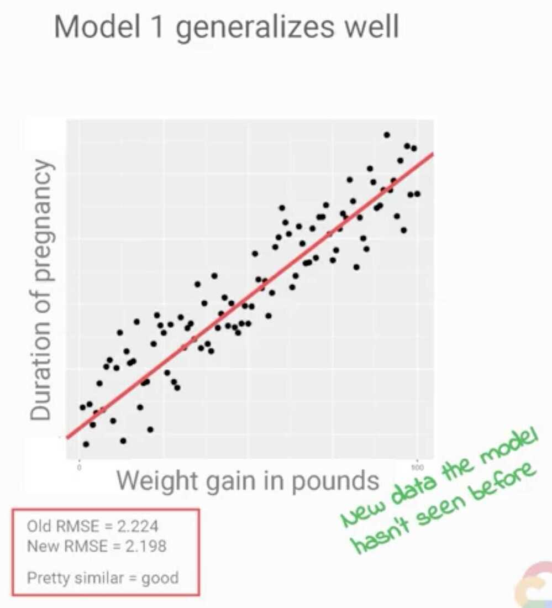
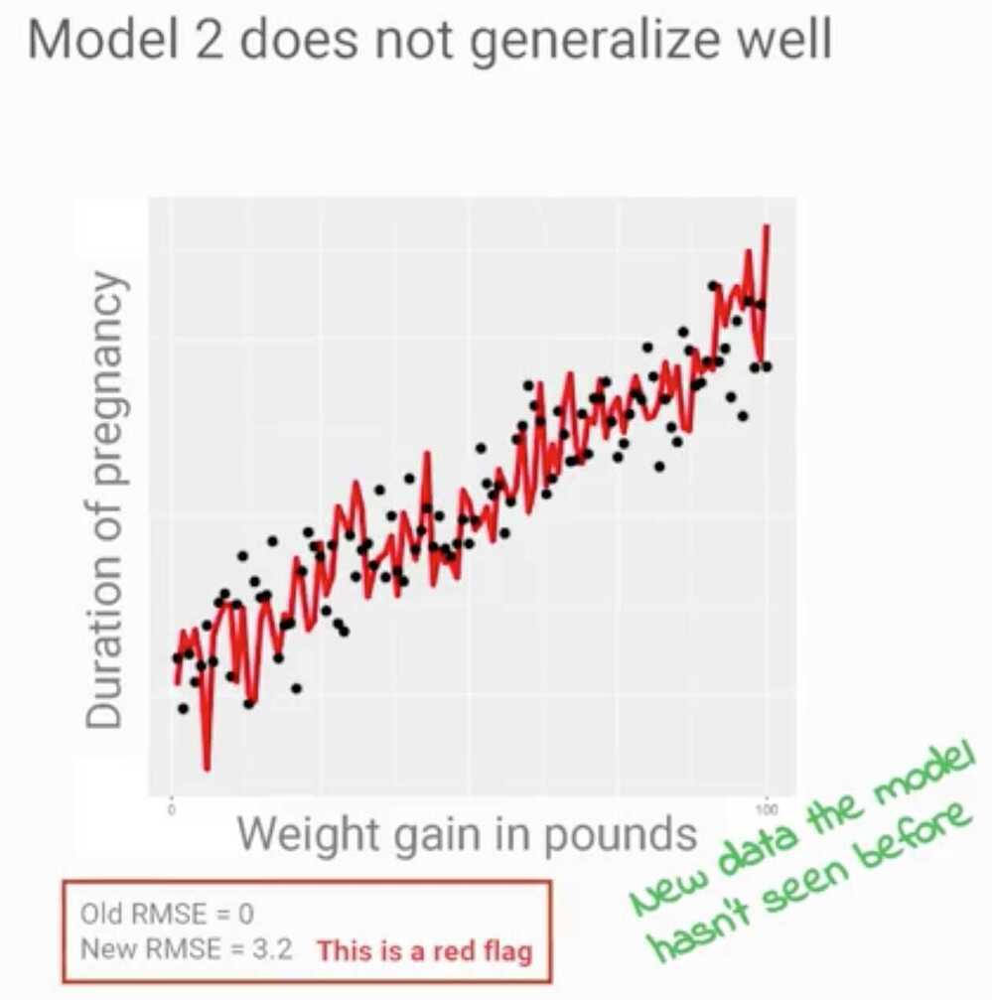
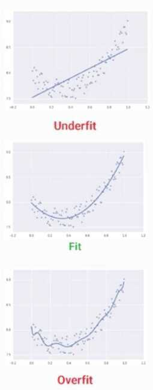
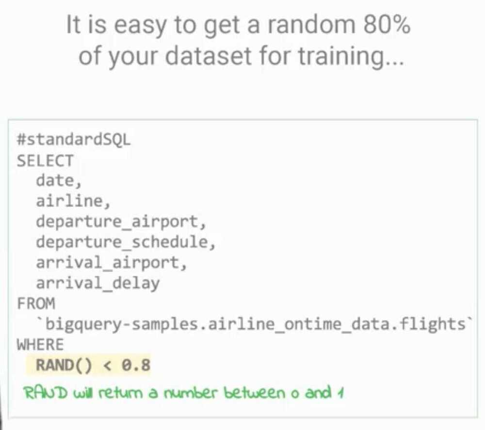
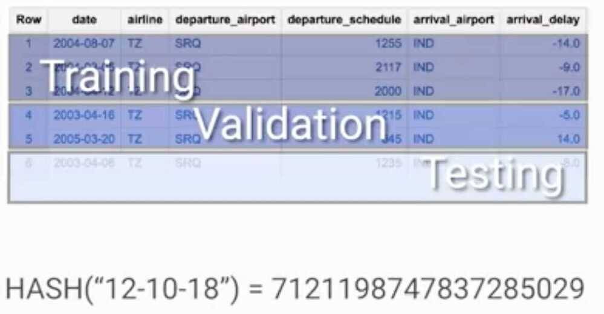

# Generalization and Sampling

## Learn how to

- Assess if your model is overfitting
- Gauge when to stop model training
- Create repeatable training, evaluation, and test datasets
- Establish performance benchmarks

## Loss Metrics

- MSE = Mean Squared Error
- RMSE = Root Mean Squared Error

## Summary

- Taking a derivative of our loss services as our guide towards a minima
- We could have more than one minima for complex services
- Loss functions
  - RMSE for regression problems
  - Cross entropy for classification

<https://machinelearningmastery.com/cross-entropy-for-machine-learning>

- Perfectly accurate model with an RMSE of zero, can perform badly against a set of new data that it had not seen before
- Generalization
- Data preparation
  - training
  - evaluation
  - testing
- Overfitting
- underfitting
- 
