# Optimization

## Learn how to

- Quantify model performance using loss function
- Use loss functions as the basis for an algorithm called gradient
- Optimize gradient descent to be as efficient as possible
- Use performance metrics to make business decisions

## Defining ML Models

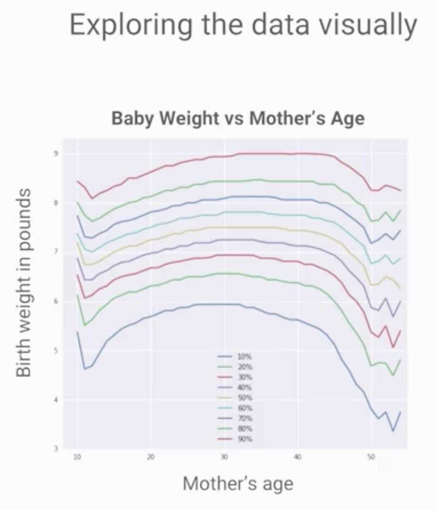

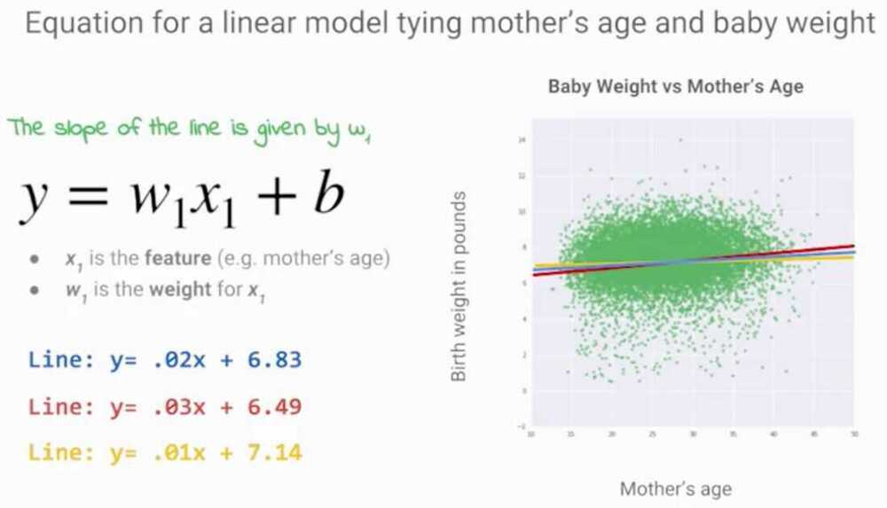

## Loss Functions

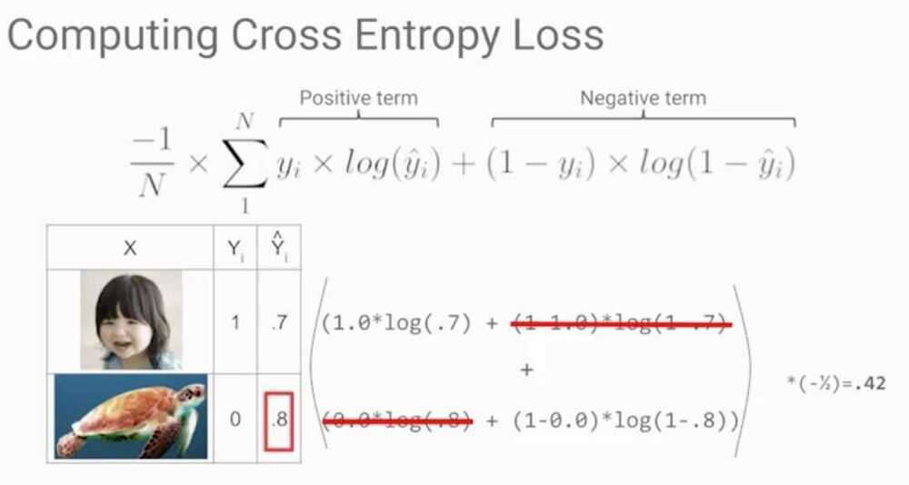

## Gradient Descent

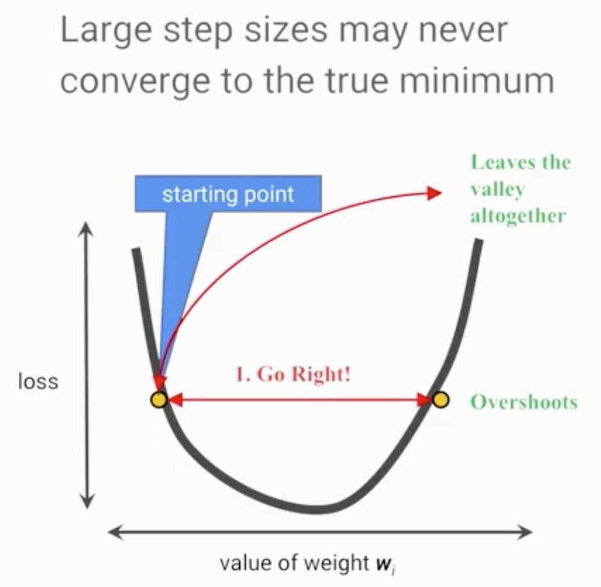

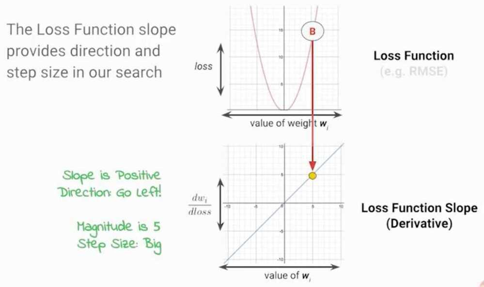

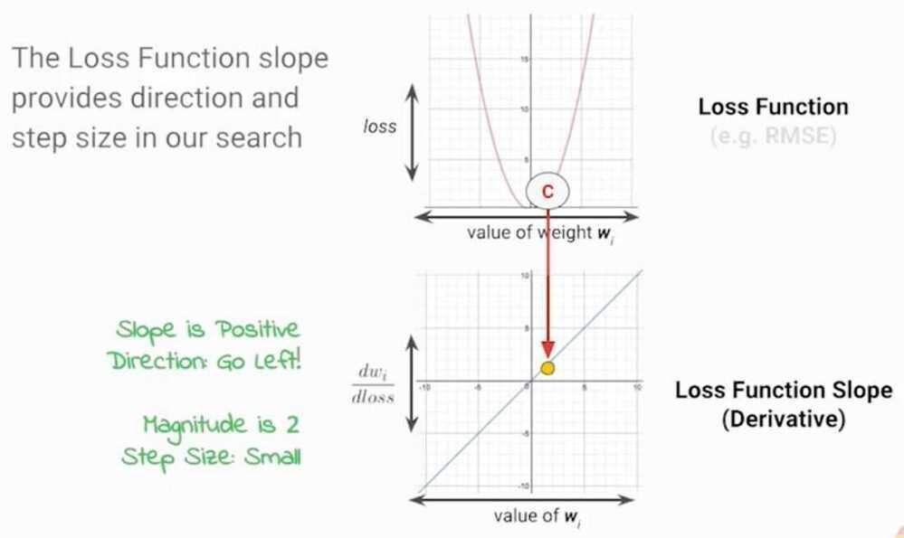

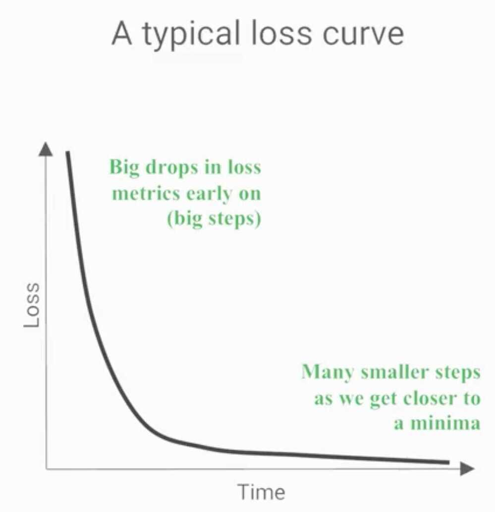

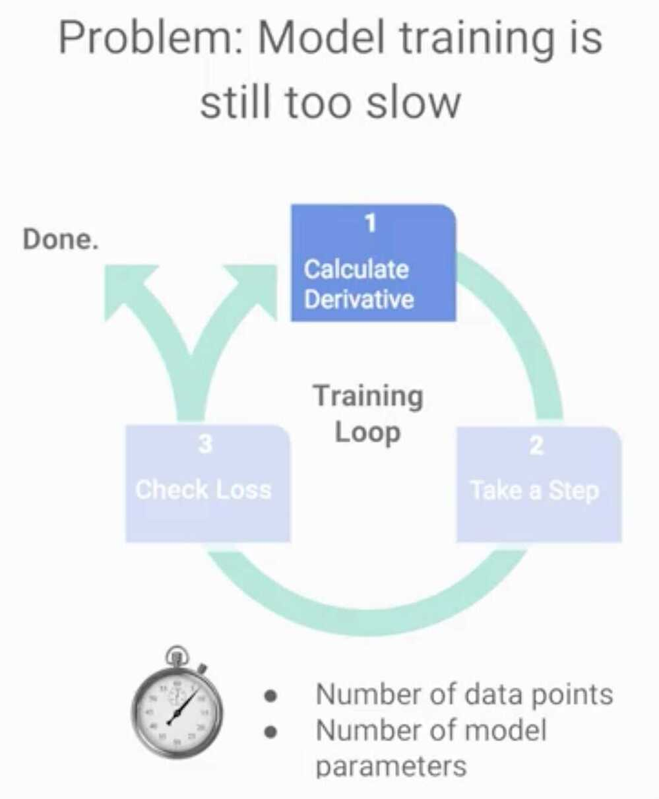

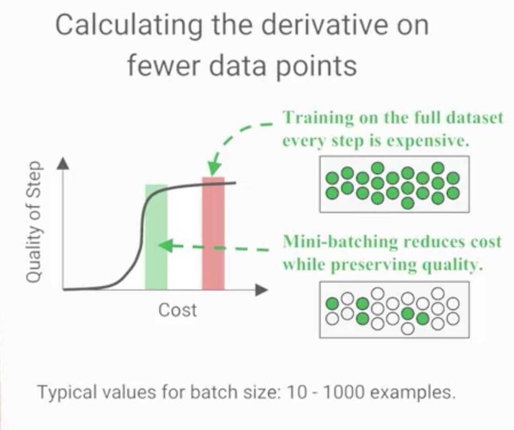

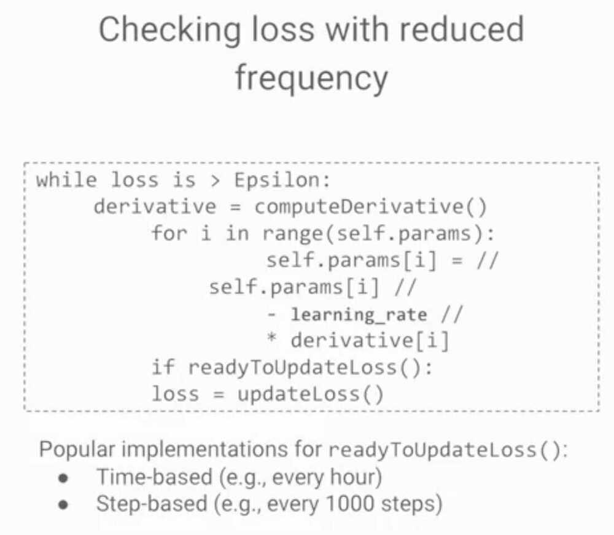

## TensorFlow Playground

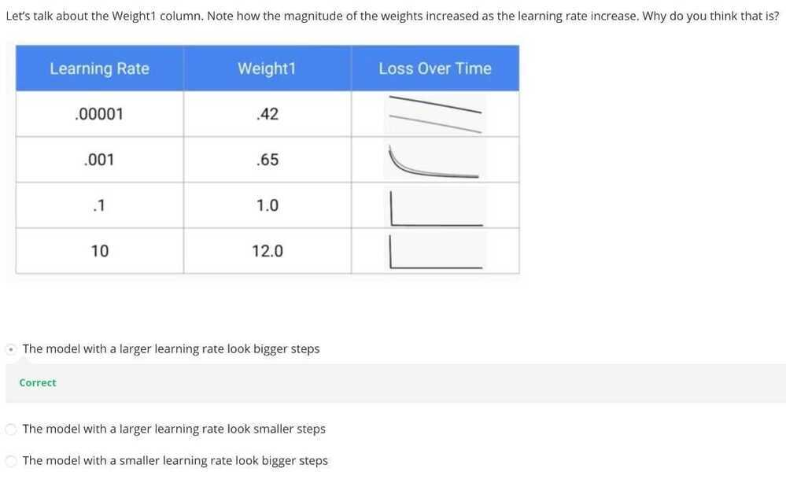

[**https://goo.gl/EEuEGp**](https://goo.gl/EEuEGp)

[**https://goo.gl/3pmeKj**](https://goo.gl/3pmeKj)

[**https://goo.gl/ou9iMB**](https://goo.gl/ou9iMB)

## Performance Metrics

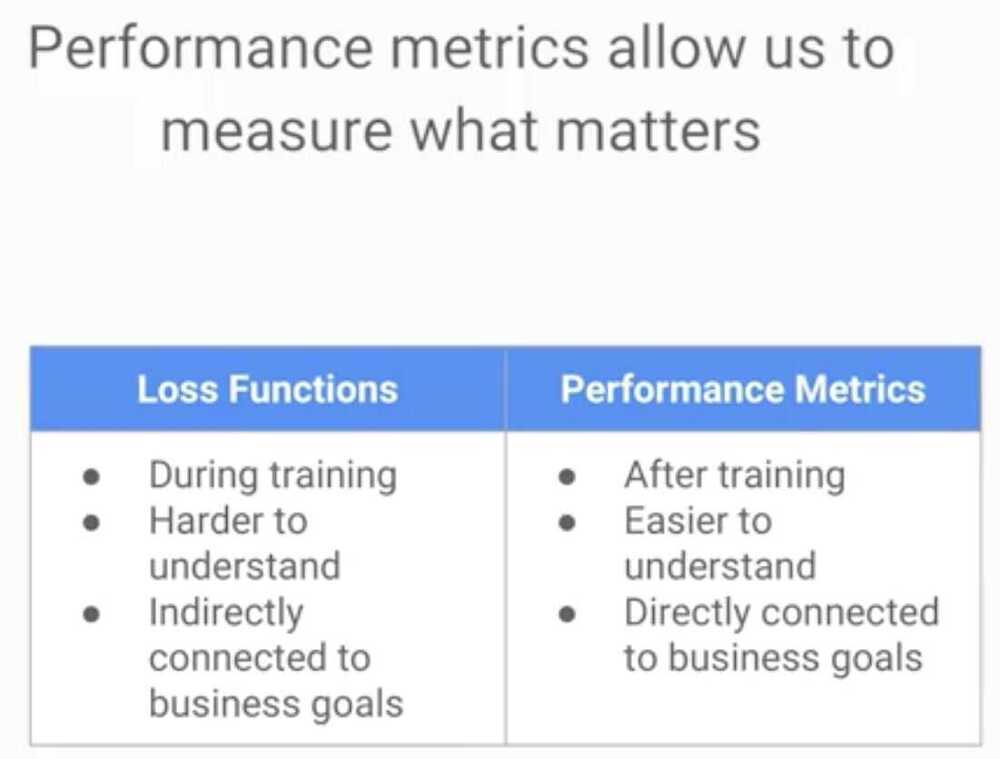
