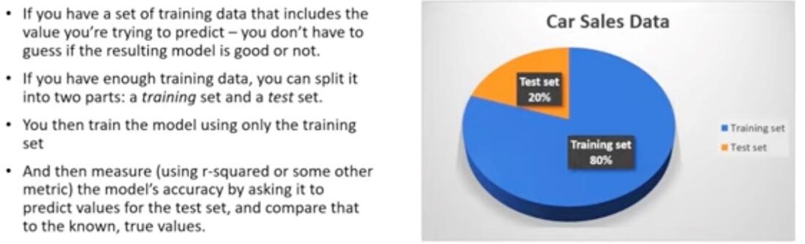

# Others

## K-S Model Evaluation

Kolmogorov-Smirnov

K-S or Kolmogorov-Smirnov chart measures performance of classification models. More accurately, K-S is a measure of the degree of separation between the positive and negative distributions.

<https://www.saedsayad.com/model_evaluation_c.htm>

## Out Of Time Validation

<https://towardsdatascience.com/why-isnt-out-of-time-validation-more-ubiquitous-7397098c4ab6>

## Evaluating Supervised Learning

## K-fold Cross Validation

One way to further protect against overfitting is K-fold cross validation

- Split your data into K randomly-assigned segments
- Reserve one segment as your test data
- Train on the remaining segments and measure performance against the test set
- Repeat, using each segment as the test data and the remaining data for training
- Take the average of the resulting accuracy scores

Using cross-validation will run the validation on multiple folds of the data, which reduces the overfitting.

<https://machinelearningmastery.com/k-fold-cross-validation>
