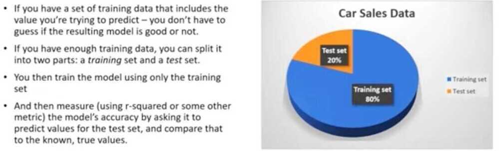

# Others

## K-S Model Evaluation

Kolmogorov-Smirnov

K-S or Kolmogorov-Smirnov chart measures performance of classification models. More accurately, K-S is a measure of the degree of separation between the positive and negative distributions.

<https://www.saedsayad.com/model_evaluation_c.htm>

## Out Of Time Validation

<https://towardsdatascience.com/why-isnt-out-of-time-validation-more-ubiquitous-7397098c4ab6>

## Evaluating Supervised Learning

## K-fold Cross Validation

