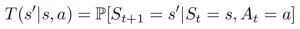
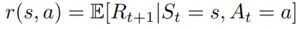

# 1. Markov Decision Process

## Introduction

- In Reinforcement Learning, an AI learns how to optimally interact in a real-time environment using the time-delayed labels, called rewards as a signal.

- The Markov Decision Process is a mathematical framework for defining the reinforcement learning problem using states, actions and rewards.

- Through interaction with the environment, an AI will learn a policy which will return an action for a given state with the highest reward

Markov Chain - has a set of states in a process that can move successively from one state to another, each move is a single step and is based on a transition model T that defines how to move from one state to the next

Markov Property - It states that given the present, the future is conditionally independent of the past, meaning the state in which the process is now, is dependent only on the state it was at one step ago

## Bellman Equation

- State - a numeric representation of what the agent is observing at a particular point of time in the environment
- Action - the input the agent provides to the environment, calculated by applying a policy to the current state
- Reward - a feedback signal from the environment reflecting how well the agent is performing the goals of the game

Goal of Reinforcement Learning

Given the current state we are in, choose the optimal action which will maximize the long-term expected reward provided by the environment.

Dynamic programming

- A class of algorithms, which seek to simplify complex problems, by breaking them up into sub-problems and solving the sub-problems recursively (by a function that calls itself)

What question does the Bellman equation answer?

- Given the state I'm in, assuming I take the best possible action now and at subsequent step, what long-term reward can I expect?
- What is the VALUE of the STATE?
- Helps us evaluate the expected reward relative to the advantage or disadvantage of each state

## Bellman Equation (For Deterministic Environments)

States that the expected long-term reward for a given action is equal to the immediate reward from the current action combined with the expected reward from the best future action taken at the following state.

## Y - Gamma is the discount factor

The discount variable allows us to decide how important the possible future rewards are compared to the present reward.

Gamma Tips

- It is important to tune this hyperparameter to get optimum results
- Successful values range between 0.9 to 0.99
- A lower value encourages short-term thinking
- A higher value emphasizes long-term rewards

## Markov Decision Processes

MDP is an approach in achieving reinforcement learning to take decisions in a matrix. The MDP tries to capture a world in the form of a grid by dividing it into states, actions, transition matrix, and rewards. The solution to an MDP is called a policy and the objective is to find the optimal policy for a task that MDP is imposed.

- **State**

AStateis a set of tokens that represent every condition that the agent can be in.

- **Model**

AModel(sometimes called Transition Model) gives an action's effect in a state. In particular, T(S, a, S') defines a transition T where being in state S and taking an action 'a' takes us to state S' (S and S' may be same). For stochastic actions (noisy, non-deterministic) we also define a probability P(S'|S,a) which represents the probability of reaching a state S' if action 'a' is taken in state S.

- **Actions**

An Action 'a' is set of all possible decisions. a(s) defines the set of actions that can be taken being in state S.

- **Reward**

A Reward is a real-valued response to an action. R(s) indicates the reward for simply being in the state S. R(S,a) indicates the reward for being in a state S and taking an action 'a'. R(S, a, S') indicates the reward for being in a state S, taking an action 'a' and ending up in a state S'.

- **Policy**

A policy is a solution to the Markov Decision Process. A policy is a set of actions that are taken by the agent to reach a goal. It indicates the action 'a' to be taken while in state S. A policy is denoted as 'Pi' π(s) -->∞

π*is called the optimal policy, which maximizes the expected reward. Among all the policies taken, the optimal policy is the one that optimizes to maximize the amount of reward received or expected to receive over a lifetime. For an MDP, there's no end of the lifetime and you have to decide the end time

Thus, the policy is nothing but a guide telling which action to take for a given state. It is not a plan but uncovers the underlying plan of the environment by returning the actions to take for each state.

## Markov Decision Process (MDP) is a tuple(S,A,T,r,?)

- **'S' Set of observations.** The agent observes the environment state as one item of this set.
- **'A' Set of actions.** The set of actions the agent can choose one from to interact with the environment.
- **'T' --P(s' | s, a)transition probability matrix.** This models what next states'will be after the agent makes the action a while being in the current state 's'.

- **'r' --P(r | s, a)reward model** that models what reward the agent will receive when it performs actionawhen it is in state 's'.

- **'?': discount factor.** This factor is a numerical value between0and1that represents the relative importance between immediate and future rewards. I.e, If the agent has to select between two actions one of them will give it a high immediate reward immediately after performing the action but will lead into going to state from which the agents expect to get less future rewards than another state that can be reached after doing an action with less immediate reward?

In addition to the state value-function, for convenience RL algorithms introduce another function which is the state-action pair**Q function**. Q is a function of a state-action pair and returns a real value.

The optimal Q-function**Q*(s, a)**means the expected total reward recieved by an agent starting in **s** and picks action **a**, then will behave optimally afterwards.There, **Q*(s, a)**is an indication for how good it is for an agent to pick action a while being in state s.

## Value-Iteration vs Policy-Iteration

Both value-iteration and policy-iteration algorithms can be used foroffline planningwhere the agent is assumed to have prior knowledge about the effects of its actions on the environment (they assume the MDP model is known). Comparing to each other, policy-iteration is computationally efficient as it often takes considerably fewer number of iterations to converge although each iteration is more computationally expensive.

## Extensions

## POMDP - A Partially Observable Markov Decision Process is an MDP with

hidden states. It is a hidden Markov model with actions.

## Sensor Networks

## Deterministic Policy - Action taken entirely depend on the state

## Stochastic Policy - Action is choosen using some random factor

- **Optimal Policy - to learn an optimal policy we have to learn an optimal value function, of which there are two kinds, state-action and action-value**
- **We can compute the value function using Bellman equation which expresses the value of any state as the sum of the immediate reward plus the value of the state that follows**
- Cumulative Future Reward
- Discounted Factor - Describes the preference of the agent for the current reward over future reward
- State-value function - for each state, state-value function yields the expected return. Are the function of environment state
- Action-value function - Are the function of the environment state and the agent's action. In action-value function we have 4 values for each state, corresponding to 4 actions (up, down, left, right).

## Google Dopamine

Dopamine is a research framework for fast prototyping of reinforcement learning algorithms.

<https://medium.com/@m.alzantot/deep-reinforcement-learning-demysitifed-episode-2-policy-iteration-value-iteration-and-q-978f9e89ddaa>
