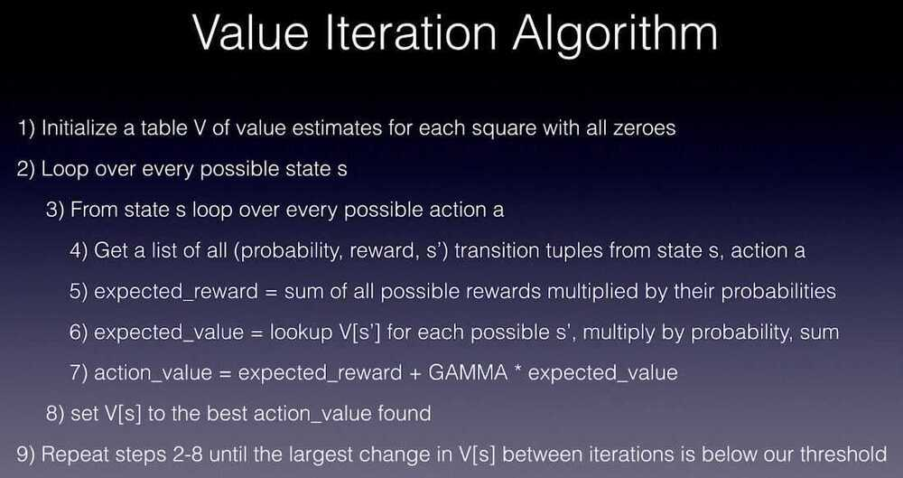
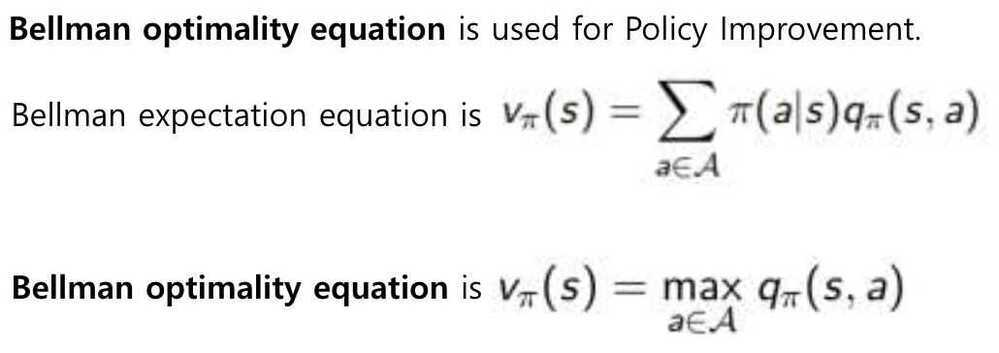
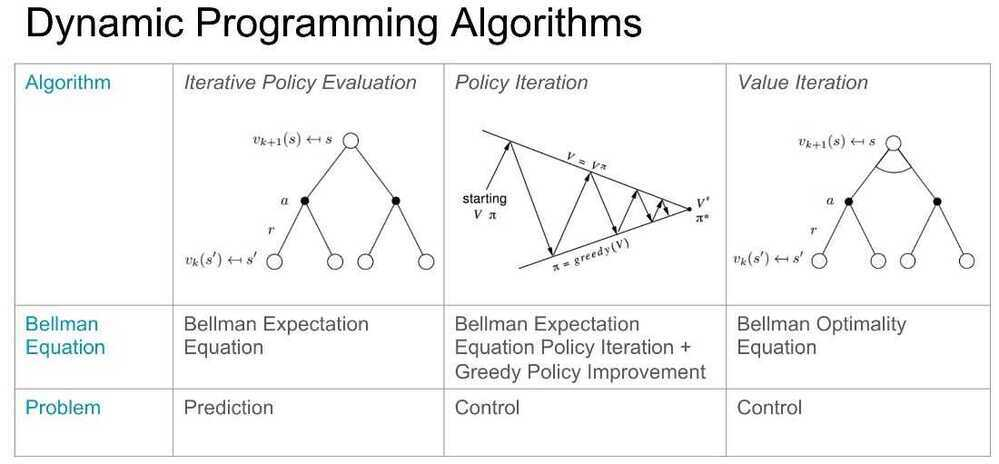

# 2. Dynamic Programming

## Sports Betting

- Dynamic programming refers to the collection of algorithms that can be used to compute optimal policies given a perfect model of the environment.
- Value iteration is a type of dynamic programming algorithm that computes the optimal value function and consequently the optimal policy
- Dynamic programming is useful, but limited because it requires a perfect environment model and is computationally expensive

## Bellman Advanced

Stochastic bellman equation, where each state transition has some probability for performing an action.

Ex - If we tell our RL agent to move left or right, it has 80% chance of moving left or right but 20% chance of moving up and down and vice-versa.

## Dynamic Programming

Create a lookup table to solve Markov Decision Processes in stochastic environments.

Dynamic Programming Algorithms -

- Policy Iteration - starts with a totally random policy and start taking actions, it then start estimating values for each square based on the reward received from this random actions updating the value table and using improved values to calculate and improve policy. This continues until both the value table stablizes and stops changing (algorithm converges)
- Value Iteration - completly ignores policy and focuses on applying bellman equation

3 Parts -

- Policy Evaluation
- Policy Iteration
- Value Iteration

## Key Points

1. **Policy iteration** includes: **policy evaluation**+**policy improvement**, and the two are repeated iteratively until policy converges.

2. **Value iteration** includes: **finding optimal value function** + one **policy extraction**. There is no repeat of the two because once the value function is optimal, then the policy out of it should also be optimal (i.e. converged).

3. **Finding optimal value function** can also be seen as a combination of policy improvement (due to max) and truncated policy evaluation (the reassignment of v_(s) after just one sweep of all states regardless of convergence).

4. The algorithms fo **policy evaluation** and **finding optimal value function** are highly similar except for a max operation (as highlighted)

5. Similarly, the key step to **policy improvement** and **policy extraction** are identical except the former involves a stability check.

In my experience,*policy iteration*is faster than*value iteration*, as a policy converges more quickly than a value function.

Why Discount Factor?

The idea of using discount factor is to prevent the total reward from going to infinity (because 0 <= γ <= 1). It also models the agent behavior when the agent prefers immediate rewards than rewards that are potentially received later in the future.

https://github.com/dennybritz/reinforcement-learning/tree/master/DP

https://towardsdatascience.com/reinforcement-learning-demystified-solving-mdps-with-dynamic-programming-b52c8093c919
