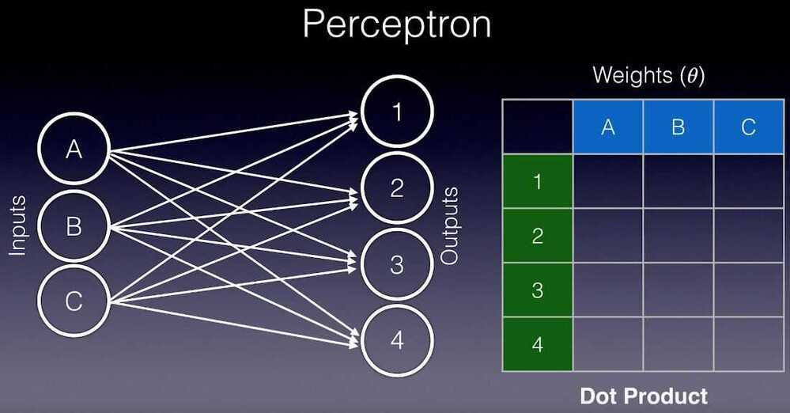
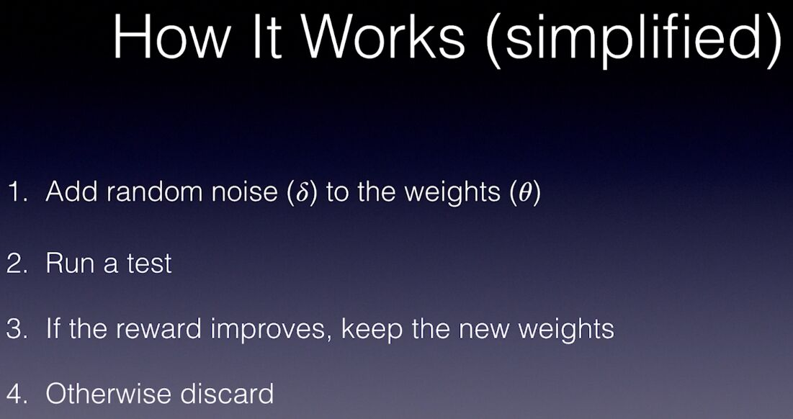
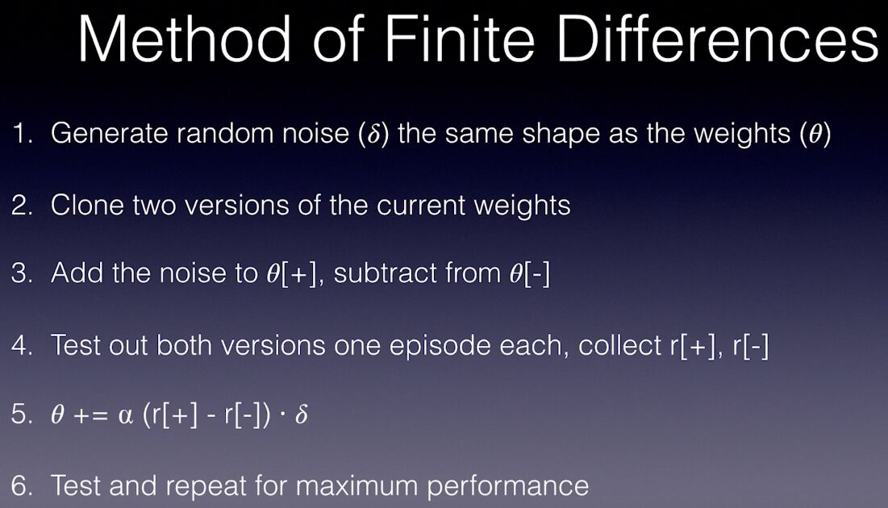
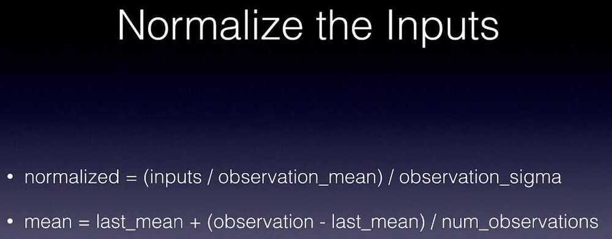
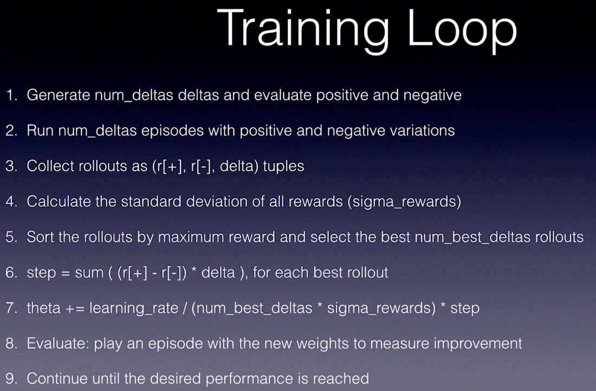

## Augmented Random Search (ARS)

- Shallow learning algorithm
- Random noise
- Genetic evolution
- Cutting edge performance on locomotion tasks

## Forward and Inverse Kinematic

## References

https://github.com/colinskow/move37/tree/master/ars

https://github.com/modestyachts/ARS
