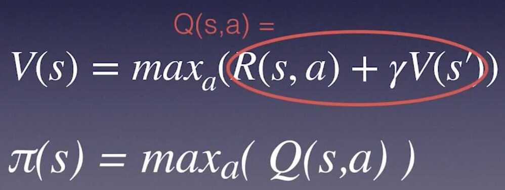
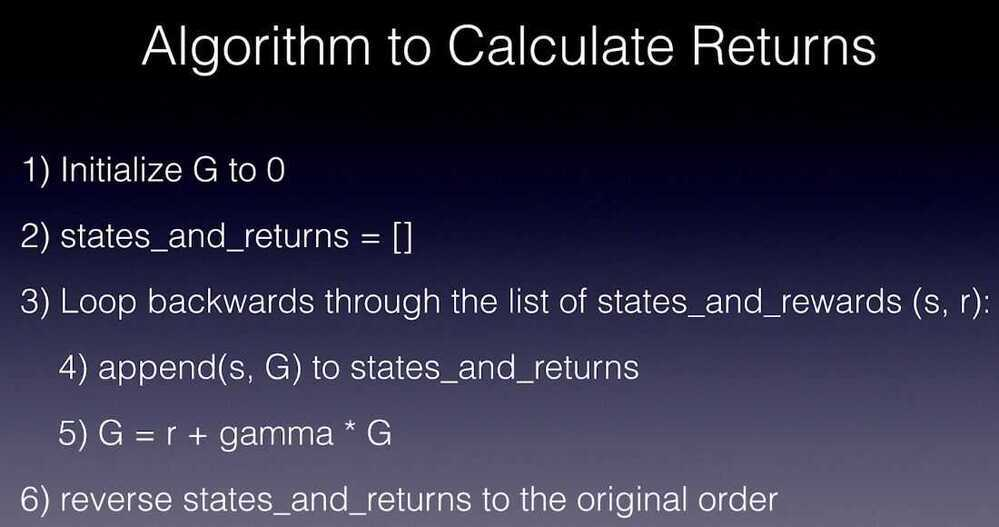

# Q-Learning Algorithms

Q-Learning algorithms are a family of Reinforcement Learning algorithms.

Unlike policy gradient methods, which attempt to learn functions which directly map an observation to an action, Q-Learning attempts to learn the value of being in a given state, and taking a specific action there.

## Policy Gradient Method - Attempts to learn functions which directly map an observation to an action

## Q-Learning - Attempts to learn the value of being in a given state, and taking a specific action there

Q - Quality

Q - Long term discounted reward we expect from taking action a in state s

The policy for state s is to choose the actual bias Q value.

## Policy - Policy is a simple lookup table: state -> best action

## Reward - the reward from our immediate action, plus all discounted future rewards from applying the current policy (Denoted by capital G)

