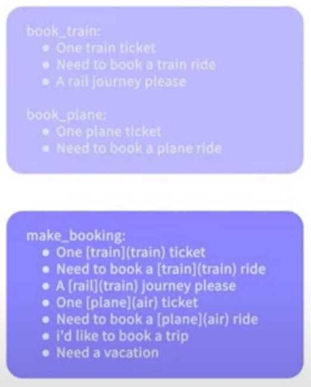
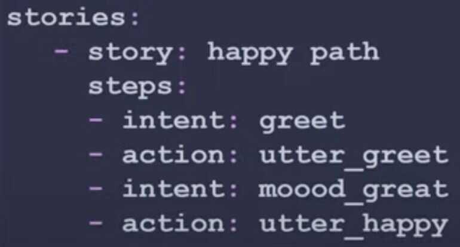
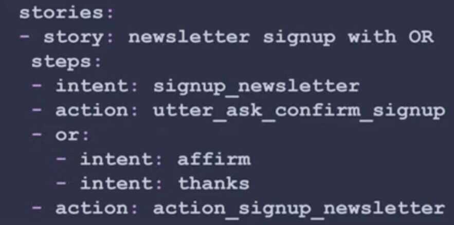

# Chatbot / chatops

https://www.freecodecamp.org/news/how-to-build-an-ai-chatbot-with-redis-python-and-gpt

## Rasa

Open source machine learning tools for developers to build, improve, and deploy text-and voice-based chatbots and assistants

- The core of building a Rasa assistant is **providing examples that your system learns from**
    - How do people say things?
    - How do conversations go?

## Types of chatbot

1. Rule-based Chatbots / Workflow chatbots
2. Intellectually Independent Chatbots
3. AI-powered Chatbots

## Types of product chatbots

### Customer Service Bots

   1. Welcome Bots
   2. Resolution Bots
   3. Navigation Bots

### E-Commerce Bots

   1. Sales Bots
   2. Product Recommendation Bots
   3. Billing Bots
   4. Order Management Bots

https://www.freshworks.com/live-chat-software/chatbots/chatbot-ideas-blog

## Task Oriented Dialogue System

- Task Oriented - Users want to accomplish something (task they want to achieve)
- Dialogue system - Talking with an automated system in a two-way conversation
- Chit chat bot - Goal is to have an ongoing conversation without necessarily doing anything


## State machines vs neural methods

1. **Understanding Text**
    - NLU - raw text in, machine-readable information out
    - **Rule based**
        - Example: A regular rexpression that finds and extracts email addresses
        - You don't need much/any data for these approaches
        - They can run very fast
        - But they're not very good at handling things they haven't seen before
    - **Neural**
        - Example: A transformer-based model (e.g. DIET) that sorts text into intents based on examples it's been provided
        - Require training examples (in general, the more the better)
        - But they're very good at handling things they haven't seen before, making "informed guesses"

    A Rasa assistant might use both, but the neural methods are the core of the framework

2. **Deciding what do do next**
    - Dialog policy - Given the conversation so far, what should your assistant say or do next?
    - **Rule-based**
        - Example: A big dialog tree of all possible paths a conversation can take
        - This is a traditional approach to dialog and it can work well in some cases
        - But they can't hand digressions and are a bit of a pain to extend/maintain
    - **Neural**
        - A transformer-based model (e.g. TED) that picks the next best turn based on the conversation so far and all the conversations it's been trained on
        - Require training examples (in general, the more the better)
        - But this approach let's users have a more natural conversations, even if they say things in a different order every time

Both 1 and 2 is recommended to use in tandem

How to make sure conversations work (and improve over time)

- The Rasa approach is
    - Flexible, every conversation might be unique
    - Works better the more high-quality training data you have
- How do you make sure conversations work?
    - Manually reviewing and annotating conversations
- How do you make sure conversations improve over time?
    - Correct any errors your assistant made in a conversation, then add it to the training data, retrain and redeploy
    - A Rasa conversational AI ystem itsn't static, It changes and adapts over time
- We call this process **"conversation-driven development"**

## Files

- domain.yml
- config.yml
- Data files
    - nlu.yml
    - stories.yml
    - rules.yml

## Commands

```bash
pip3 install --upgrade rasa
rasa init
rasa train
rasa shell
rasa shell --debug
rasa -h
```

## Domain.yml

The domain file is a directory of everything our assistant "knows"

- Responses: These are the things the assistant can say to users
- Intents: These are categories of things users say
    - affirm
    - deny
    - greet
    - thankyou
    - goodbye
    - search_concerts
    - search_venues
    - compare_reviews
    - bot_challenge
    - how_to_get_started
- Slots: These are variables remembered over the course of a conversation
- Entities: These are pieces of information extracted from incoming text
- Forms & actions: These add application logic and extend what your assistant can do

## Data

- The text data used to pretrain any models or features you're using (e.g. language models,, word embeddings, etc.)
- User-generated text
- Patterns of conversations
- Examples:
    - Customer support logs
    - **User conversations with your assistant**
- How should conversations with your chatbot go?
    - Stories
    - Rules
- How do users say things?
    - Intents
- **If you have data**
    - Modified content analysis
        - Go through data (or sample) by hand and assign each datapoint to a group
        - If no existing group fits, add a new one
        - At given intervals, go through your groups and combine or separate them as needed
        - Start with 2-3 passes through your dataset
    - Can't you just automate this i.e. intent discovery and classification
        - It's easiest to use interactive learning to create stories
- **If you don't have data**
    - Start with the most common intent
    - Start with the smallest possible number of intents (that conver your core use case)
    - Everything else goes in and out of scope intent
        - If your assistant can't handle something, give users an escape hatch right away
    - Additional intents will come from user data
- **Have fewer intents**
    - Rasa style CDD
        - You only need to start with the most popular, important intents & a way to handle things outside them
        - Continue to build from there if that's what users need
    - Human reasons
        - More intents = more training data, maintenance, documentation
        - More intents = annotation more difficult
    - ML reasons
        - Transformer classifiers scale linearly with the # of classes
        - Entity extraction (esp with very lightweight rule-baed system like Duckling) is often faster
- **Paring down intents**
    - Don't use intents as a way to store information (use slots instead)
    - Consider to combine, if a lot of same tokens show up in training data for two intents
    - **Example**



- Training data for an intent
    - User-generated > synthetic
    - Each utterance should unambigously match to a single intent
        - You can verify this using human sorting & inter-rater reliability
    - Is an utterance ambiguous?
        - Use end-to-end instead (the raw text as training data w/out classifying it)

## Stories

Training data to teach your assistant what it should do next

- If you have conversational data, start with those patterns
- Generate your own conversational patterns
    - It's easiest to use interactive learning to create stories
    - Start with common flows, happy paths
    - Then add common errors/digressions
- Once your model is trained, add more data from user conversations



## Or statements



## Checkpoints


## Rules

A way to describe short pieces of conversations that always go the same way

- User rules for one-off interactions (checking account balance, checking if this is a bot)
- Don't use rules for multi-turn interactions
- Don't use OR statements and checkpointing often
- Don't write out every possible conversation flow start to finish
- Don't delay user testing

## Entities

Entities are structured pieces of information inside of a user message

An entity can be any important detail that your assitant could use later in a conversation:

- Numbers
- Dates
- Country names
- Product names, etc

There are 3 ways entities can be extracted in Rasa

1. Using pre-build models
    - Duckling for extracting numbers, dates, url, email addresses
    - SpaCy - for extracting names, product names, locations, etc

2. Using Regex
    - For entities that match a specific pattern (e.g. phone numbers, postcodes, etc.)

3. Using ML
    - For extracting custom entities


The output of the entity extraction is a snippet of JSON which contains the details of

- Entity category ("city")
- Entity value ("New York City")
- Confidence levels
- The component that extracted the entity

## Synonyms

Synonyms can be used to map the extracted values to a single standardized value


OR during entity extraction


## Others

https://rasa.com/docs/action-server/knowledge-bases

https://github.com/RasaHQ/tutorial-knowledge-base

NER - Rasa NLU for Entity Extraction

## Learning

[**https://learning.rasa.com/certification-study-guide/**](https://learning.rasa.com/certification-study-guide/)

[Conversational AI with Rasa Open Source 3.x](https://www.youtube.com/playlist?list=PL75e0qA87dlEjGAc9j9v3a5h1mxI2Z9fi)

[Rasa 3.x Tutorials](https://www.youtube.com/playlist?list=PL75e0qA87dlHogEVKnBJLhqyaZKDg2f0W)

https://rasa.com/docs

[Algorithm Whiteboard](https://www.youtube.com/playlist?list=PL75e0qA87dlG-za8eLI6t0_Pbxafk-cxb)

[Level 3 AI Assistant Conference 2021](https://www.youtube.com/playlist?list=PL75e0qA87dlH3kgGVl3EphdsU9HOaOEyf)

## Demo

http://financial-demo.rasa.com/guest/conversations/production/d379406177e14dcfa67ed47ebfdd9106

https://rasa.com/showcase/albert-heijn

## Responses

https://rasa.com/docs/rasa/responses

https://rasa.com/blog/response-retrieval-models

https://rasa.com/docs/rasa/chitchat-faqs

## Rasa 3.0

https://rasa.com/blog/updated-learning-resources-for-rasa-open-source-3-0

https://rasa.com/blog/slots-in-rasa-open-source-3-0

https://rasa.com/blog/markers-in-rasa-open-source-3-0

https://rasa.com/blog/bending-the-ml-pipeline-in-rasa-3-0

https://rasa.com

[**https://github.com/rasaHQ/**](https://github.com/rasaHQ/)

https://blog.rasa.com

https://github.com/RasaHQ/helpdesk-assistant

[Building Your First Chatbot in Python || Rachael Tatman](https://www.youtube.com/watch?v=VpvmLxO3Ys0)

https://enterprisebot.ai/case-studies

https://www.freecodecamp.org/news/python-project-how-to-build-your-own-jarvis-using-python

[Conversational AI with Rasa: Integration with a Website](https://www.youtube.com/watch?v=ZhRo3gfLk90)

[**Webinar: New Chatbot Starter Packs for Banking and IT Support**](https://www.youtube.com/watch?v=nHqriTMRvPI)

https://github.com/RasaHQ/financial-demo

https://github.com/RasaHQ/helpdesk-assistant

https://rasa.com/blog/rasa-example-helpdesk

## Solutions

https://rasa.com/solutions/lead-generation-sales

https://rasa.com/solutions/customer-service-automation

https://info.rasa.com/poc-to-production-whitepaper

## Resources

[Level 3 AI Assistant Conference 2021](https://www.youtube.com/playlist?list=PL75e0qA87dlH3kgGVl3EphdsU9HOaOEyf)

## Chatbot strategy


