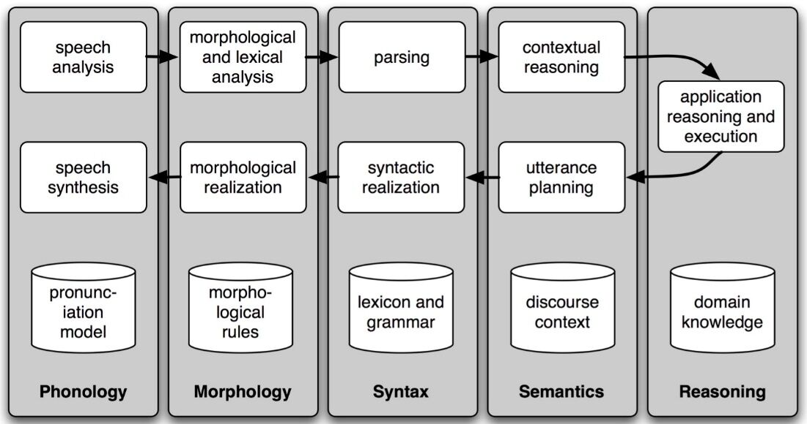

# NLP Concepts

A **token** is the technical name for a sequence of characters - such as hairy, his, or :) --- that we want to treat as a group. When we count the number of tokens in a text, say, the phrase *to be or not to be*, we are counting occurrences of these sequences

A **word type** is the form or spelling of the word independently of its specific occurrences in a text - that is, the word considered as a unique item of vocabulary.

Now, let's calculate a measure of the lexical richness of the text. The next example shows us that the number of distinct words is just 6% of the total number of words, or equivalently that each word is used 16 times on average

## len(set(text3)) / len(text3)

## Frequency Distribution

It is a "distribution" because it tells us how the total number of word tokens in the text are distributed across the vocabulary items.

## hapaxes - the words that occur once only

A **collocation** is a sequence of words that occur together unusually often. Thus *red wine* is a collocation, whereas *the wine* is not. A characteristic of collocations is that they are resistant to substitution with words that have similar senses; for example, *maroon wine* sounds definitely odd.

To get a handle on collocations, we start off by extracting from a text a list of word pairs, also known as **bigrams**.

`list(bigrams(['more', 'is', 'said', 'than', 'done']))`

`[('more', 'is'), ('is', 'said'), ('said', 'than'), ('than', 'done')]`

word sense disambiguation we want to work out which sense of a word was intended in a given context. we automatically disambiguate words using context, exploiting the simple fact that nearby words have closely related meanings

- *serve*: help with food or drink; hold an office; put ball into play
- *dish*: plate; course of a meal; communications device

- The lost children were found by the *searchers* (**agentive**)
- The lost children were found by the *mountain* (**locative**)
- The lost children were found by the *afternoon* (**temporal**)

## Pronoun Resolution

A deeper kind of language understanding is to work out "who did what to whom" --- i.e., to detect the subjects and objects of verbs. You learnt to do this in elementary school, but it's harder than you might think. In the sentence the thieves stole the paintings it is easy to tell who performed the stealing action. Consider three possible following sentences in (4c), and try to determine what was sold, caught, and found (one case is ambiguous).

The thieves stole the paintings. They were subsequently sold.

The thieves stole the paintings. They were subsequently caught.

The thieves stole the paintings. They were subsequently found.

Answering this question involves finding the **antecedent** of the pronoun they, either thieves or paintings. Computational techniques for tackling this problem include **anaphora resolution** --- identifying what a pronoun or noun phrase refers to - and **semantic role labeling** --- identifying how a noun phrase relates to the verb (as agent, patient, instrument, and so on).

## Spoken Dialog Systems

*Simple Pipeline Architecture for a Spoken Dialogue System: Spoken input (top left) is analyzed, words are recognized, sentences are parsed and interpreted in context, application-specific actions take place (top right); a response is planned, realized as a syntactic structure, then to suitably inflected words, and finally to spoken output; different types of linguistic knowledge inform each stage of the process.*

## Recognizing Textual Entailment (RTE)
