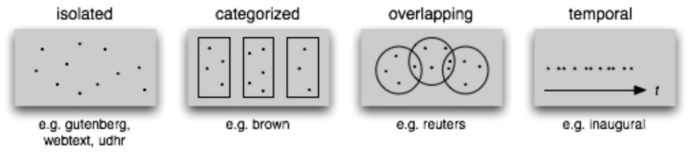

# NLTK

NLTK -- the Natural Language Toolkit -- is a suite of open source Python modules, data sets, and tutorials supporting research and development in Natural Language Processing.

NLTK supports classification, tokenization, stemming **(lemmatization better than stemming)**, tagging, parsing, and semantic reasoning functionalities.

Library highlights

- [Lexical analysis](https://en.wikipedia.org/wiki/Lexical_analysis): Word and text tokenizer
- [n-gram](https://en.wikipedia.org/wiki/N-gram) and collocations
- [Part-of-speech tagger](https://en.wikipedia.org/wiki/Part-of-speech_tagging)
- Tree model and Text[chunker](https://en.wikipedia.org/wiki/Chunking_(computational_linguistics)) for capturing
- [Named-entity recognition](https://en.wikipedia.org/wiki/Named-entity_recognition)

## Commands

```python
import nltk
nltk.download()

from nltk.book import *
text1
len(text6)
texts()
sents()
    The sents() function divides the text up into its sentences, where each sentence is a list of words

text1.concordance("monstrous") #A concordance view shows us every occurrence of a given word, together with some context
text2.similar("monstrous")
text2.common_contexts(["monstrous", "very"])
text4.dispersion_plot(["citizens", "democracy", "freedom", "duties", "America"])
text6.dispersion_plot(["Arthur", "Holy", "Grail"])
text6.generate()
text6.count("Grail")
text6.count("grail")
fdist1 = FreqDist(text1)
fdist1.most_common(50)
fdist1.plot(50, cumulative=True)

cfd = nltk.ConditionalFreqDist(
...           (genre, word)
...           for genre in brown.categories()
...           for word in brown.words(categories=genre))
genres = ['news', 'religion', 'hobbies', 'science_fiction', 'romance', 'humor']
modals = ['can', 'could', 'may', 'might', 'must', 'will']
cfd.tabulate(conditions=genres, samples=modals)
```

### NLTK's Frequency Distributionss

| **Example**                 | **Description**                                                |
|--------------------------|----------------------------------------------|
| fdist = FreqDist(samples)   | create a frequency distribution containing the given samples   |
| fdist[sample] += 1        | increment the count for this sample                            |
| fdist['monstrous']      | count of the number of times a given sample occurred           |
| fdist.freq('monstrous')   | frequency of a given sample                                    |
| fdist.N()                   | total number of samples                                        |
| fdist.most_common(n)        | the n most common samples and their frequencies                |
| for sample in fdist:        | iterate over the samples                                       |
| fdist.max()                 | sample with the greatest count                                 |
| fdist.tabulate()            | tabulate the frequency distribution                            |
| fdist.plot()                | graphical plot of the frequency distribution                   |
| fdist.plot(cumulative=True) | cumulative plot of the frequency distribution                  |
| fdist1 |= fdist2           | update fdist1 with counts from fdist2                          |
| fdist1 < fdist2            | test if samples in fdist1 occur less frequently than in fdist2 |

### Corpus

```python
nltk.chat.chatbots()
nltk.corpus.gutenberg.fileids()
emma = nltk.Text(nltk.corpus.gutenberg.words('austen-emma.txt'))
len(gutenberg.raw('austen-emma.txt'))
    The raw() function gives us the contents of the file without any linguistic processing.

from nltk.corpus import webtext
webtext.fileids()

from nltk.corpus import nps_chat
nps_chat.posts('10-19-20s_706posts.xml')

The Brown Corpus is a convenient resource for studying systematic differences between genres, a kind of linguistic inquiry known as stylistics.
first million-word electronic corpus of English
from nltk.corpus import brown
brown.categories()
brown.words(categories='news')
brown.words(fileids=['cg22'])
brown.sents(categories=['news', 'editorial', 'reviews'])

from nltk.corpus import reuters
reuters.fileids()
reuters.categories()
reuters.categories(['training/9865', 'training/9880'])

from nltk.corpus import inaugural
inaugural.fileids()
cfd = nltk.ConditionalFreqDist(
...           (target, fileid[:4])
...           for fileid in inaugural.fileids()
...           for w in inaugural.words(fileid)
...           for target in ['america', 'citizen']
...           if w.lower().startswith(target))
cfd.plot()
nltk.corpus.indian.words('hindi.pos')
nltk.corpus.cess_esp.words()
nltk.corpus.floresta.words()
nltk.corpus.udhr.fileids() #univeral declaration of human rights in 300 languages
```



| **Example**                 | **Description**                                                                                   |
|------------------------|------------------------------------------------|
| fileids()                   | the files of the corpus                                                                           |
| fileids([categories])     | the files of the corpus corresponding to these categories                                         |
| categories()                | the categories of the corpus                                                                      |
| categories([fileids])     | the categories of the corpus corresponding to these files                                         |
| raw()                       | the raw content of the corpus                                                                     |
| raw(fileids=[f1,f2,f3])   | the raw content of the specified files                                                            |
| raw(categories=[c1,c2])   | the raw content of the specified categories                                                       |
| words()                     | the words of the whole corpus                                                                     |
| words(fileids=[f1,f2,f3]) | the words of the specified fileids                                                                |
| words(categories=[c1,c2]) | the words of the specified categories                                                             |
| sents()                     | the sentences of the whole corpus                                                                 |
| sents(fileids=[f1,f2,f3]) | the sentences of the specified fileids                                                            |
| sents(categories=[c1,c2]) | the sentences of the specified categories                                                         |
| abspath(fileid)             | the location of the given file on disk                                                            |
| encoding(fileid)            | the encoding of the file (if known)                                                               |
| open(fileid)                | open a stream for reading the given corpus file                                                   |
| root                        | if the path to the root of locally installed corpus                                               |
| readme()                    | if the path to the root of locally installed corpus the contents of the README file of the corpus |

<https://github.com/nltk/nltk>

## Others

### python - indian-namematch 1.3.0

<https://pypi.org/project/indian-namematch>

<https://towardsdatascience.com/surprisingly-effective-way-to-name-matching-in-python-1a67328e670e>
