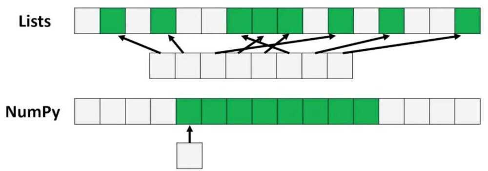

# Internals

## Why is NumPy Faster?

1. **Fixed type**

- Faster to read less bytes of memory
- No type checking when iterating through objects

2. **Contiguous Memory**

- Benefits
  - SIMD (Single Instruction Multiple Data) Vector Processing
  - Effective Cache Utilization
