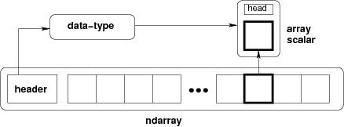

# Ndarray Object

The most important object defined in NumPy is an N-dimensional array type calledndarray. It describes the collection of items of the same type. Items in the collection can be accessed using a zero-based index.

Every item in an ndarray takes the same size of block in the memory. Each element in ndarray is an object of data-type object (calleddtype).

Any item extracted from ndarray object (by slicing) is represented by a Python object of one of array scalar types. The following diagram shows a relationship between ndarray, data type object (dtype) and array scalar type −



The basic ndarray is created using an array function in NumPy as follows

numpy.array

The basic ndarray creates an ndarray from any object exposing array interface, or from any method that returns an array

numpy.array(object, dtype = None, copy = True, order = None, subok = False, ndmin = 0)

## Parameter & Description

1. object - Any object exposing the array interface method returns an array, or any (nested) sequence.

2. dtype - Desired data type of array, optional

3. copy - Optional. By default (true), the object is copied

4. order - C (row major) or F (column major) or A (any) (default)

5. subok - By default, returned array forced to be a base class array. If true, sub-classes passed through

6. ndmin - Specifies minimum dimensions of resultant array

Thendarrayobject consists of contiguous one-dimensional segment of computer memory, combined with an indexing scheme that maps each item to a location in the memory block. The memory block holds the elements in a row-major order (C style) or a column-major order (FORTRAN or MatLab style).

## Examples

```python
import numpy as np
a = np.array([1,2,3])
print a

[1, 2, 3]

# more than one dimensions
import numpy as np
a = np.array([[1, 2], [3, 4]])
print a

[[1, 2]
[3, 4]]

# minimum dimensions
import numpy as np
a = np.array([1, 2, 3,4,5], ndmin = 2)
print a

[[1, 2, 3, 4, 5]]

# dtype parameter
import numpy as np
a = np.array([1, 2, 3], dtype = complex)
print a

[ 1.+0.j, 2.+0.j, 3.+0.j]
```
