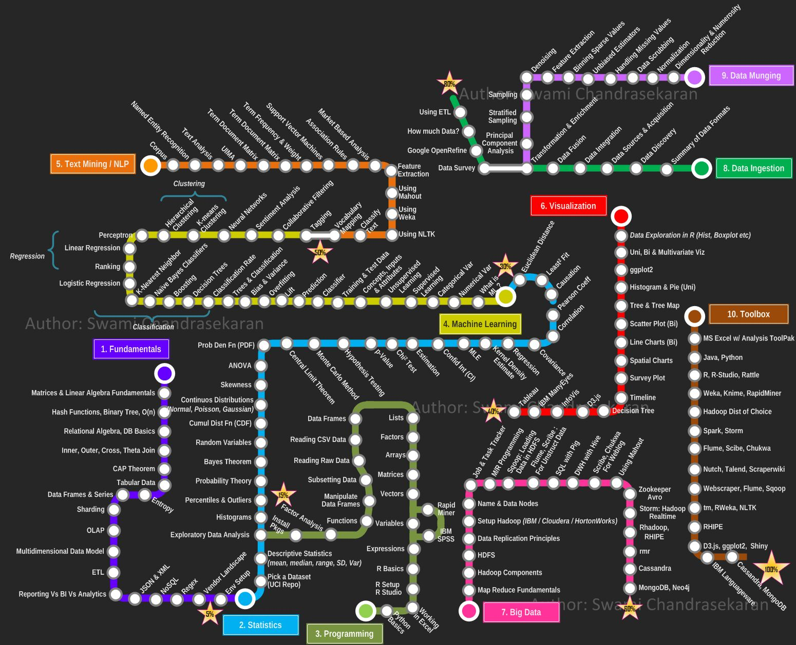

# Others / Resources / Interview / Learning / Courses

- [Intro to graph neural networks (ML Tech Talks)](https://www.youtube.com/watch?v=8owQBFAHw7E&ab_channel=TensorFlow)
- [Machine Learning Course for Beginners](https://www.youtube.com/watch?v=NWONeJKn6kc)
- https://github.com/josephmisiti/awesome-machine-learning
- https://www.freecodecamp.org/news/best-machine-learning-courses

## LLM

- [**AI Canon** | Andreessen Horowitz](https://a16z.com/2023/05/25/ai-canon/)
- LLM - [dbdemos Build your Chat Bot with Dolly - Databricks demos](https://www.dbdemos.ai/demo.html?demoName=llm-dolly-chatbot)
- [CS 886: Recent Advances on Foundation Models](https://cs.uwaterloo.ca/~wenhuche/teaching/cs886/)
- [LLM Bootcamp - Spring 2023 - The Full Stack](https://fullstackdeeplearning.com/llm-bootcamp/spring-2023/)
- [GitHub - microsoft/generative-ai-for-beginners: 18 Lessons, Get Started Building with Generative AI 🔗 https://microsoft.github.io/generative-ai-for-beginners/](https://github.com/microsoft/generative-ai-for-beginners)
- [**AI Skills Navigator**](https://aiskillsnavigator.microsoft.com/en-us)
	- [Career Essentials in Generative AI by Microsoft and LinkedIn Learning Path | LinkedIn Learning, formerly Lynda.com](https://aka.ms/GenAILearningPathway)
	- [Microsoft Launches New AI Skills Training and Resources as part of Skill for Jobs Initiative](https://www.linkedin.com/pulse/microsofts-launches-new-ai-skills-training-resources-part-behncken/)
	- [Ignite Edition Challenge: Microsoft Learn Challenge | Microsoft Learn](https://learn.microsoft.com/en-us/training/topics/event-challenges)
- [Hands-On Large Language Models](https://www.llm-book.com/)
- [Jay Alammar – Visualizing machine learning one concept at a time.](https://jalammar.github.io/)

## AI (Artificial Intelligence) + ML (Machine Learning)

- https://www.freecodecamp.org/learn/machine-learning-with-python
- OpenCV - https://www.youtube.com/watch?v=P4Z8_qe2Cu0
- D2l.ai + coursera + fast.ai
- Kaggle
- AI - Model serving framework
- https://www.kaggle.com/learn
- Data modelling
- [FinGPT: Open-Source Financial Large Language Models](https://arxiv.org/abs/2306.06031)
- [Learn Machine Learning in 3 Months (PyTorch Curriculum) - YouTube](https://www.youtube.com/watch?v=dS2HYPY7T-4)
- [AI Jesus Made Me a Believer - YouTube](https://www.youtube.com/watch?v=kyY9PSQRH1Q)
- [Master Coding for Data Science - StrataScratch](https://www.stratascratch.com/)
- [Harvard CS50's Introduction to Artificial Intelligence with Python - Free University Course](https://www.freecodecamp.org/news/harvard-cs50s-ai-python-course)
- Mathematics (probability, statistics, calculus)
- [Machine Learning & Neural Networks without Libraries - No Black Box Course - YouTube](https://www.youtube.com/watch?v=3wwiOSxDAmg)
- [udlbook](https://udlbook.github.io/udlbook/)
- [Learn Machine Learning in 2024](https://www.freecodecamp.org/news/learn-machine-learning-in-2024/)
- [5 Free AI Courses With Certifications In 2024](https://www.forbes.com/sites/rachelwells/2024/08/08/5-free-ai-courses-with-certifications-in-2024/)
- [A Roadmap for Your Machine Learning Career - MachineLearningMastery.com](https://machinelearningmastery.com/a-roadmap-for-your-machine-learning-career/)
- [AWS Certified AI Practitioner (AIF-C01) – Full Course to PASS the Certification Exam - YouTube](https://www.youtube.com/watch?v=WZeZZ8_W-M4)
- [Generative AI for Everyone](https://www.deeplearning.ai/courses/generative-ai-for-everyone/)

## DS (Data Science) + DA (Data Analytics) + DE (Data Engineering)

- Tool - dbt, fivetran, Informatica
- [GitHub - DataEngineer-io/data-engineer-handbook: This is a repo with links to everything you'd ever want to learn about data engineering](https://github.com/DataEngineer-io/data-engineer-handbook)
- [IOT & Predictive maintenance](https://www.dbdemos.ai/minisite/lakehouse-iot-platform/index.html)
- [Data Analysis with Python Certification | freeCodeCamp.org](https://www.freecodecamp.org/learn/data-analysis-with-python)
- DS - Pandas and Numpy + Scipy + scikit-learn
- Data Analytics Certification (powerbi / tableau)
- Credit Risk Modeling (Data Science)
- https://www.analyticsvidhya.com/blog/2019/12/30-challenging-open-source-data-science-projects-2020
- scipy documentation
- Python for DS - Freecodecamp certification
- https://www.startdataengineering.com/post/data-engineering-project-to-impress-hiring-managers
- [Data Engineering Study Guide](https://docs.google.com/spreadsheets/d/1atzJSnV86J1ylnpOGVO8VaBVmx8TEAhw_DzHr25-ql4/edit?usp=sharing)
- [Learn Pandas & Python for Data Analysis - Full Course](https://www.freecodecamp.org/news/learn-pandas-for-data-science/)
- [SQL Interview Prep With Zach Wilson - YouTube](https://www.youtube.com/watch?v=ycQ-wqlaEX8)
- [Google Advanced Data Analytics Professional Certificate | Coursera](https://www.coursera.org/google-certificates/google-advanced-data-analytics)
- [GitHub - alfarias/awesome-kaggle-kernels: Compilation of good Kaggle Kernels.](https://github.com/alfarias/awesome-kaggle-kernels)

## Courses ML & AI

- https://www.freecodecamp.org/news/machine-learning-for-everybody
- https://github.com/GoogleCloudPlatform/training-data-analyst
- https://www.datacamp.com/courses/machine-learning-with-tree-based-models-in-python
- CS 498 Applied Machine Learning
- STAT 420 Methods of Applied Statistics
- STAT 571 Multivariate Analysis
- CS 410 Text Information Systems
- https://github.com/GokuMohandas/practicalAI
- STAT 542 Practical Statistical Learning Causal Inference / Econometrics
- JASON@MLMastery 14 day course email
- Adrian@pysearchimage 17 day ml course email
- https://www.kaggle.com/c/titanic
- https://github.com/Avik-Jain/100-Days-Of-ML-Code
- https://www.elementsofai.com
- Learning from Data Course by Prof Yaser Abu-Mostafa
- FREE - Google's ML Crash Course
- FREE - course.fast.ai
- Free Computation Linear Algebra - https://www.fast.ai/2017/07/17/num-lin-alg
- Neural Networks and Deep Learning by Andrew Ng
- Stanford's ML Course by Andrew Ng
- The school of AI - Move37
- The school of AI - Decentralized Applications
- https://scpd.stanford.edu/public/category/courseCategoryCertificateProfile.do?method=load&certificateId=99107737
- https://ocw.mit.edu/courses/electrical-engineering-and-computer-science/6-034-artificial-intelligence-fall-2010
- https://madewithml.com
- https://www.coursera.org/specializations/practical-data-science
- https://www.edx.org/course/fundamentals-of-tinyml
- https://www.univ.ai
- [Interpretable Machine Learning](https://christophm.github.io/interpretable-ml-book/)
- Paid - [Complete Machine Learning & Data Science Program](https://www.geeksforgeeks.org/courses/data-science-live)

## Courses - Data

- https://stories.thedataproject.net
- https://www.alphaa.ai/saurabh-moody (Certification Free)
- Python for data science
- Data Warehousing & Business Intelligence
- Bipedal robot walker openai gym move37 course
- https://www.kaggle.com/learn/data-visualization-from-non-coder-to-coder
- WorldQuant University Scientific Computing and Python for Data Science
- https://www.coursera.org/specializations/data-mining
- https://www.edx.org/course/data-science-wrangling-2
- https://lagunita.stanford.edu/courses/course-v1:ComputerScience+MMDS+SelfPaced/about
- https://www.coursera.org/specializations/big-data
- https://onlinecourses.nptel.ac.in/noc19_cs33/course
- https://in.udacity.com/course/data-science-interview-prep--ud944
- PGDAST - Post Graduate Diploma in Applied Statistics - IGNOU
- Applied Data Science in Python
- https://in.udacity.com/course/data-wrangling-with-mongodb--ud032
- https://www.coursera.org/specializations/data-science
- scikit-learn
- freecodecamp.org data visualization certification
- Training data analyst google github https://github.com/GoogleCloudPlatform/training-data-analyst
- Data science for startup - https://bgweber.github.io
- Readings in applied data science - https://github.com/hadley/stats337
- Fundamentals of data vizualization - https://serialmentor.com/dataviz
- Spark - https://cognitiveclass.ai/learn/spark
    - Spark, storm, flink
    - Athena / Presto / Hive
- HDFS Architecture - https://hadoop.apache.org/docs/r3.0.0/hadoop-project-dist/hadoop-hdfs/HdfsDesign.html
- Computer Vision - https://in.udacity.com/course/introduction-to-computer-vision--ud810
- NPTEL - Data Mining - https://onlinecourses.nptel.ac.in/noc19_cs15
- NPTEL - Big Data Computing - https://onlinecourses.nptel.ac.in/noc19_cs33/course
- https://www.analyticsvidhya.com/blog/2019/12/30-challenging-open-source-data-science-projects-2020
- Dagster POC
- https://realpython.com/pandas-groupby
- https://realpython.com/build-recommendation-engine-collaborative-filtering
- https://realpython.com/python-statistics
- https://www.sketchingbigdata.org
- https://realpython.com/numpy-array-programming
- https://github.com/guipsamora/pandas_exercises
- https://www.kaggle.com/learn/overview
- [GOOD] https://www.coursera.org/specializations/big-data-engineering
- https://github.com/adilkhash/Data-Engineering-HowTo
- https://in.udacity.com/course/intro-to-data-science--ud359
- https://in.udacity.com/course/intro-to-data-analysis--ud170-india
- Google Cloud Coursera free specialization
- https://www.udemy.com/applied-deep-learningtm-the-complete-self-driving-car-course
- [Python for Data Science](https://www.classcentral.com/course/swayam-python-for-data-science-14266) by Indian Institute of Technology Madras via Swayam
- [Python and Statistics for Financial Analysis](https://www.classcentral.com/course/python-statistics-financial-analysis-12648) by The Hong Kong University of Science and Technology via Coursera
- https://www.youtube.com/365datascience
- https://www.coursera.org/professional-certificates/gcp-data-engineering
- [**https://www.coursera.org/specializations/data-science-python**](https://www.coursera.org/specializations/data-science-python)
- https://www.freecodecamp.org/news/algorithmic-trading-using-python-course
- https://www.freecodecamp.org/news/hands-on-data-science-course

### Others

- Statistics and EDA
- Data Visualization
- Descriptive Statistics
- central tendency and variability
- Inferential Statistics
- probability, central limit theorem and more to draw inferences
- Exploratory Data Analysis
- Hypothesis Testing
- Case Study - Uber supply demand gap

## Introduction to ML 1

- Linear Regression
- predict continuous data values
- Supervised Classification
- KNN, Naives Bayes and Logistic Regression
- Clustering
- K-Means and Hierarchical Clustering
- Case Study - Telecom Churn

## Introduction to ML 2

- Time Series
- Decision Trees
- Support Vector Machines
- Neural Networks
- Master Feed-forward, Recurrent and Gaussian Neural Networks.
- Association Rule Mining
- BIG DATA ANALYTICS
- INTRODUCTION TO BIG DATA AND HADOOP
- Understand the basic concepts of Big Data and Hadoop as processing platforms for Big Data
- MANAGING BIG DATA
- Learn and use Hadoop ecosystem tools like Sqoop & Hive for data ingestion, extraction and management.
- INTRODUCTION TO SPARK
- Understand and use Spark, a fast Big Data processing platform
- BIG DATA ANALYSIS
- Learn how to analyze Big Data using SparkR, SparkSQL
- Domain Electives
- BFS
- Learn Customer analytics and Risk Analytics within BFS (Banking and Financial Services)
- E-commerce
- Customer marketing analytics and recommendation engines
- Health care

## Model resources

- [**https://paperswithcode.com/**](https://paperswithcode.com/)
- [**https://paperswithcode.com/sota**](https://paperswithcode.com/sota)
- [**https://github.com/tensorflow/models**](https://github.com/tensorflow/models)
- https://github.com/academic/awesome-datascience
- https://mlcourse.ai/roadmap
- https://whimsical.com/machine-learning-roadmap-2020-CA7f3ykvXpnJ9Az32vYXva
- https://i.am.ai/roadmap
- https://github.com/MrMimic/data-scientist-roadmap

- https://github.com/tirthajyoti/Data-science-best-resources/blob/master/README
- https://github.com/FavioVazquez/ds-cheatsheets
- https://github.com/jonathan-bower/DataScienceResources
- https://towardsdatascience.com/5-professional-projects-every-data-scientist-should-know-e89bf4e7e8e1

 1. Customer Segmentation
 2. Text Classification
 3. Sentiment Analysis
 4. Time Series Forecasting
 5. Recommendation Systems

## Courses

- https://www.freecodecamp.org/news/statistics-for-data-science
- https://www.freecodecamp.org/news/how-to-analyze-data-with-python-pandas
- https://www.coursera.org/learn/machine-learning
- Free - (7 Weeks each)
- http://course.fast.ai
- http://course.fast.ai/part2.html
- https://github.com/josephmisiti/awesome-machine-learning/blob/master/books

## Machine Learning

- https://www.toptal.com/machine-learning/machine-learning-theory-an-introductory-primer
- [**https://www.toptal.com/machine-learning/interview-questions**](https://www.toptal.com/machine-learning/interview-questions)
- [**https://semanti.ca/blog/?the-most-important-machine-learning-algorithms**](https://semanti.ca/blog/?the-most-important-machine-learning-algorithms)
- [**https://www.uruit.com/machine-learning-guide/**](https://www.uruit.com/machine-learning-guide/)
- How to approach ml problems - https://www.toptal.com/machine-learning/machine-learning-problems
- https://github.com/trekhleb/homemade-machine-learning
- Convoluational neural network - https://towardsdatascience.com/the-most-intuitive-and-easiest-guide-for-convolutional-neural-network-3607be47480
- https://ahmedbesbes.com/end-to-end-ml.html
- [**https://developers.google.com/machine-learning/crash-course/**](https://developers.google.com/machine-learning/crash-course/)
- https://madewithml.com
- https://madewithml.com/topics
- [**https://www.freecodecamp.org/news/a-no-code-intro-to-the-9-most-important-machine-learning-algorithms-today/**](https://www.freecodecamp.org/news/a-no-code-intro-to-the-9-most-important-machine-learning-algorithms-today/)
- https://aws.amazon.com/blogs/machine-learning/amazons-own-machine-learning-university-now-available-to-all-developers
- https://www.freecodecamp.org/news/free-machine-learning-course-10-hourse

## Cheatsheet

- https://stanford.edu/~shervine/teaching/cs-229/cheatsheet-machine-learning-tips-and-tricks
- https://stanford.edu/~shervine/teaching/cs-229/cheatsheet-supervised-learning
- https://stanford.edu/~shervine/teaching/cs-229/cheatsheet-unsupervised-learning
- [Cheat Sheets for Machine Learning Interview Topics | by Aqeel Anwar | Medium](https://medium.com/swlh/cheat-sheets-for-machine-learning-interview-topics-51c2bc2bab4f)
   	- [www.cheatsheets.aqeel-anwar.com](https://sites.google.com/view/datascience-cheat-sheets)

## NewsLetter & Blogs

- https://blog.udacity.com/2018/03/5-must-read-ai-newsletters.html
- https://medium.com/@ageitgey
- https://distill.pub
- https://i.am.ai

## Examples

https://towardsdatascience.com/how-to-build-a-real-time-fraud-detection-pipeline-using-faust-and-mlflow-24e787dd51fa

## Resources

- https://www.toptal.com/machine-learning/tensorflow-machine-learning-tutorial
- https://www.inference.vc/untitled

## Questions

- http://onlinetutorials.today/data-science/data-science-interview-questions-and-answers
- https://medium.com/@leventov/design-of-a-cost-efficient-time-series-store-for-big-data-88c5dc41af8e
- https://www.fast.ai/2020/01/07/data-questionnaire
- https://www.conordewey.com/blog/the-big-list-of-data-science-interview-resources
- https://towardsdatascience.com/the-uber-data-scientist-interview-7ba9ca95f4e3

## Links

- [Understand ANY Machine Learning Model - YouTube](https://www.youtube.com/watch?v=IqT551LjKHw)
- [9.5 Shapley Values | Interpretable Machine Learning](https://christophm.github.io/interpretable-ml-book/shapley.html#the-shapley-value-in-detail)
- [It's All About AI • Martin Förtsch, Thomas Endres & Jonas Mayer • YOW! 2022 - YouTube](https://www.youtube.com/watch?v=krihq4iSaO0)
- [The State of Competitive Machine Learning | ML Contests](https://mlcontests.com/state-of-competitive-machine-learning-2023/)
- [Deep-ML](https://www.deep-ml.com/)
- [Big Data Engineer Mock Interview | AWS | Kafka Streaming | SQL | PySpark Optimization #interview - YouTube](https://www.youtube.com/watch?v=t3_ZzPoJx_Y&ab_channel=SumitMittal)
