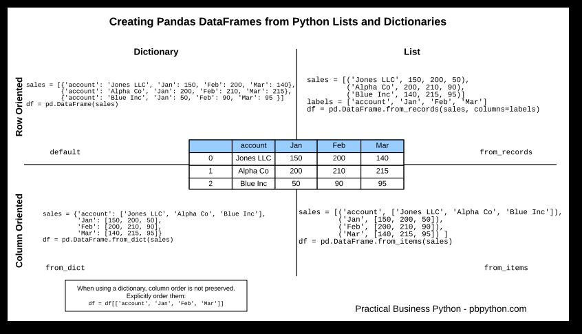

# Commands

`DataFrame.describe(percentiles=None, include=None, exclude=None)`

Generates descriptive statistics that summarize the central tendency, dispersion and shape of a dataset's distribution, excludingNaNvalues.

Analyzes both numeric and object series, as well asDataFramecolumn sets of mixed data types. The output will vary depending on what is provided.

Only give statistics for numerical dataset and not categorical dataset



```python
df = pd.DataFrame.from_dict(out1).T
df.columns = ['r', 't'']
df = df.drop('r', axis=1)
big_df = pd.concat([df, df1], axis=1)
big_df['diff'] = big_df['one'] - big_df['two']
big_df.assign(diff1 = big_df.one - big_df.two)
df.describe(include = 'all')
```

## Final Commands

Create a dataframe from two dictionary with same keys and values from each dictionary as columns. Create a new column with the difference of the two column.

```python
df = pd.DataFrame.from_dict({'one':out1,'two':out2})
df=df.assign(three=df.one-df.two)
```

<https://pandas.pydata.org/pandas-docs/stable/generated/pandas.DataFrame.describe.html>

```python
DataFrame.groupby(*self***, ***by=None***, ***axis=0***, ***level=None***, ***as_index: bool = True***, ***sort: bool = True***, ***group_keys: bool = True***, ***squeeze: bool = False***, ***observed: bool = False*)→ 'groupby_generic.DataFrameGroupBy'

    df.groupby(level=0).apply(lambda x: x.to_json(orient='records'))
    df.groupby(['A','B']).c.unique().reset_index()
```

<https://pandas.pydata.org/pandas-docs/stable/reference/api/pandas.DataFrame.groupby.html>

## pandas.crosstab

<https://pandas.pydata.org/pandas-docs/stable/reference/api/pandas.crosstab.html>

<https://pbpython.com/pandas-crosstab.html>
