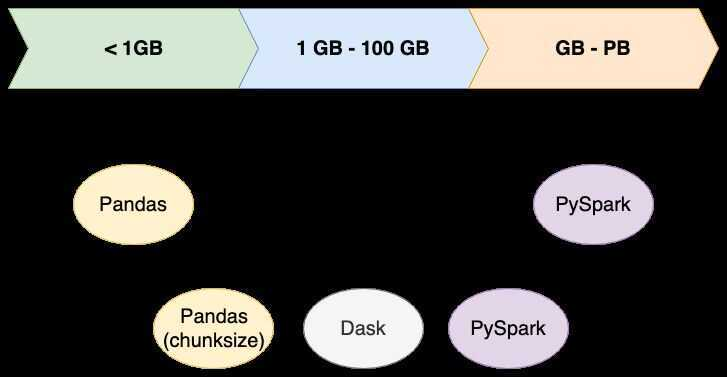

# Pandas Intro

Pandas is an open-source, BSD-licensed Python library providing high-performance, easy-to-use data structures and data analysis tools for the Python programming language.

## Concatenation

- pd.**concat**()function: the most multi-purpose and can be used to combine multiple DataFrames along either axis.
- DataFrame.**append**()method: a quick way to add rows to your DataFrame, but not applicable for adding columns.
- pd.**merge**()function: great for joining two DataFrames together when we have one column (key) containing common values.
- DataFrame.**join**()method: a quicker way to join two DataFrames, but works only off index labels rather than columns.

## Options

`pd.options.display.max_columns = None`

## Reference

https://www.dataquest.io/blog/pandas-concatenation-tutorial

https://pandas.pydata.org/docs/getting_started/10min.html
