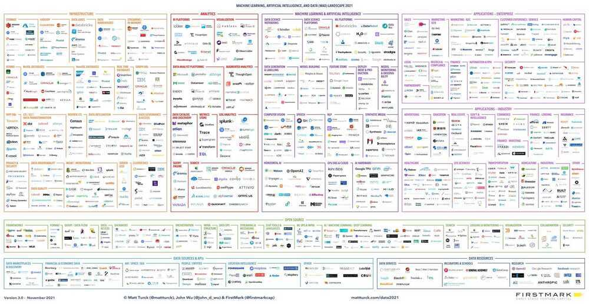

# AI

- [agi](ai/agi.md)
- [Model Evaulation](model-evaluation/readme.md)
- [Data Science](data-science/readme.md)
- [Big Data](ai/big-data/readme.md)
- [Data Visualization](ai/data-visualization/readme.md)
- [ML Fundamentals](ml-fundamentals/readme.md)
- [ML Algorithms](ml-algorithms/readme.md)
- [Deep Learning](deep-learning/readme.md)
- [LLM](ai/llm/readme.md)
- [Computer Vision](computer-vision-cv/readme.md)
- [NLP](nlp/readme.md)
- [Move37 - Reinforcement Learning](move-37/readme.md)
- [Pandas](pandas/readme.md)
- [Numpy](numpy/readme.md)
- [Scikit-learn / Scipy](scikit-learn/readme.md)
- [Libraries](libraries/readme.md)
- [Courses](courses/readme.md)
- [Others / Resources / Interview / Learning](ai/others-resources-interview-learning-courses.md)
- [Hackathons](ai/hackathons.md)
	- [Hackathon Hackhound](ai/hackathon-hackhound.md)
	- [Hackathon RabbittAI](ai/hackathon-rabbittai.md)
- [Solutions](ai/solutions.md)
    - [Content Moderation](ai/content-moderation.md)
    - [Social Media Analytics Solution](ai/social-media-analytics-solution.md)

## Data & AI Landscape

Interactive - [FirstMark | 2024 MAD (ML/AI/Data) Landscape](https://mad.firstmark.com/)

[Full Steam Ahead: The 2024 MAD (Machine Learning, AI & Data) Landscape – Matt Turck](https://mattturck.com/mad2024/)
