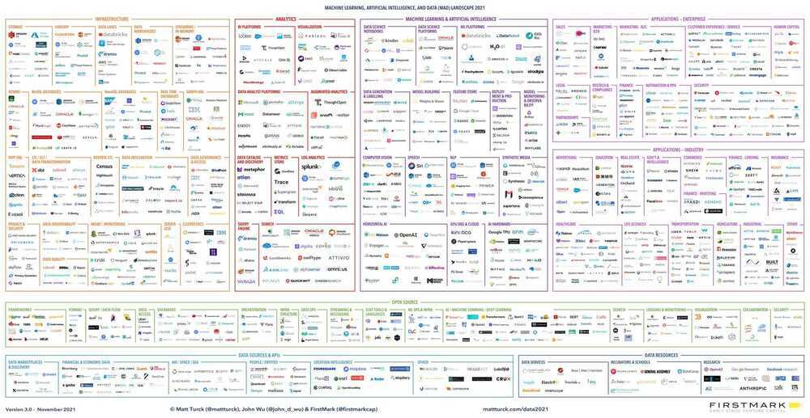

# AI

- [Model Evaulation](model-evaluation/readme.md)
- [Data Science](data-science/readme.md)
- [Big Data](ai/big-data/readme.md)
- [Data Visualization](ai/data-visualization/readme.md)
- [ML Fundamentals](ml-fundamentals/readme.md)
- [ML Algorithms](ml-algorithms/readme.md)
- [Deep Learning](deep-learning/readme.md)
- [LLM](ai/llm/readme.md)
- [Computer Vision](computer-vision-cv/readme.md)
- [NLP](nlp/readme.md)
- [Move37 - Reinforcement Learning](move-37/readme.md)
- [Pandas](pandas/readme.md)
- [Numpy](numpy/readme.md)
- [Scikit-learn / Scipy](scikit-learn/readme.md)
- [Libraries](libraries/readme.md)
- [Courses](courses/readme.md)
- [Others / Resources / Interview / Learning](ai/others-resources-interview-learning-courses.md)
- [Hackathons](ai/hackathons.md)
	- [Hackathon Hackhound](ai/hackathon-hackhound.md)
	- [Hackathon RabbittAI](ai/hackathon-rabbittai.md)
- [Solutions](ai/solutions.md)
    - [Content Moderation](ai/content-moderation.md)
    - [Social Media Analytics Solution](ai/social-media-analytics-solution.md)

## Data & AI Landscape

Interactive - [FirstMark | 2024 MAD (ML/AI/Data) Landscape](https://mad.firstmark.com/)

[Full Steam Ahead: The 2024 MAD (Machine Learning, AI & Data) Landscape – Matt Turck](https://mattturck.com/mad2024/)

## AGI (Artificial General Intelligence) / Sentient / Intelligence Explosion / Technological singularity / Superintelligence

- Current - ANI - Artificial Narrow Intelligence
- ASI — Artificial Super Intelligence

AGI will be intellectually, morally, ethically and creatively superior to humans in every conceivable way

An "intelligence explosion" refers to a hypothetical scenario where a self-improving AI system could rapidly and exponentially increase its intelligence, surpassing human intelligence. This concept, also known as the "singularity," suggests that the initial superintelligent machine could design even better machines, leading to a cascade of intelligence growth.

- [Introduction - SITUATIONAL AWARENESS: The Decade Ahead](https://situational-awareness.ai/)
- [**Technological singularity** - Wikipedia](https://en.wikipedia.org/wiki/Technological_singularity)
- [Ben Goertzel: Singularity, Sparks of AGI in GPT - YouTube](https://www.youtube.com/watch?v=27zHyw_oHSI)
- [Ben Goertzel - Open Ended vs Closed Minded Conceptions of Superintelligence - YouTube](https://www.youtube.com/watch?v=4mEsJ3z6T_E)
- [Christopher Hitchens on Fear and A.I. - YouTube](https://www.youtube.com/watch?v=VmKqBlbxfUo)
- [Google's DeepMind Co-founder: AI Is Becoming More Dangerous And Threatening! - Mustafa Suleyman - YouTube](https://www.youtube.com/watch?v=CTxnLsYHWuI)
- [Artificial consciousness - Wikipedia](https://en.wikipedia.org/wiki/Artificial_consciousness)
- [A.I. ‐ Humanity's Final Invention? - YouTube](https://www.youtube.com/watch?v=fa8k8IQ1_X0)
- [Once upon a time…AI created a religion about a Goat | by AJ | Medium](https://medium.com/@Paradith/once-upon-a-time-ai-created-a-religion-about-a-goat-1ff3f40c2f42)
- [DeepMind CEO Demis Hassabis + Google Co-Founder Sergey Brin: AGI by 2030? - YouTube](https://youtu.be/M2ZtBQI2-GY)
- [Why Can’t We Tame AI? - Cal Newport](https://calnewport.com/why-cant-we-tame-ai/)
- [Why the AI Revolution Has a Fatal Flaw - YouTube](https://www.youtube.com/watch?v=hBfhd88DCZA&ab_channel=UndecidedwithMattFerrell)
	- AI economic paradox
- [AI isn't replacing radiologists - by Deena Mousa](https://www.understandingai.org/p/ai-isnt-replacing-radiologists)
- [Leopold Aschenbrenner — 2027 AGI, China/US super-intelligence race, & the return of history - YouTube](https://www.youtube.com/watch?v=zdbVtZIn9IM)
- [Will AI outsmart human intelligence? - with 'Godfather of AI' Geoffrey H...](https://youtu.be/IkdziSLYzHw)

## Links

- [AI Index Report 2024 – Artificial Intelligence Index](https://aiindex.stanford.edu/report/)
- [When Machines Think Ahead: The Rise of Strategic AI | by Hans Christian Ekne | Nov, 2024 | Towards Data Science](https://towardsdatascience.com/when-machines-think-ahead-the-rise-of-strategic-ai-91052e4c5da9)
- [AI Slop Is Killing Our Channel - YouTube](https://www.youtube.com/watch?v=_zfN9wnPvU0)
- [Welcome to State of AI Report 2025](https://www.stateof.ai/)
	- [Welcome to State of AI Report 2025](https://www.stateof.ai/2025-report-launch)
	- [State of AI Report - 2025 ONLINE - Google Slides](https://docs.google.com/presentation/d/1xiLl0VdrlNMAei8pmaX4ojIOfej6lhvZbOIK7Z6C-Go/edit?usp=sharing)
