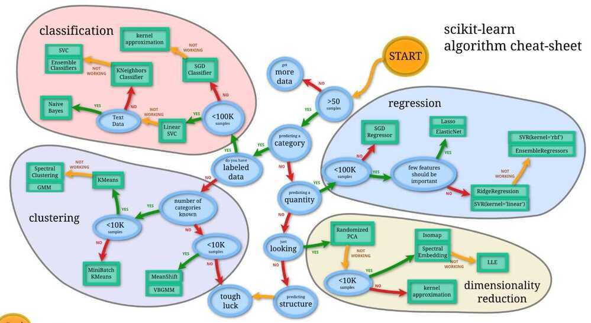

# Intro

- Simple and efficient tools for data mining and data analysis
- Accessible to everybody, and reusable in various contexts
- Built on NumPy, SciPy, and matplotlib
- Open source, commercially usable - BSD license

## References

<http://scikit-learn.org/stable/tutorial/machine_learning_map>

<http://scikit-learn.org/stable/modules/classes.html>
