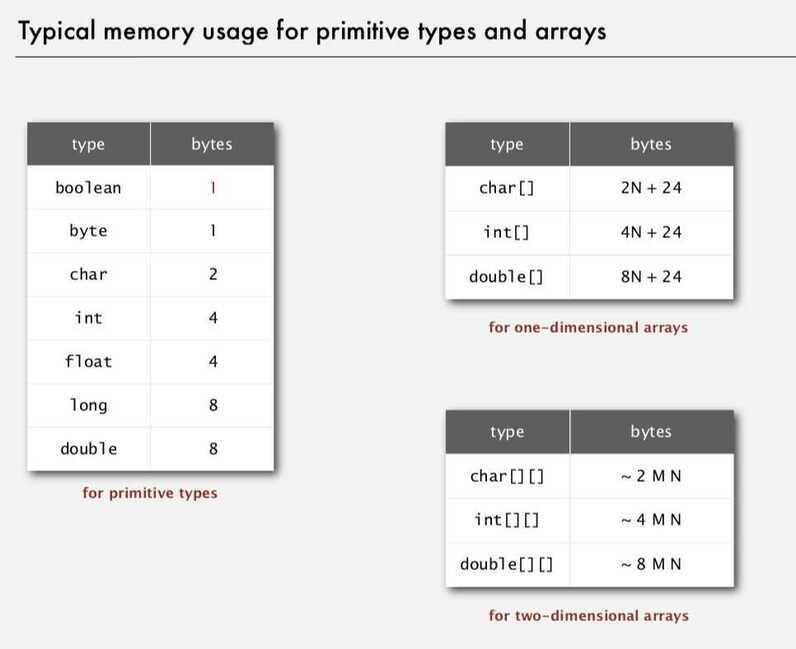
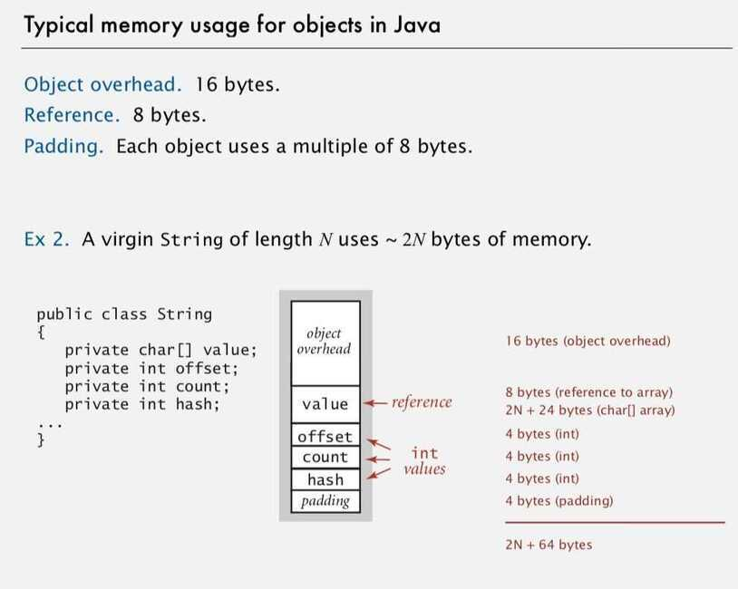

# Analysis of Algorithms

Discrete Fourier Transform (FTT - Fast Fourier Transform)

## Scientific method

1. Observe
2. Hypothesis
3. Predict
4. Verify
5. Validate

## Empirical Analysis

Run the program for various input sizes and measure running time

1. 3-Sum Problem -

   Given N distinct integers, how many triples sum to exactly zero

   Brute-force uses n^3 time.

   Can be solved in n^2 log N

      1. Sort the N (distinct) numbers

      2. For each pair of numbers a[i] and a[j], binary search for -(a[i] + a[j])

2. 1-Sum problem -

   How many integers are 0 in an array

3. 2-Sum problem

   How many pair integers sum to 0

## Mathematical Model

Cost Model

Tilde notation

Estimating a discrete sum (replace sum with an integral, and use calculus)

1. 3-Sum Problem can be improved -

   - Sort the input array

   - For each pair of number a[i] and a[j], binary search for -(a[i] + a[j])

   - Order of growth is N^2 log N

## Theory of algorithms

1. Best Case
2. Worst Case
3. Average Case

## Amortized Analysis

Amortized analysisis a method of analyzing the costs associated with a data structure that averages the worst operations out over time. Often, a data structure has one particularly costly operation, but it doesn't get performed very often. That data structure shouldn't be labelled a costly structure just because that one operation, that is seldom performed, is costly.

So, amortized analysis is used to average out the costly operations in the worst case. The worst case scenario for a data structure is the absolute worst ordering of operations from a cost perspective. Once that ordering is found, then the operations can be averaged.

There are three main types of amortized analysis:aggregate analysis, theaccounting method, and thepotential method.

https://brilliant.org/wiki/amortized-analysis

## Memory

## Typical memory usage summary

Total memory. usage for a data type value

- Primitive type: 4 bytes for int, 8 bytes for double, ...
- Object reference: 8 bytes
- Array: 24 bytes + memory for each array entry
- Object: 16 bytes + memory for each instance variable + 8 bytes if inner class (for pointer to enclosing class)
- Padding: round up to multiple of 8 bytes

### Shallow memory usage: Don't count referenced objects

### Deep memory usage: If array entry or instance variable is a reference, add memory (recursively) for referenced object

## Space--time or time-memory tradeoff (TMTO)

Aspace--timeortime--memory trade-offin [computer science](https://en.wikipedia.org/wiki/Computer_science) is a case where an [algorithm](https://en.wikipedia.org/wiki/Algorithm) or [program](https://en.wikipedia.org/wiki/Computer_program)[trades](https://en.wikipedia.org/wiki/Trade-off) increased space usage with decreased time. Here, spacerefers to the [data storage](https://en.wikipedia.org/wiki/Computer_storage) consumed in performing a given task ([RAM](https://en.wikipedia.org/wiki/Dynamic_random-access_memory), [HDD](https://en.wikipedia.org/wiki/Hard_disk_drive), etc), andtimerefers to the time consumed in performing a given task ([computation](https://en.wikipedia.org/wiki/Time_complexity) time or [response time](https://en.wikipedia.org/wiki/Response_time_(technology))).

The utility of a given space--time tradeoff is affected by related [fixed](https://en.wikipedia.org/wiki/Fixed_cost) and [variable costs](https://en.wikipedia.org/wiki/Variable_costs)(of, e.g., [CPU](https://en.wikipedia.org/wiki/CPU) speed, storage space), and is subject to [diminishing returns](https://en.wikipedia.org/wiki/Diminishing_returns).

https://en.wikipedia.org/wiki/Space%E2%80%93time_tradeoff

## Types of tradeoff

## Lookup tables vs. recalculation

A common situation is an algorithm involving a [lookup table](https://en.wikipedia.org/wiki/Lookup_table): an implementation can include the entire table, which reduces computing time, but increases the amount of memory needed, or it can compute table entries as needed, increasing computing time, but reducing memory requirements.

## Compressed vs. uncompressed data

A space--time tradeoff can be applied to the problem of data storage. If data is stored uncompressed, it takes more space but access takes less time than if the data were stored compressed (since compressing the data reduces the amount of space it takes, but it takes time to run the [decompression algorithm](https://en.wikipedia.org/wiki/Data_compression)). Depending on the particular instance of the problem, either way is practical. There are also rare instances where it is possible to directly work with compressed data, such as in the case of compressed [bitmap indices](https://en.wikipedia.org/wiki/Bitmap_index), where it is faster to work with compression than without compression.

## Re-rendering vs. stored images

Storing only the [SVG](https://en.wikipedia.org/wiki/Scalable_Vector_Graphics) source of a [vector image](https://en.wikipedia.org/wiki/Vector_graphics) and rendering it as a [bitmap image](https://en.wikipedia.org/wiki/Bitmap) every time the page is requested would be trading time for space; more time used, but less space. Rendering the image when the page is changed and storing the rendered images would be trading space for time; more space used, but less time. This technique is more generally known as [caching](https://en.wikipedia.org/wiki/Cache_(computing)).

## Smaller code vs. loop unrolling

Larger code size can be traded for higher program speed when applying [loop unrolling](https://en.wikipedia.org/wiki/Loop_unrolling). This technique makes the code longer for each iteration of a loop, but saves the computation time required for jumping back to the beginning of the loop at the end of each iteration.

## Time/memory/data tradeoff attack

Atime/memory/data tradeoff attackis a type of [cryptographic attack](https://en.wikipedia.org/wiki/Cryptanalysis) where an attacker tries to achieve a situation similar to the [space--time tradeoff](https://en.wikipedia.org/wiki/Space%E2%80%93time_tradeoff) but with the additional parameter ofdata, representing the amount of data available to the attacker. An attacker balances or reduces one or two of those parameters in favor of the other one or two. This type of attack is very difficult, so most of the ciphers and encryption schemes in use were not designed to resist it.

https://en.wikipedia.org/wiki/Time/memory/data_tradeoff_attack
