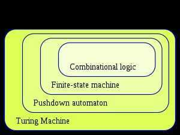

# Finite-State Machine

DFA - Deterministic Finite Automata

NFA - Non-deterministic Finite Automata

Use *e (epsilon)* transition to get to next state

Afinite-state machine(FSM) orfinite-state automaton(FSA, plural:automata), finite automaton, or simply astate machine, is a mathematical [model of computation](https://en.wikipedia.org/wiki/Model_of_computation). It is an [abstract machine](https://en.wikipedia.org/wiki/Abstract_machine) that can be in exactly one of a finite number of [states](https://en.wikipedia.org/wiki/State_(computer_science)) at any given time. The FSM can change from one state to another in response to some external [inputs](https://en.wikipedia.org/wiki/Input_(computer_science)); the change from one state to another is called atransition. An FSM is defined by a list of its states, its initial state, and the conditions for each transition. Finite state machines are of two types --[deterministic finite state machines](https://en.wikipedia.org/wiki/Deterministic_finite_automaton) and [non-deterministic finite state machines](https://en.wikipedia.org/wiki/Nondeterministic_finite_automaton).A deterministic finite-state machine can be constructed equivalent to any non-deterministic one.

The behavior of state machines can be observed in many devices in modern society that perform a predetermined sequence of actions depending on a sequence of events with which they are presented. Simple examples are [vending machines](https://en.wikipedia.org/wiki/Vending_machine), which dispense products when the proper combination of coins is deposited, [elevators](https://en.wikipedia.org/wiki/Elevator), whose sequence of stops is determined by the floors requested by riders, [traffic lights](https://en.wikipedia.org/wiki/Traffic_light), which change sequence when cars are waiting, and [combination locks](https://en.wikipedia.org/wiki/Combination_lock), which require the input of a sequence of numbers in the proper order.

The finite state machine has less computational power than some other models of computation such as the [Turing machine](https://en.wikipedia.org/wiki/Turing_machine).The computational power distinction means there are computational tasks that a Turing machine can do but a FSM cannot. This is because a FSM's [memory](https://en.wikipedia.org/wiki/Computer_memory) is limited by the number of states it has. FSMs are studied in the more general field of [automata theory](https://en.wikipedia.org/wiki/Automata_theory).

https://en.wikipedia.org/wiki/Finite-state_machine
