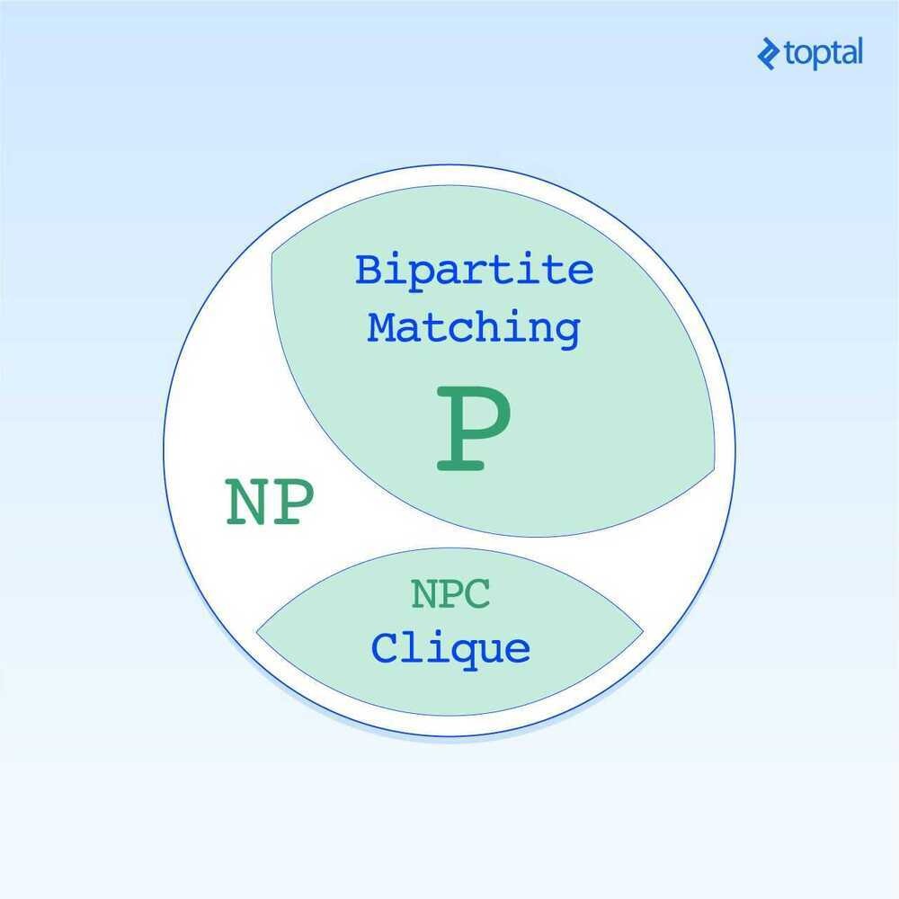

# NP Hardness

| [**P**](https://en.wikipedia.org/wiki/P_(complexity))     | The [complexity class](https://en.wikipedia.org/wiki/Complexity_class) of [decision problems](https://en.wikipedia.org/wiki/Decision_problem) that can be solved on a [deterministic Turing machine](https://en.wikipedia.org/wiki/Deterministic_Turing_machine) in polynomial time |
|---------|---------------------------------------------------------------|
| [**NP**](https://en.wikipedia.org/wiki/NP_(complexity))   | The complexity class of decision problems that can be solved on a [non-deterministic Turing machine](https://en.wikipedia.org/wiki/Non-deterministic_Turing_machine) in polynomial time                                                                                             |
| [**ZPP**](https://en.wikipedia.org/wiki/ZPP_(complexity)) | The complexity class of decision problems that can be solved with zero error on a [probabilistic Turing machine](https://en.wikipedia.org/wiki/Probabilistic_Turing_machine) in polynomial time                                                                                     |
| [**RP**](https://en.wikipedia.org/wiki/RP_(complexity))   | The complexity class of decision problems that can be solved with 1-sided error on a probabilistic Turing machine in polynomial time.                                                                                                                                               |
| [**BPP**](https://en.wikipedia.org/wiki/BPP_(complexity)) | The complexity class of decision problems that can be solved with 2-sided error on a probabilistic Turing machine in polynomial time                                                                                                                                                |
| [**BQP**](https://en.wikipedia.org/wiki/BQP)              | The complexity class of decision problems that can be solved with 2-sided error on a [quantum Turing machine](https://en.wikipedia.org/wiki/Quantum_Turing_machine) in polynomial time                                                                                              |

NP-hardness([non-deterministic polynomial-time](https://en.wikipedia.org/wiki/NP_(complexity)) hardness), in [computational complexity theory](https://en.wikipedia.org/wiki/Computational_complexity_theory), is the defining property of a class of problems that are informally "at least as hard as the hardest problems in NP". A simple example of an NP-hard problem is the [subset sum problem](https://en.wikipedia.org/wiki/Subset_sum_problem).

A more precise specification is: a problemHis NP-hard when every problemLin NP can be [reduced](https://en.wikipedia.org/wiki/Reduction_(complexity)) in [polynomial time](https://en.wikipedia.org/wiki/Polynomial_time) toH; that is, assuming a solution forHtakes 1 unit time, H‎'s solution can be used to solveLin polynomial time.As a consequence, finding a polynomial algorithm to solve any NP-hard problem would give polynomial algorithms for all the problems in NP, which is unlikely as many of them are considered difficult.

A common misconception is that theNPin "NP-hard" stands for "non-polynomial" when in fact it stands for "[non-deterministic](https://en.wikipedia.org/wiki/Non-deterministic_Turing_machine) polynomial acceptable problems".It is suspected that there are no polynomial-time algorithms for NP-hard problems, but that has not been proven. Moreover, the class [P](https://en.wikipedia.org/wiki/P_(complexity)), in which all problems can be solved in polynomial time, is contained in the [NP](https://en.wikipedia.org/wiki/NP_(complexity)) class.

## NP Naming Convention

NP-hard problems do not have to be elements of the complexity class NP. As NP plays a central role in [computational complexity](https://en.wikipedia.org/wiki/Computational_complexity_theory), it is used as the basis of several classes:

## P

Problems that computer can solve quickly and efficiently (P is a set of problems that are solvable in polynomial time. That is, the number of computational steps is bounded by polynomial function with respect to the problem size. Ex- Bipartite Matching)

[**NP**](https://en.wikipedia.org/wiki/NP_(complexity))

Class of computational decision problems for which a givenyes-solution can be verified as a solution in polynomial time by a deterministic Turing machine (orsolvableby anon-deterministicTuring machine in polynomial time).

Problems whose solutions can be verified quickly but cannot be obtained quickly

(NP is the set of problem that are verifiable in polynomial time. This includes all the problems in P, of course; however we don't know whether this containment is strict. We know of problems that are efficiently verifiable but not efficiently solvable, but we don't know if the problem is truly intractable. Ex-Clique Problem)

## NP-hard

Class of problems which are at least as hard as the hardest problems in NP. Problems that are NP-hard do not have to be elements of NP; indeed, they may not even be decidable.

[**NP-complete**](https://en.wikipedia.org/wiki/NP-complete)

Class of decision problems which contains the hardest problems in NP. Each NP-complete problem has to be in NP.

NP-Complete is the set of problems that are the hardest problems in NP. They are referred to as the hardest problem because any problem in NP can efficiently be transformed into NPC. As a result, if someone were to identify an efficient solution to a problem in NPC, then the entire class of NP would be absorbed by P. (Ex - Clique Problem)

- Weakly NP-Complete
- Strongly NP-Complete

An [NP-complete](https://en.wikipedia.org/wiki/NP-complete) problem with known pseudo-polynomial time algorithms is called [weakly NP-complete](https://en.wikipedia.org/wiki/Weakly_NP-complete). An [NP-complete](https://en.wikipedia.org/wiki/NP-complete) problem is called [strongly NP-complete](https://en.wikipedia.org/wiki/Strongly_NP-complete) if it is proven that it cannot be solved by a pseudo-polynomial time algorithm unless [P=NP](https://en.wikipedia.org/wiki/P%3DNP). The strong/weak kinds of [NP-hardness](https://en.wikipedia.org/wiki/NP-hard) are defined analogously.

[**NP-easy**](https://en.wikipedia.org/wiki/NP-easy)

At most as hard as NP, but not necessarily in NP.

[**NP-equivalent**](https://en.wikipedia.org/wiki/NP-equivalent)

Decision problems that are both NP-hard and NP-easy, but not necessarily in NP.

[**NP-intermediate**](https://en.wikipedia.org/wiki/NP-intermediate)

If P and NP are different, then there exist decision problems in the region of NP that fall between P and the NP-complete problems. (If P and NP are the same class, then NP-intermediate problems do not exist because in this case every NP-complete problem would fall in P, and by definition, every problem in NP can be reduced to an NP-complete problem.)

<https://en.wikipedia.org/wiki/NP-hardness>

## P vs NP Problem

It is the problem of confirming if every computational problem whose solution can be verified in polynomial time can also be solved in polynomial time.

## PTAS

In [computer science](https://en.wikipedia.org/wiki/Computer_science), a**polynomial-time approximation scheme**(**PTAS**) is a type of [approximation algorithm](https://en.wikipedia.org/wiki/Approximation_algorithm) for [optimization problems](https://en.wikipedia.org/wiki/Optimization_problem)(most often, [NP-hard](https://en.wikipedia.org/wiki/NP-hard) optimization problems).

A PTAS is an algorithm which takes an instance of an optimization problem and a parameter ε>0 and, in polynomial time, produces a solution that is within a factor 1 + ε of being optimal (or 1 − ε for maximization problems). For example, for the Euclidean [traveling salesman problem](https://en.wikipedia.org/wiki/Traveling_salesman_problem), a PTAS would produce a tour with length at most (1+ε)*L*, with *L* being the length of the shortest tour.There exists also PTAS for the class of all dense constraint satisfaction problems (CSPs)

The running time of a PTAS is required to be polynomial in *n* for every fixed ε but can be different for different ε. Thus an algorithm running in time [*O*](https://en.wikipedia.org/wiki/Big_O_notation)(*n*^1/ε^) or even*O*(*n*^exp(1/ε)^) counts as a PTAS.

<https://en.wikipedia.org/wiki/Polynomial-time_approximation_scheme>

## PTAS Reduction

In [computational complexity theory](https://en.wikipedia.org/wiki/Computational_complexity_theory), a**PTAS reduction** is an [approximation-preserving reduction](https://en.wikipedia.org/wiki/Approximation-preserving_reduction) that is often used to perform [reductions](https://en.wikipedia.org/wiki/Reduction_(complexity)) between solutions to [optimization problems](https://en.wikipedia.org/wiki/Optimization_problem). It preserves the property that a problem has a [polynomial time approximation scheme](https://en.wikipedia.org/wiki/Polynomial_time_approximation_scheme)(PTAS) and is used to define [completeness](https://en.wikipedia.org/wiki/Complete_(complexity)) for certain classes of optimization problems such as [APX](https://en.wikipedia.org/wiki/APX). Notationally, if there is a PTAS reduction from a problem A to a problem B, we writeA <=~PTAS~ B

With ordinary [polynomial-time many-one reductions](https://en.wikipedia.org/wiki/Polynomial-time_many-one_reduction), if we can describe a [reduction](https://en.wikipedia.org/wiki/Reduction_(complexity)) from a problem A to a problem B, then any polynomial-time solution for B can be composed with that reduction to obtain a polynomial-time solution for the problem A. Similarly, our goal in defining PTAS reductions is so that given a PTAS reduction from an optimization problem A to a problem B, a PTAS for B can be composed with the reduction to obtain a PTAS for the problem A.

<https://en.wikipedia.org/wiki/PTAS_reduction>
