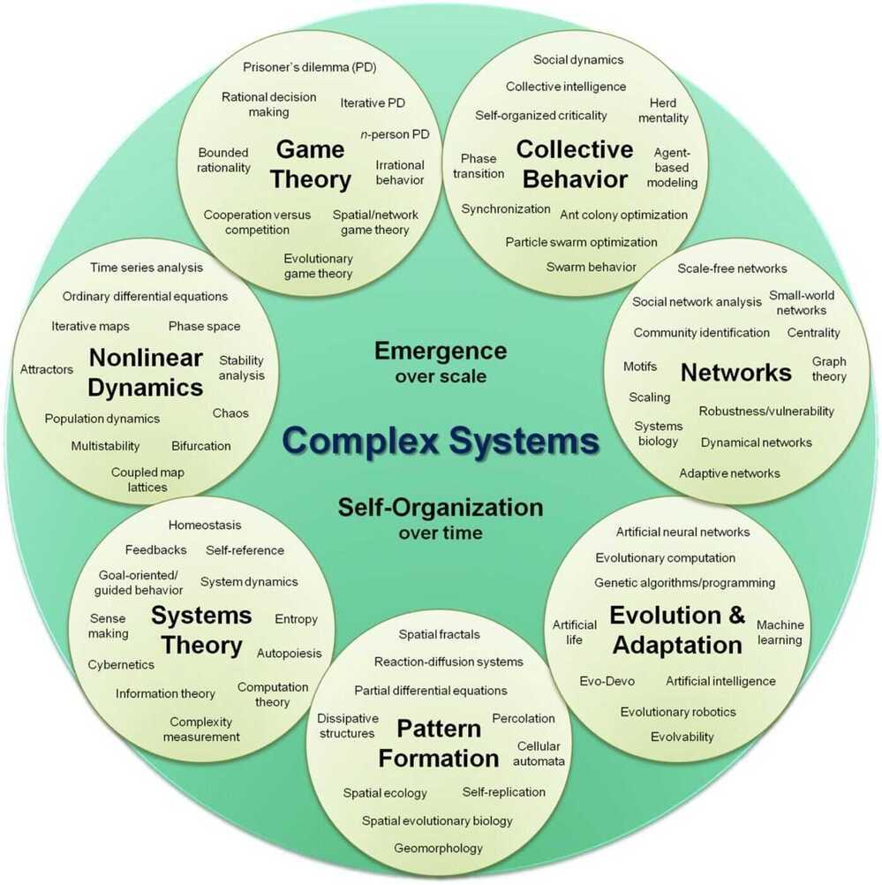

# Game Theory

A Game is any interaction between multiple people in which each person's payoff is affected by the decisions made by others.

## Two main branches

### Cooperative

- Where each player has agreed to work together towards a common goal.
- A coalition is what you call a group of players in a cooperative game
- Shapley Value
- Game theory can tell you how to be fair

### Non-cooperative / Competitive

- Covers competitive social interactions in which there will be some winners and some losers
- Nash Equilibrium
- Game theory can tell you how to be smart

## [Game types](https://en.wikipedia.org/wiki/Game_theory#Game_types)

1. [Cooperative / non-cooperative](https://en.wikipedia.org/wiki/Game_theory#Cooperative_/_non-cooperative)
2. [Symmetric / asymmetric](https://en.wikipedia.org/wiki/Game_theory#Symmetric_/_asymmetric)
3. [Zero-sum / non-zero-sum](https://en.wikipedia.org/wiki/Game_theory#Zero-sum_/_non-zero-sum)
4. [Simultaneous / sequential](https://en.wikipedia.org/wiki/Game_theory#Simultaneous_/_sequential)
[Cournot Competition](https://en.wikipedia.org/wiki/Game_theory#Cournot_Competition)
[Bertrand Competition](https://en.wikipedia.org/wiki/Game_theory#Bertrand_Competition)
5. [Perfect information and imperfect information](https://en.wikipedia.org/wiki/Game_theory#Perfect_information_and_imperfect_information)
[Bayesian game](https://en.wikipedia.org/wiki/Game_theory#Bayesian_game)
6. [Combinatorial games](https://en.wikipedia.org/wiki/Game_theory#Combinatorial_games)
7. [Infinitely long games](https://en.wikipedia.org/wiki/Game_theory#Infinitely_long_games)
8. [Discrete and continuous games](https://en.wikipedia.org/wiki/Game_theory#Discrete_and_continuous_games)
9. [Differential games](https://en.wikipedia.org/wiki/Game_theory#Differential_games)
10. [Evolutionary game theory](https://en.wikipedia.org/wiki/Game_theory#Evolutionary_game_theory)
11. [Stochastic outcomes (and relation to other fields)](https://en.wikipedia.org/wiki/Game_theory#Stochastic_outcomes_(and_relation_to_other_fields))
12. [Metagames](https://en.wikipedia.org/wiki/Game_theory#Metagames)
13. [Pooling games](https://en.wikipedia.org/wiki/Game_theory#Pooling_games)
14. [Mean field game theory](https://en.wikipedia.org/wiki/Game_theory#Mean_field_game_theory)

## The Prisoner's Dilemma

The**prisoner's dilemma**is a standard example of a game analyzed in [game theory](https://en.wikipedia.org/wiki/Game_theory) that shows why two completely [rational](https://en.wikipedia.org/wiki/Rationality#Economics) individuals might not cooperate, even if it appears that it is in their best interests to do so.

Two members of a criminal gang are arrested and imprisoned. Each prisoner is in solitary confinement with no means of communicating with the other. The prosecutors lack sufficient evidence to convict the pair on the principal charge, but they have enough to convict both on a lesser charge. Simultaneously, the prosecutors offer each prisoner a bargain. Each prisoner is given the opportunity either to betray the other by testifying that the other committed the crime, or to cooperate with the other by remaining silent. The offer is:

- If A and B each betray the other, each of them serves two years in prison
- If A betrays B but B remains silent, A will be set free and B will serve three years in prison (and vice versa)
- If A and B both remain silent, both of them will only serve one year in prison (on the lesser charge).

## Prisoner's dilemma payoff matrix

| | | |
|---|---|---|
| **Prisoner A / Prisoner B** | **Prisoner B stays silent (cooperates)** | **Prisoner B betrays (defects)** |
| **Prisoner A stays silent (cooperates)** | Each serves 1 year | Prisoner A: 3 years, Prisoner B: goes free |
| **Prisoner A betrays (defects)** | Prisoner A: goes free, Prisoner B: 3 years | Each serves 2 years |

Solution is both should **defect**, because then they have reached Nash Equilibrium

## Nash Equilibrium

A player in a game has found Nash Equilibrium when they make the choice that leaves them better off no matter what their opponents decide to do.

Under the Nash equilibrium, the less optimal but stable outcome is reached between both sides. Yet, they cannot reach a better outcome unless they drop their opposing positions and work together on a common goal that would give each at least a neutral role that would keep them from getting into each other's way.

## Shapley Value

A method of dividing up gains or costs among players according to the value of their individual contributions

**Axioms**

#### 1. Marginal Contribution

The contribution of each player is determined by what is gained or lost by removing them from the game

#### 2. Interchangeable players have equal values

If 2 parties bring the same things to the coalition, they should have to contribute the same amount, and should be rewarded for their contributions equally

#### 3. Dummy players have zero value

If a member of a coalition contributes nothing then they should receive nothing

#### 4. If a game has multiple parts, cost or payment should be decomposed across those parts

## Fair Division

In [game theory](https://en.wikipedia.org/wiki/Game_theory), fair divisionis the problem of dividing a set of [resources](https://en.wikipedia.org/wiki/Resources) among several people who have an [entitlement](https://en.wikipedia.org/wiki/Entitlement) to them, such that each person receives their due share.

The archetypal fair division [algorithm](https://en.wikipedia.org/wiki/Algorithm) is [divide and choose](https://en.wikipedia.org/wiki/Divide_and_choose). It demonstrates that two agents with different tastes can divide a cake such that each of them believes that he got the best piece. The research in fair division can be seen as an extension of this procedure to various more complex settings.

## Cricket Coin Toss

Move the toss from a two-step formula -- toss thecoin, winning captain chooses -- to a three-step formula: toss, propose, choose. Here, thecoinis tossed as normal, then the Unlucky (toss-losing) captain chooses a run handicap to pin to the more favourable option in order to equalise the two choices, before handing back to the Lucky (toss-winning) captain to make the final decision of whether to bat or field. The beauty of the division is that the Unlucky captain will not overestimate or underestimate the runs needed to equal up the decision, as it is the Lucky captain who gets to make the final choice.

It is inspired by a rule called **divide and choose** which has been used throughout history to make a very different kind of allocation decision about dividing a divisible resource. Steven Brams and Alan Taylor have written an excellent book on it called Fair Division. Here we don't have a divisible resource but we do have runs, which are almost a divisible resource, and which we can use to balance things out."

https://en.wikipedia.org/wiki/Fair_division

https://brilliant.org/wiki/fair-division

https://en.wikipedia.org/wiki/Game_theory

[Game Theory: The Science of Decision-Making](https://www.youtube.com/watch?v=MHS-htjGgSY)

https://www.freecodecamp.org/news/introduction-to-evolutionary-game-theory
