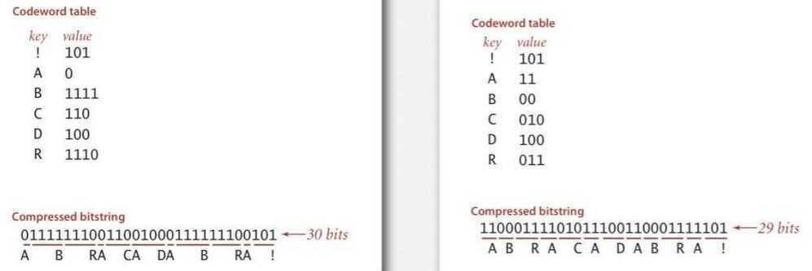
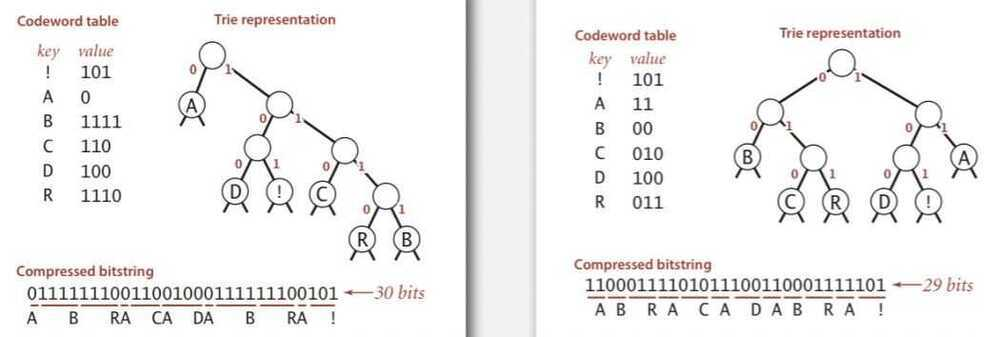
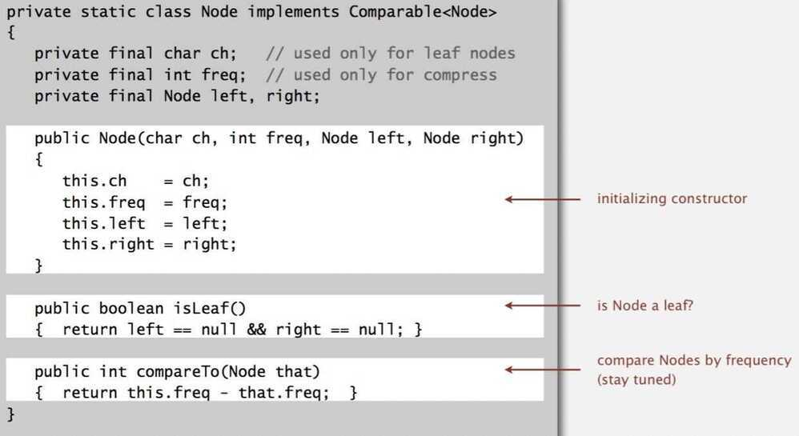
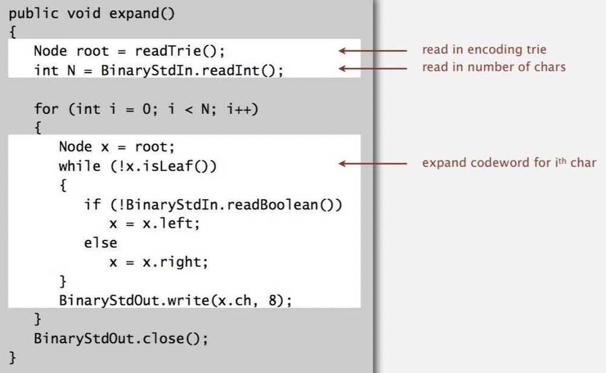
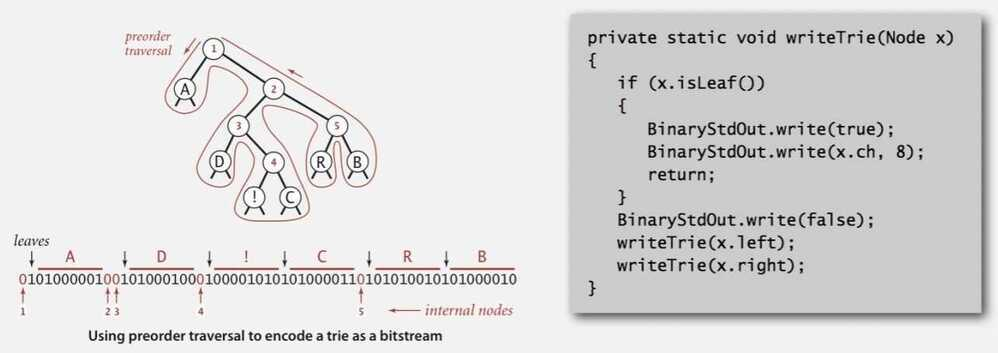
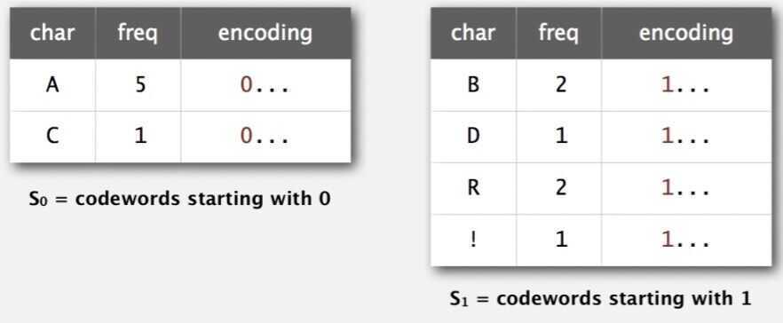

# Huffman Compression

## Variable-length codes

Use different number of bits to encode different chars

Que: How do we avoid ambiguity?

Ans: Ensure that no condeword is a prefix of another

Ex 1: Fixed-length code

Ex 2: Append special stop char to each codeword

Ex 3: General prefix-free code

## Prefix-free codes: trie representation

Que: How to represent the prefix-free code?

Ans: A binary trie

- Chars in leaves
- Codeword is path from root to leaf

## Compression

- Method 1: start at leaf; follow path up to the root; print bits in reverse
- Method 2: create ST of key-value pairs

## Expansion

- Start at root
- Go left if bit is 0; go right if 1
- If leaf node, print char and return to root

## Huffman trie node data type

## Prefix-free codes: expansion

Running time: Linear in input size N

## How to transmit

Que: How to write the trie?

Ans: Write preorder traversal of trie; mark leaf and internal nodes with a bit

Note: If message is long, overhead of transmitting trie is small

Que: How to read in the trie?

Ans: Reconstruct from preorder traversal of trie

## Shannon-Fano codes

Que: How to find best prefix-free code?

Shannon-Fano algorithm:

- Partition symbols S into two subsets S~0~ and S~1~ of (roughly) equal freq
- Codewords for symbols in S~0~ start with 0; for symbols in S~1~ start with 1
- Recur in S~0~ and S~1~.

Problem 1: How to divide up symbols?

Problem 2: Not optimal

## Huffman codes

Que: How to find best prefix-free code?

Huffman algorithm:

- Count frequency freq[i] for each char i in input
- Start with one node corresponding to each char i (with weight freq[i])
- Repeat until single trie formed:
  - Select two tries with min weight freq[i] and freq[j]
  - merge into single trie with weight freq[i] + freq[j]

## Constructing a Huffman encoding trie: Java implementation

## Huffman encoding summary

Proposition: Huffman algorithm produces an optimal prefix-free code

Implementation:

Pass 1: tabulate char frequencies and build trie

Pass 2: encode file by traversing frie or lookup table

Running time: Using a binary heap => N+R log R

