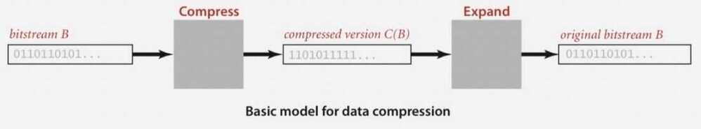
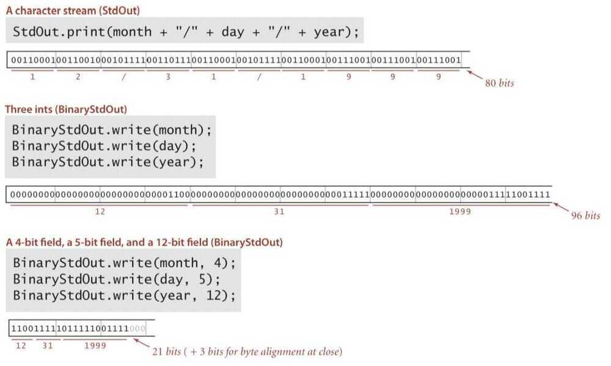

# Intro

<https://quixdb.github.io/squash-benchmark>

## Entropy Encoding

An **entropy encoding** is a [lossless data compression](https://en.wikipedia.org/wiki/Lossless_compression) scheme that is independent of the specific characteristics of the medium.

Types

1. Huffman Coding
2. Arithmetic Coding

## Lossless Compression

1. Run Length Encoding (Fixed length codes)
2. Huffman Compression (Variable length codes)
3. LZW Compression (Variable length codes)
4. UTF-8 (Variable width character encoding)
    - Backward compatible with ASCII
    - Can encode all 1,112,064 valid code points in Unicode using one to four 8-bit bytes.
    - Derived from Unicode (Universal Coded Character Set) Transformation - 8-bit.

## Advantages

- To save space when storing data
- To save time when transmitting data
- Most files have lots of redundancy

## Applications

1. Generic file compression
    - Files: Gzip, Bzip, 7z, zip64 (zip64 format is an extension to the standard zip format that practically removes limits in sizes and the number of files inside of a zip archive)
    - Archivers: PKZIP
    - File systems: NTFS, HFS+, ZFS, exFAT

        <https://www.quora.com/Is-HFS-better-than-exFAT>

2. Multimedia
    - Images: GIF, JPEG
    - Sound: MP3
    - Video: MPEG, DivX, HDTV

3. Communication
    - ITU-T T4 Group 43 Fax
    - V.42bis modem
    - Skype

## Lossless compression and expansion

Message: Binary data B we want to compress

Compress: Generates a compressed representation C(B)

Expand: Reconstructs original bitstream B

Compression ratio: Bits in C(B) / bits in B

Ex. 50-75% or better compression ratio for natural language

## Data representation: genomic code

Genome: String over the alphabet { A, C, T, G }

Goal: Encode an N-character genome: A T A G A T G C A T A G . . .

Fixed-length code - k-bit code supports alphabet of size 2^k^

Amazing but true - Initial genomic databases in 1990s used ASCII

## Reading and writing binary data

Binary standard input and standard output: Libraries to read and write bits from standard input and to standard output

## Writing binary data

Date representation - Three different ways to represent 12/31/1999

## Binary dumps

How to examine the contents of a bitstream?

## Universal data compression

Proposition: No algorithm can compress every bitstring

Proof 1 - by contradiction

- Suppose you have a universal data compression algorithm U that can compress every bitstream
- Given bitstring B~0~, compress it to get smaller bistring B1.
- Compress B~1~ to get a smaller bistring B~2~.
- Continue until reaching bitstring of size 0
- Implication: all bitstrings can be compressed to 0 bits

Proof 2 - by counting

- Suppose your algorithm that can compress all 1000-bit strings
- 2^1000^ possible bitstrings with 1000 bits
- Only 1+2+4+ ... + 2^998^ + 2^999^ can be encoded with <= 999 bits
- Similarly, only 1 in 2^499^ bitstrings can be encoded with <= 500 bits

## Lossless data compression benchmarks (using Calgary corpus)

1. **Lossless compression**
    - **Represent fixed-length symbols with variable-length codes [Huffman]**
    - **Represent variable-length symbols with fixed-length codes [LZW]**

2. **Lossy compression**
    - **JPEG, MPEG, MP3**
    - **FFT, wavelets, fractals**

## Theoretical limits on compression - Shannon entropy

## Predicate Pushdown

Predicate pushdown is actually a simple concept:

- If you issue a query in one place to run against a lot of data that's in another place, you could spawn a lot of network traffic, which could be slow and costly. However ...
- ... if you can "push down" parts of the query to where the data is stored, and thus filter out most of the data, then you can greatly reduce network traffic.

"Predicate pushdown" gets its name from the fact that portions of SQL statements, specifically ones that filter data, are properly referred to as predicates. They earn that name because predicates in mathematical logic and clauses in SQL are the same kind of thing - statements that, upon evaluation, can be TRUE or FALSE for different values of variables or data.

<https://docs.cloudera.com/documentation/enterprise/6/6.3/topics/cdh_ig_predicate_pushdown_parquet.html>

## Dictionary Coders

A **dictionary coder**, also sometimes known as a**substitution coder**, is a class of [lossless data compression](https://en.wikipedia.org/wiki/Lossless_data_compression) algorithms which operate by searching for matches between the text to be compressed and a set of [strings](https://en.wikipedia.org/wiki/String_(computer_science)) contained in a [data structure](https://en.wikipedia.org/wiki/Data_structure)(called the 'dictionary') maintained by the encoder. When the encoder finds such a match, it substitutes a reference to the string's position in the data structure.

<https://en.wikipedia.org/wiki/Dictionary_coder>

## Dictionary Encoding

Elasticsearch and other databases converts big values to a bit representation that signifies that final value

## Image Compression (JPEG)

[How are Images Compressed? [46MB ↘↘ 4.07MB]](https://www.youtube.com/watch?v=Kv1Hiv3ox8I)
