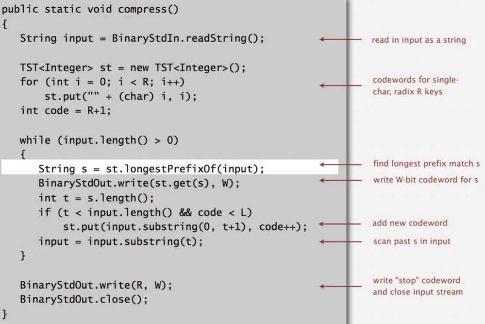
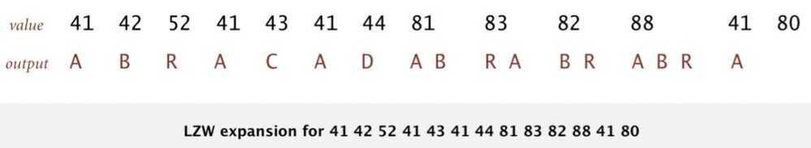
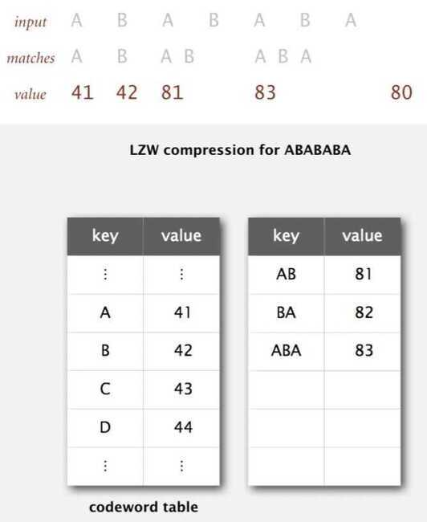

# LZW Compression

LZF belongs to a family of compression codecs called "simple Lempel-Ziv" codecs. Since LZ compression is also the first part ofdeflatecompression (which is used, along with simple framing, forgzip), it can be viewed as "first-part of gzip" (second part being Huffman-encoding of compressed content).

- Used in Druid

https://github.com/ning/compress/wiki/LZFFormat

## Properties

- Lossless data compression algorithms
- Dictionary coders
- LZ77 maintains a sliding window during compression

## LZW (Abraham Lampel, Jacob Ziv, Terry Welch)

## Statistical Methods

1. **Static model:** Same model for all texts
    - **Fast**
    - **Not optimal: different texts have different statistical properties**
    - **Ex: ASCII, Morse code**

2. **Dynamic model**: Generate model based on text
    - **Preliminary pass needed to generate model**
    - **Must transmit the model**
    - **Ex: Huffman code**

3. **Adaptive model:** Progressively learn and update model as you read text
    - **More accurate modeling produces better compression**
    - **Decoding must start from beginning**
    - **Ex: LZW**

## LZW compression example

## Lempel-Ziv-Welch compression

- Create ST associating W-bit codewords with string keys
- Initialize ST with codewords for single-char keys
- Find longest string s in ST that is a prefix of unscanned part of input
- Write the W-bit codeword associated with s
- Ass s+c to ST, where c is next char in the input

Que: How to represent LZW compression code table?

Ans: A trie to support longest prefix match

## LZW compression: Java Implementation

## LZW expansion example

## LZW expansion

- Create ST associating string values with W-bit keys
- Initialize ST to contain single-char values
- Read a W-bit key
- Find associated string value in ST and write it out
- Update ST

Que: How to represent LZW expansion code table?

Ans: An array of size 2^w^.

## LZW example: tricky case

## LZW implementation details

- **How big to make ST?**
  - How long is message?
  - Whole message similar model?
  - [many other variations]

- **What to do when ST fills up?**
  - Throw away and start over [GIF]
  - Throw away when not effective [Unix compress]
  - [many other variations]

- **Why not put longer substrings in ST?**
  - [many variations have been developed]

## LZW in the real world

- **LZ77**
- **LZ78**
- **LZW**
  - Unix Compress, GIF, TIFF, V.42bis modem

- **Deflate / zlib = LZ77 variant + Huffman**
  - zip, 7zip, gzip, jar, png, pdf
  - iPhone, Sony Playstation 3, Apache HTTP server
- GIF (PNG)
- LZMA
- LZSS

https://en.wikipedia.org/wiki/LZ77_and_LZ78
