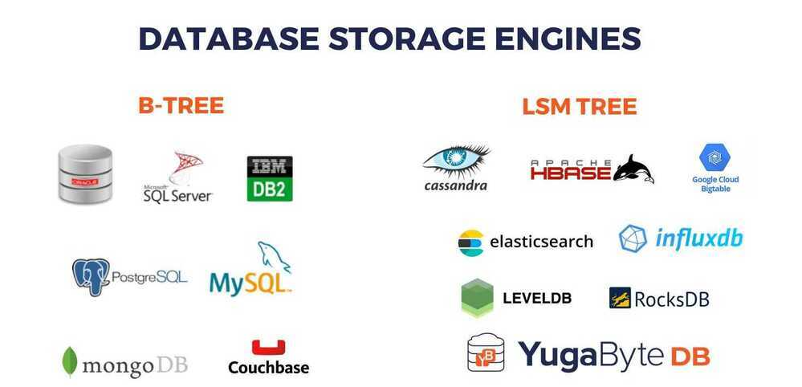

# Others



## Zstd (by facebook)

Zstandard, orzstdas short version, is a fast lossless compression algorithm, targeting real-time compression scenarios at zlib-level and better compression ratios. It's backed by a very fast entropy stage, provided by [Huff0 and FSE library](https://github.com/Cyan4973/FiniteStateEntropy).

<https://github.com/facebook/zstd>

<https://facebook.github.io/zstd>

## WebP (for images)

See > Image Formats

## cwebp (for image compression)

`for file in *.jpg; do cwebp -q 50 "$file" -o "${file%.jpg}.webp"; done`

## Brotli

Brotli is a generic-purpose lossless compression algorithm that compresses data using a combination of a modern variant of the LZ77 algorithm, Huffman coding and 2nd order context modeling, with a compression ratio comparable to the best currently available general-purpose compression methods. It is similar in speed with deflate but offers more dense compression.

<https://github.com/google/brotli>

## Snappy Compression

Snappy is a compression/decompression library. It does not aim for maximum compression, or compatibility with any other compression library; instead, it aims for very high speeds and reasonable compression. For instance, compared to the fastest mode of zlib, Snappy is an order of magnitude faster for most inputs, but the resulting compressed files are anywhere from 20% to 100% bigger.

Snappy has the following properties:

- Fast: Compression speeds at 250 MB/sec and beyond, with no assembler code. See "Performance" below.
- Stable: Over the last few years, Snappy has compressed and decompressed petabytes of data in Google's production environment. The Snappy bitstream format is stable and will not change between versions.
- Robust: The Snappy decompressor is designed not to crash in the face of corrupted or malicious input.
- Free and open source software: Snappy is licensed under a BSD-type license. For more information, see the included COPYING file.

### Performance

Snappy is intended to be fast. On a single core of a Core i7 processor in 64-bit mode, it compresses at about 250 MB/sec or more and decompresses at about 500 MB/sec or more. (These numbers are for the slowest inputs in our benchmark suite; others are much faster.) In our tests, Snappy usually is faster than algorithms in the same class (e.g. LZO, LZF, QuickLZ, etc.) while achieving comparable compression ratios.

Typical compression ratios (based on the benchmark suite) are about 1.5-1.7x for plain text, about 2-4x for HTML, and of course 1.0x for JPEGs, PNGs and other already-compressed data. Similar numbers for zlib in its fastest mode are 2.6-2.8x, 3-7x and 1.0x, respectively. More sophisticated algorithms are capable of achieving yet higher compression rates, although usually at the expense of speed. Of course, compression ratio will vary significantly with the input.

Although Snappy should be fairly portable, it is primarily optimized for 64-bit x86-compatible processors, and may run slower in other environments. In particular:

- Snappy uses 64-bit operations in several places to process more data at once than would otherwise be possible.
- Snappy assumes unaligned 32 and 64-bit loads and stores are cheap. On some platforms, these must be emulated with single-byte loads and stores, which is much slower.
- Snappy assumes little-endian throughout, and needs to byte-swap data in several places if running on a big-endian platform.

<https://github.com/andrix/python-snappy>

```python
python -m snappy -c uncompressed_file compressed_file.snappy

r = snappy.compress("hola mundo cruel!")
snappy.uncompress(r)
```

### Working

#### Phase 1: Dictionary Creation

Before compressing the data, Snappy creates a dictionary based on a sample of the input data. This dictionary consists of sequences of bytes that occur frequently in the input data. The dictionary is used to replace these sequences with shorter codes during compression, which improves the compression ratio.

#### Phase 2: Blocks

Snappy divides the input data into blocks of up to 64 KB in size. Each block is compressed separately, which makes it possible to decompress individual parts of the data without having to decompress the entire file.

#### Phase 3: Huffman coding

Snappy uses Huffman coding to compress the data within each block. Huffman coding assigns shorter codes to more frequently occuring symbols. Snappy uses a pre-defined set of Huffman codes that is optimized for the type of data being compressed

#### Phase 4: Compressed output

The compressed data is output in a block-based format that includes information about the size of each block, the length of the uncompressed data, and the contents of the dictionary

#### Phase 5: Decompression

Snappy reverses the compression process. It reads the block headers, decompresses each block using the Huffman codes and dictionary, and concatenates the decompressed blocks to produce the original data.

## Roaring Bitmaps

Roaring bitmaps are compressed bitmaps. They can be hundreds of times faster.

Bitsets, also called bitmaps, are commonly used as fast data structures. Unfortunately, they can use too much memory. To compensate, we often use compressed bitmaps.

Roaring bitmaps are compressed bitmaps which tend to outperform conventional compressed bitmaps such as WAH, EWAH or Concise. In some instances, roaring bitmaps can be hundreds of times faster and they often offer significantly better compression. They can even be faster than uncompressed bitmaps.

<https://roaringbitmap.org>

## Message Pack

MessagePack is an efficient binary serialization format. It lets you exchange data among multiple languages like JSON. But it's faster and smaller. Small integers are encoded into a single byte, and typical short strings require only one extra byte in addition to the strings themselves.

<https://msgpack.org/index.html>

## Digital Video

<https://github.com/leandromoreira/digital_video_introduction>
