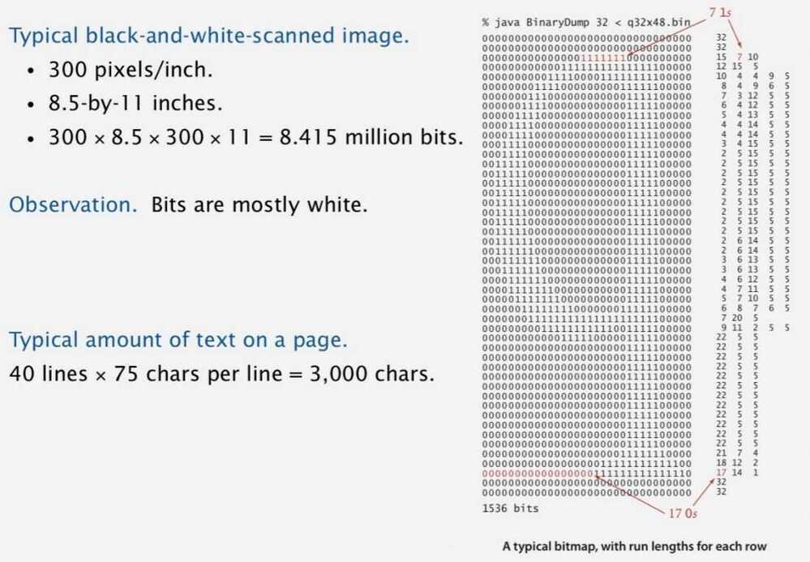

# Run Length Encoding

Que: How many bits to store the counts?

Ans: We'll use 8 (but 4 in the example above)

Que: What to do when run length exceeds max count?

Ans: If longer than 255, intersperse runs of length 0

Applications: JPEG, ITU-T T4 Group 3 Fax

## Java implementation

## Application: compress a bitmap

