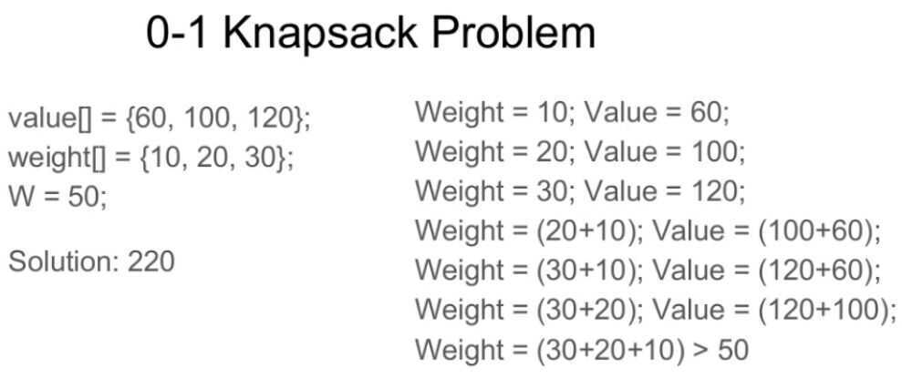

# Knapsack Problem

The **knapsack problem** or **rucksack problem** is a [combinatorial optimization](https://en.wikipedia.org/wiki/Combinatorial_optimization): Given a set of items, each with a weight and a value, determine the number of each item to include in a collection so that the total weight is less than or equal to a given limit and the total value is as large as possible. It derives its name from the problem faced by someone who is constrained by a fixed-size[knapsack](https://en.wikipedia.org/wiki/Knapsack) and must fill it with the most valuable items.

## 0-1 Knapsack Problem

Given weights and values of n items, put these items in a knapsack of capacity W to get the maximum total value in the knapsack.In other words, given two integer arrays val[0..n-1] and wt[0..n-1] which represent values and weights associated with n items respectively. Also given an integer W which represents knapsack capacity, find out the maximum value subset of val[] such that sum of the weights of this subset is smaller than or equal to W. You cannot break an item, either pick the complete item, or don't pick it (0-1 property).

## References

<https://en.wikipedia.org/wiki/Knapsack_problem>

<https://www.geeksforgeeks.org/0-1-knapsack-problem-dp-10>
