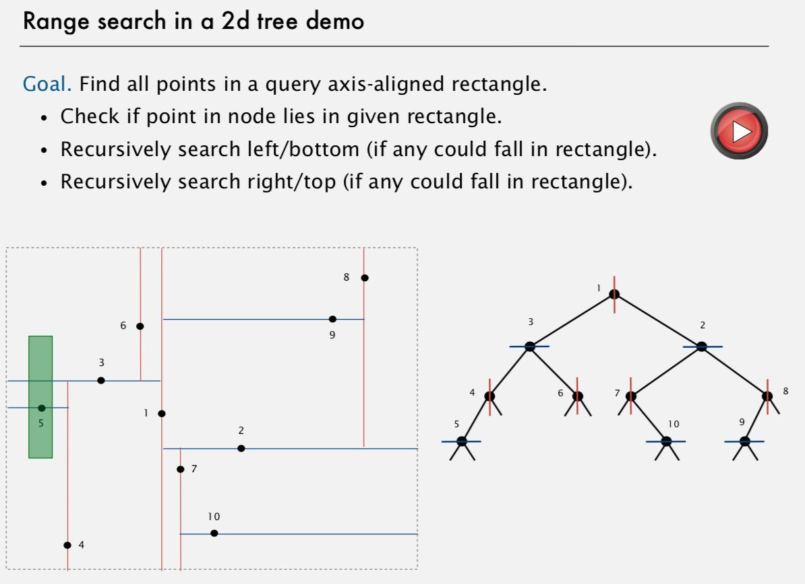
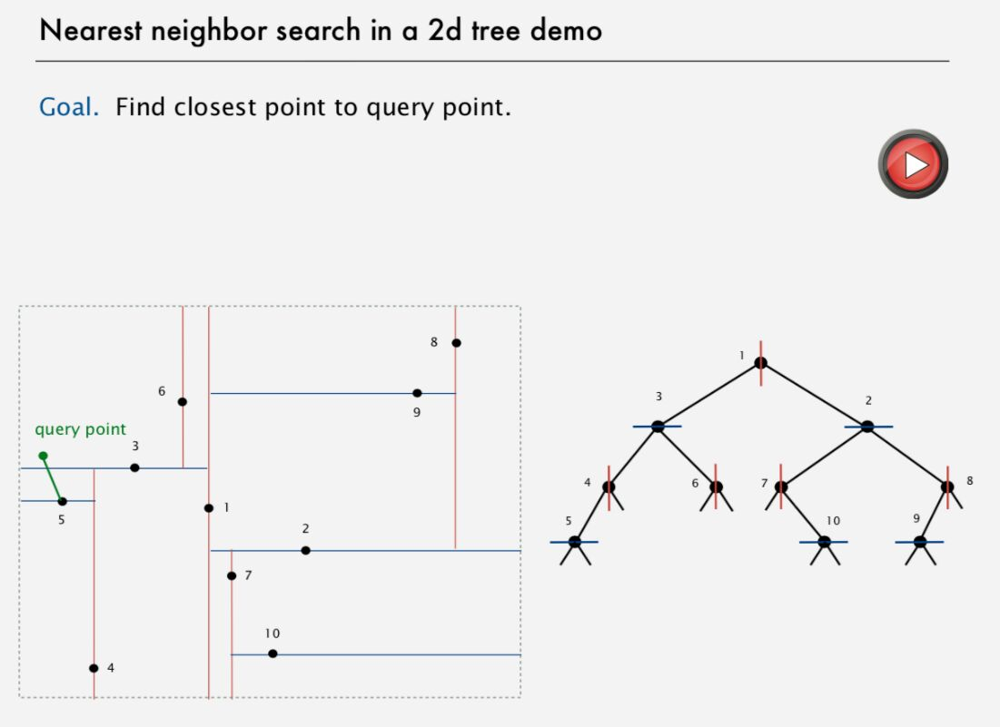
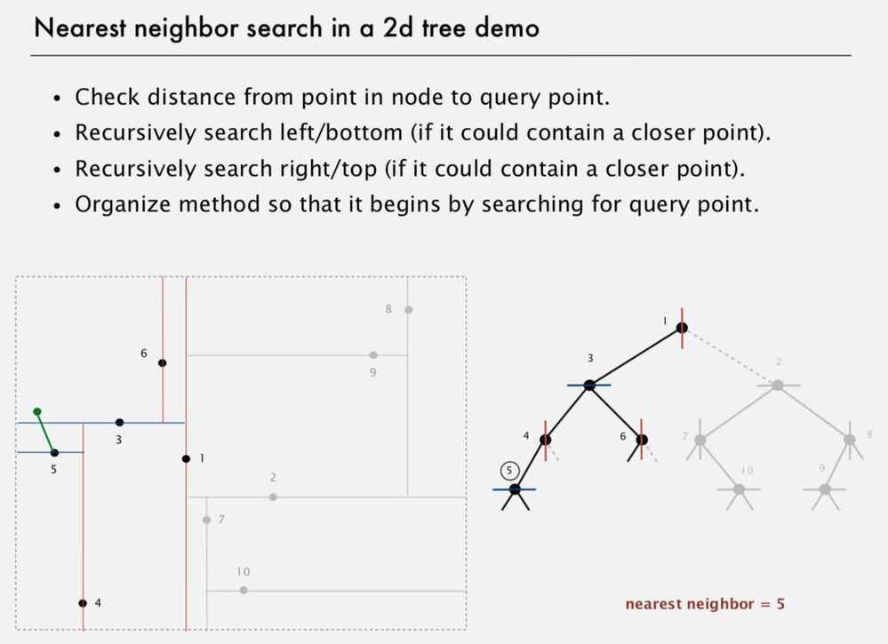

# 2d orthogonal range search

## Analysis

Typical case: R + log N

Worst case (assuming tree is balanced): R + sqrt(N)

## Analysis

Typical case: log N

Worst case (even if tree is balanced): N
