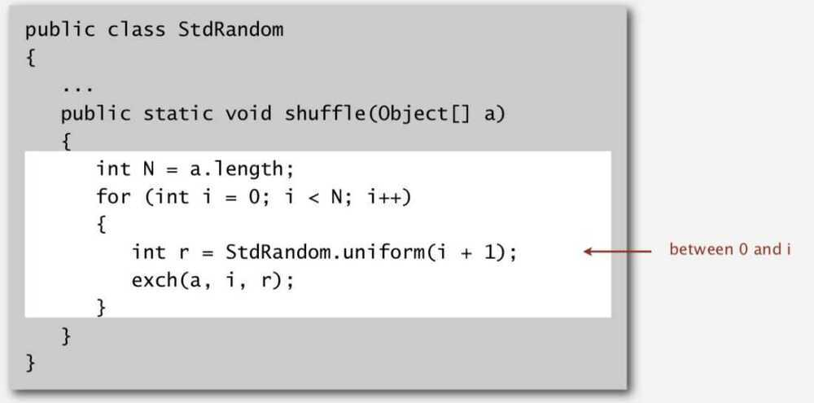

# Knuth Shuffle

Goal: Rearrange array so that the result is a uniformly random permutation in linear time

- In iteration i, pick integer r between 0 and i uniformly at random.
- Swap a[i] and a[r]

