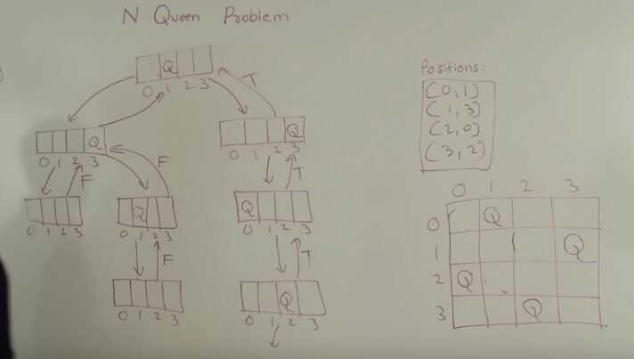

# N Queens Problem

The N Queen is the problem of placing N chess queens on an N×N chessboard so that no two queens attack each other. For example, following is a solution for 4 Queen problem.


## Question Types

- Find any placement of queens that do not attack each other
- Find all placement of queens on the board


## Naive Algorithm

Generate all possible configurations of queens on board and print a configuration that satisfies the given constraints.

```bash
while there are untried conflagrations
{
    generate the next configuration
    if queens don't attack in this configuration then
    {
        print this configuration;
    }
}
```

## Backtracking Algorithm

The idea is to place queens one by one in different columns, starting from the leftmost column. When we place a queen in a column, we check for clashes with already placed queens. In the current column, if we find a row for which there is no clash, we mark this row and column as part of the solution. If we do not find such a row due to clashes then we backtrack and return false.

- Start in the leftmost column
- If all queens are placed return true
- Try all rows in the current column. Do following for every tried row.
    - If the queen can be placed safely in this row then mark this [row, column] as part of the solution and recursively check if placing queen here leads to a solution.
    - If placing queen in [row, column] leads to a solution then return true.
    - If placing queen doesn't lead to a solution then umark this [row, column] (Backtrack) and go to step (a) to try other rows.
- If all rows have been tried and nothing worked, return false to trigger backtracking.

### Recursion tree

- For a board of 4x4, recursion will be 4 level deep
- At 0th level of recursion, we will place 0th queen on 0th row
- At 1st level of recursion, we will place 1st queen on 1st row such that she does not attack the 0th queen
- At 2nd level of recursion, we will place 2nd queen on 2nd row such that she does not attack the 0th queen and 1st queen.




## Time Complexity - Exponential O(n^n / n!)

Space Complexity - n*n

## References

https://en.wikipedia.org/wiki/Eight_queens_puzzle

[N Queen Problem Using Backtracking Algorithm](https://www.youtube.com/watch?v=xouin83ebxE)
