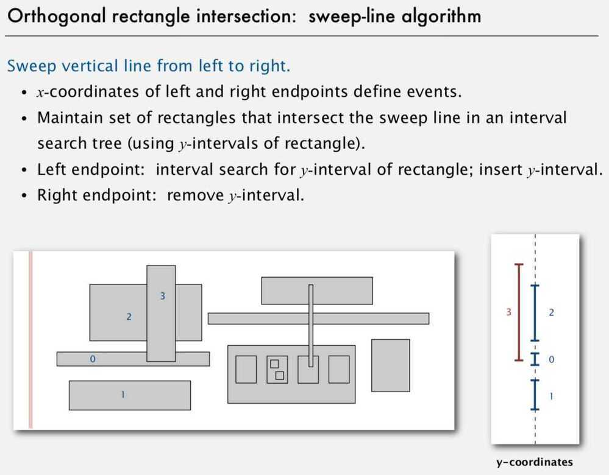

# Orthogonal rectangle intersection search

Goal: find all intersections among a set of N orthogonal rectangles

Sweep-line algorithm (Sweep vertical line from left to right)

Proposition: Sweep line algorithm takes time proportional to N log N + R log N to find R intersections among a set of N rectangles

### Proof

- Put x-coordinates on a PQ (or sort) - N log N
- Insert y-intervals into ST - N log N
- Delete y-intervals from ST - N log N
- Interval searches for y-intervals - N log N + R log N

Bottom line: Sweep line reduces 2d orthogonal rectangle intersection search to 1 d interval search
