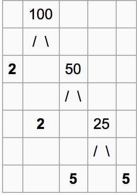

# Prime Factorization

Prime factorization or integer factorization of a number is breaking a number down into the set of prime numbers which multiply together to result in the original number. This is also known as prime decomposition.

## Prime Factorization using Trial Division

Following are the steps to find all prime factors.

1. While n is divisible by 2, print 2 and divide n by 2

2. After step 1, n must be odd. Now start a loop from i = 3 to square root of n. While i divides n, print i and divide n by i, increment i by 2 and continue

3. If n is a prime number and is greater than 2, then n will not become 1 by above two steps. So print n if it is greater than 2

## Prime Factors Tree

Using a prime factorization tree to see the work, prime decomposition of `100 = 2 x 2 x 5 x 5` looks like this:



## Optimization 1: running the loop till `sqrt(n)`

Now the main part is, the loop runs till square root of n not till. To prove that this optimization works, let us consider the following property of composite numbers.

*Every composite number has at least one prime factor less than or equal to square root of itself.*

This property can be proved using counter statement. Let a and b be two factors of n such that `a*b = n`. If both are greater than `√n`, then `a.b > √n,* √n`, which contradicts the expression `a * b = n`.

Running Time : sqrt(n)

## Code

```python
def primeFactors(n):

    # Print the number of two's that divide n
    while n % 2 == 0:
        print 2,
        n = n / 2

    # n must be odd at this point
    # so a skip of 2 ( i = i + 2) can be used
    for i in range(3,int(math.sqrt(n))+1,2):

        # while i divides n , print i ad divide n
        while n % i== 0:
            print i,
            n = n / i

    # Condition if n is a prime
    # number greater than 2
    if n > 2:
    print n
```

For multiple queries we can use Sieve of Eratosthenes for giving result in O(log n)

## Sieve of Eratosthenes, (for primality test)

```python
def sieve(n):
    prime = [True for i in range(n + 1)]
    p = 2
    while (p * p <= n):

        # If prime[p] is not changed, then it is a prime
        if (prime[p] == True):

            # Update all multiples of p
            for i in range(p * 2, n + 1, p):
                prime[i] = False
        p += 1
    prime[0]= False
    prime[1]= False

    lst = []
    for p in range(n + 1):
        if prime[p]:
            lst.append(p)

return lst
```

## Sieve of Atkin

Factors of a number

```python
# find all factors of a given number
import math

def printDivisors(n):

    # Note that this loop runs till square root
    i = 1
    fac = []
    while i <= math.sqrt(n):

        if n % i == 0:

            # If divisors are equal, print only one
            if (n // i == i):
                fac.append(i)
            else:
                # Otherwise print both
                fac.append([i, n//i])

        i = i + 1

    return fac

assert printDivisors(100) == [[1, 100], [2, 50], [4, 25], [5, 20], 10]
```

Time Complexity : O(sqrt(n))

Auxiliary Space : O(1)

<https://www.geeksforgeeks.org/find-divisors-natural-number-set-1>

## Others

<https://en.wikipedia.org/wiki/Shor%27s_algorithm>
